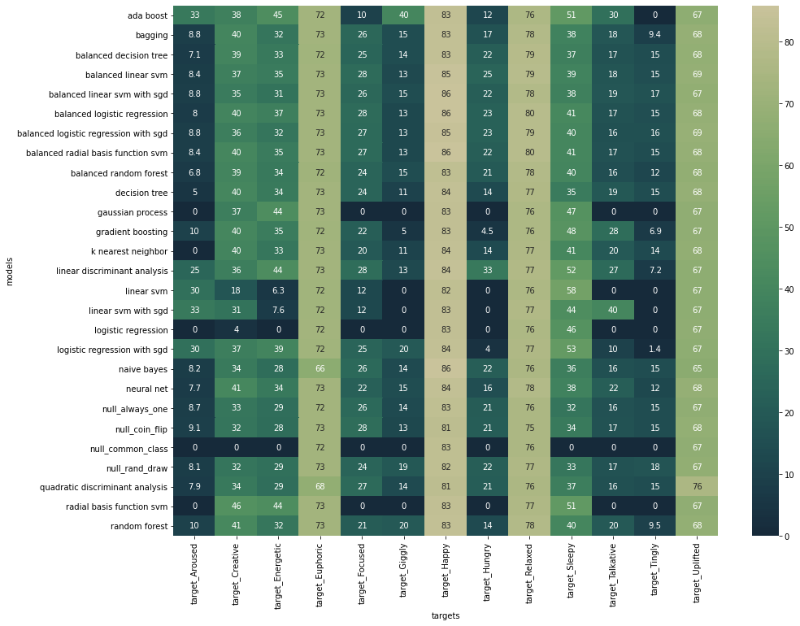
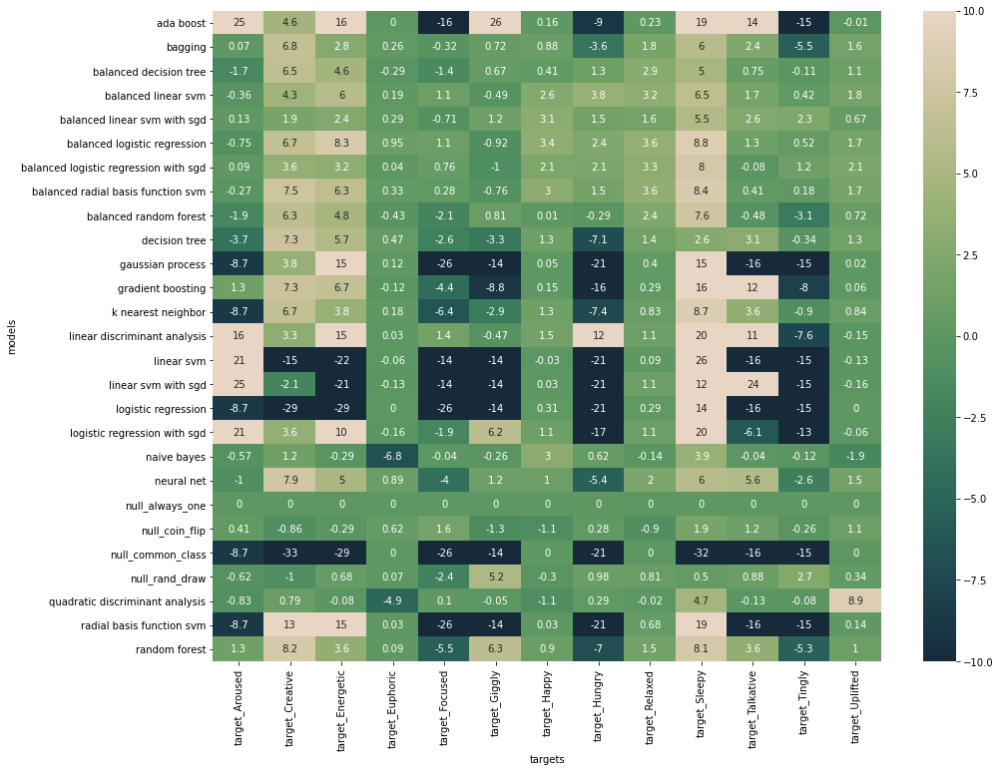
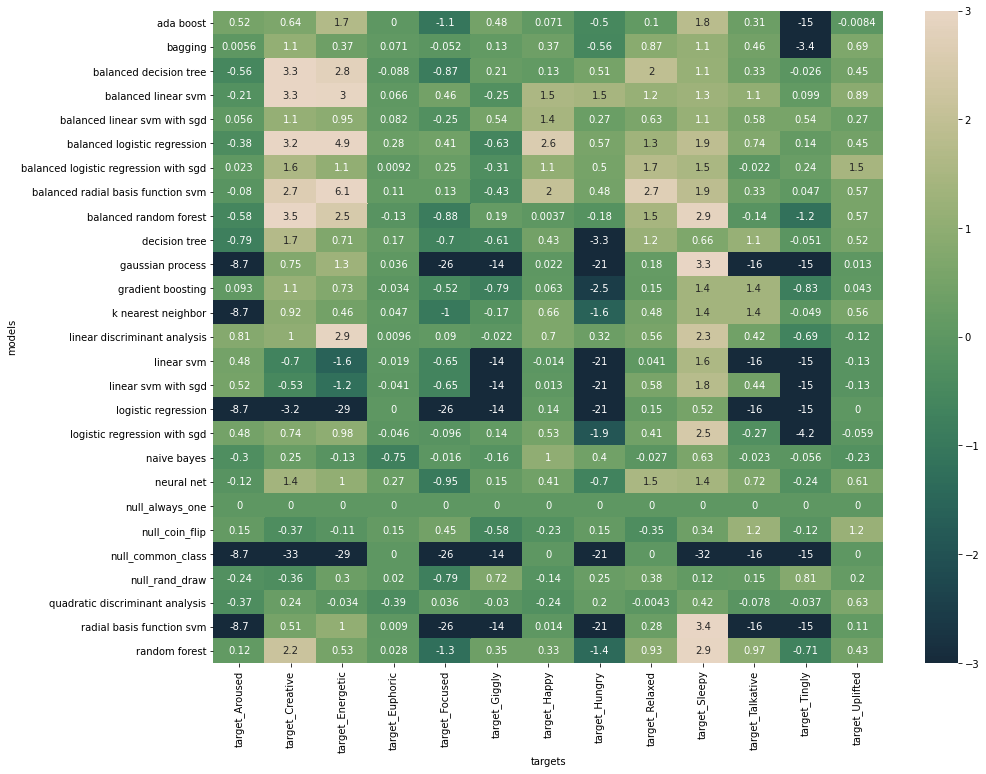
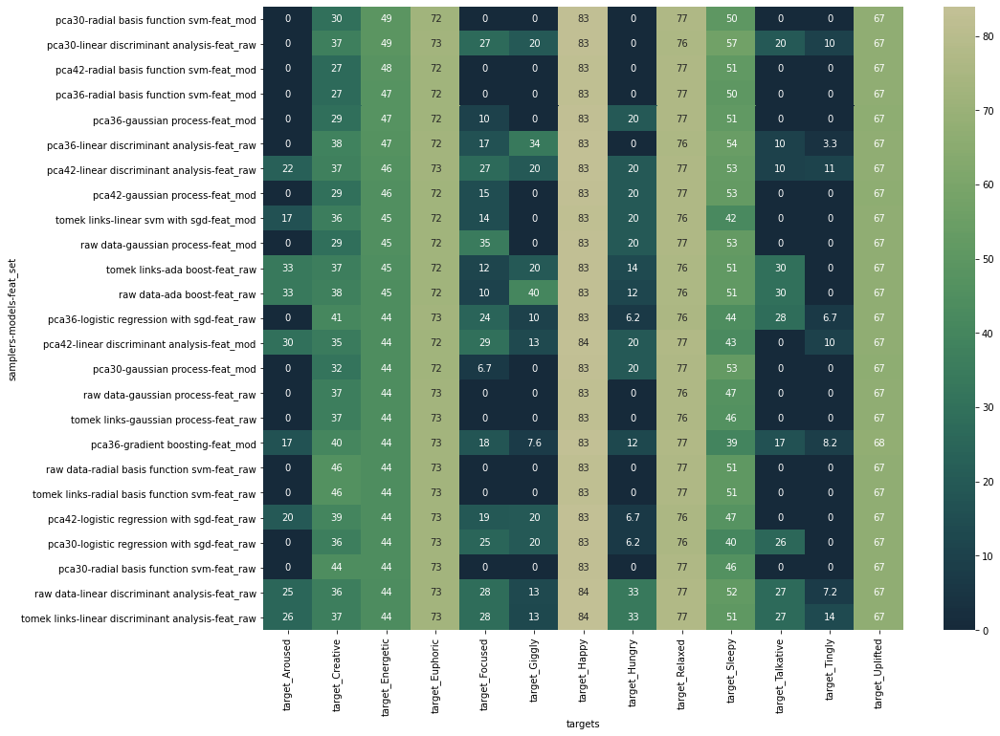
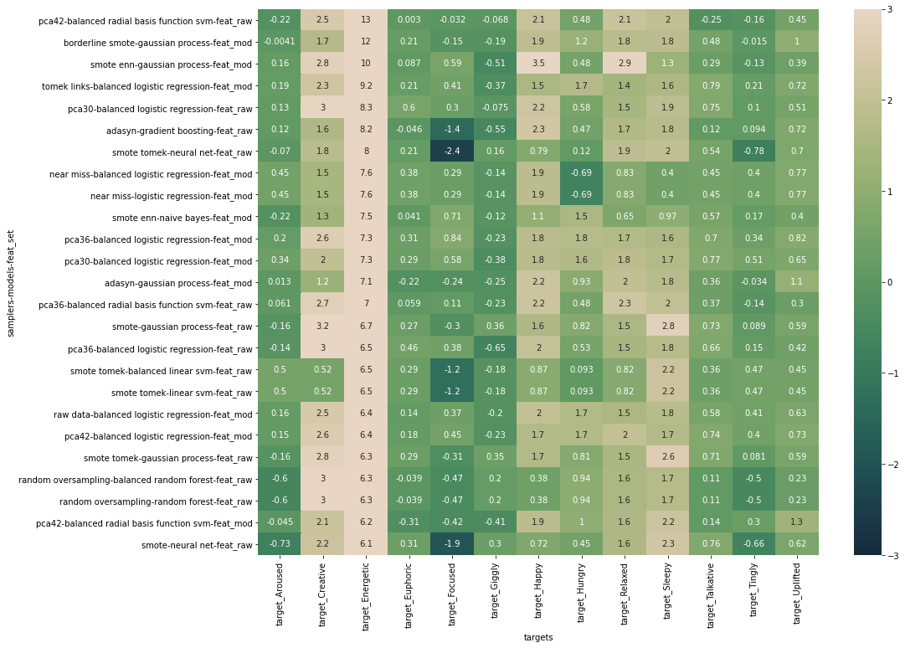
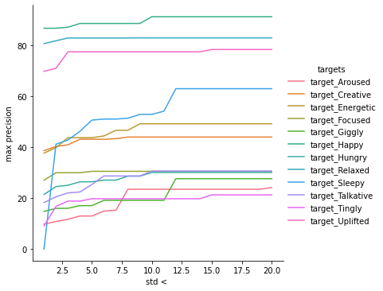
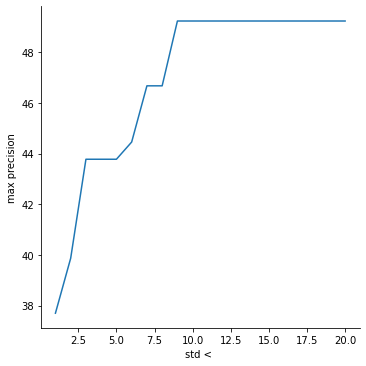
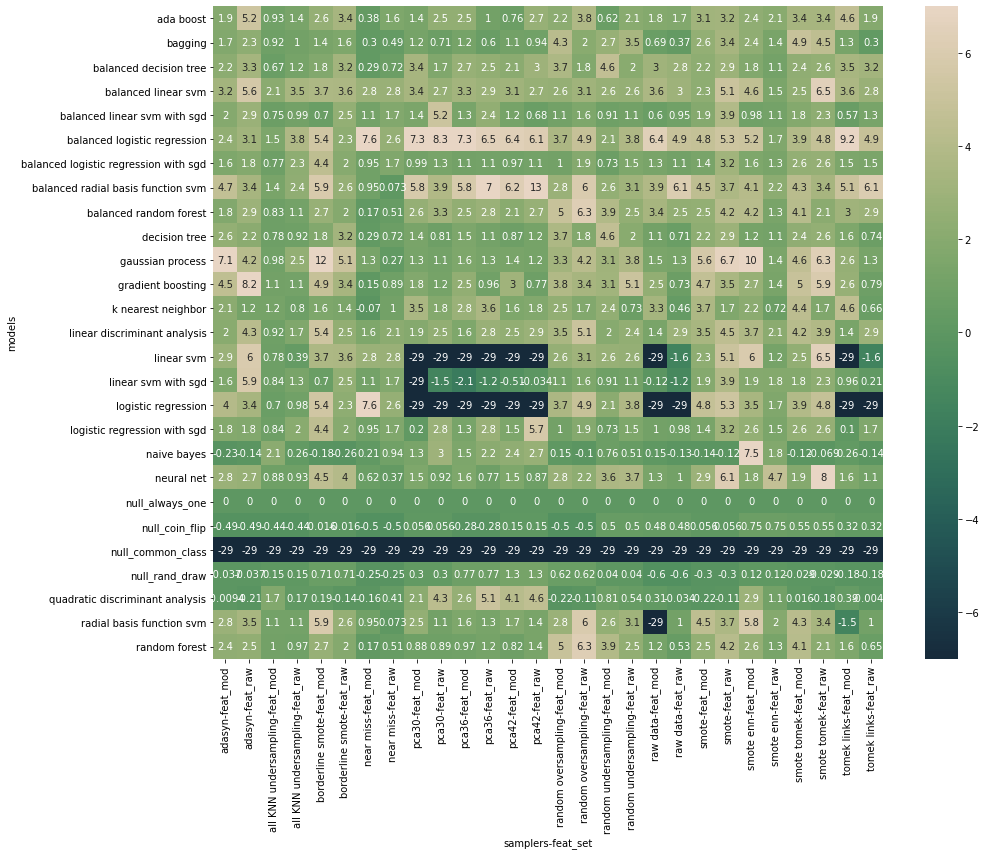
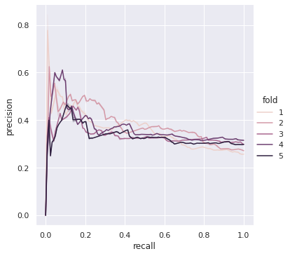
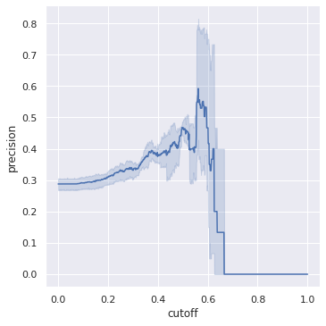

# Predicting psychoactive effects of *Cannabis* spp. from flavor and scent

During my PhD, I spent a lot of time studying the complex chemical compositions of plants and animals, and thinking about how collections of molecules can synergize to produce varied ecological and pharmacological effects. While my studies were focuesed in the marine realm, the same ideas can be extended to terrestrial organisms. In fact with the continual rise of cannabis in popularity and popular conscience, conversations about chemical synergism have begun to sneak into broader discussions trying to understand the multifaceted impacts and effects that cannabis can provide to patients and adult-use consumers.

Cannabis produces a wealth of natural products, which are specialized chemicals produced for such beneficial uses as protection from grazers, chemical signaling and communication, and defense against fungal and bacterial pathogens. In many cases, not only for cannabis but also for most plants, animals, algae, fungi, and bacteria whose natural products are studied, the ecological roles played by those compounds are unknown. Instead, most research has focused on the potential beneficial pharmacological effects that these natural products can have when applied to humans. Cannabis is famous (notorious?) for its production of a class of compounds known as cannabinoids, especially delta-9-tetrahydrocannabinol or THC. The 'high' associated with cannabis consumption has long been attributed to THC, but it is far from the only biologically active chemical constituent in the plant. Other cannabinoids, such as the recently popularized cannabidiol or CBD, can also provide beneficial effects (though perhaps not as many as current marketing efforts might like for you to believe).

In 2011, Dr. Ethan Russo published a fascinating [paper](https://www.ncbi.nlm.nih.gov/pmc/articles/PMC3165946/) titled **Taming THC** in which he discusses potential synergisms between THC and another vast family of compounds produced in cannabis as well as numerous other plants - terpenes! Whether you know it or not, you are exceedingly familiar with terpenes, more specifically with their smells and tastes. From bright and fruity limonene in citrus peels, and fresh pinene in the sap dripping from a pine tree, to earthy and herbaceous beta-caryophyllene in a hoppy beer or some rosemary, and the floral notes of linalool most associated with lavendar, we encounter terpenes anytime we eat or otherwise interact with plants. While many terpenes have documented associated biological activites in their own right, Dr. Russo is a champion of the idea that the terpene composition of a cannabis strain, combined with its cannabinoids, dictates the effects one experiences upon consuming that cannabis strain. 

Terpenes are major contributors to the unique aromas associated with different cannabis strains, and are also thought by Dr. Russo and a growing number of others to majorly contribute to the varied pharmacological effects experienced across different cannabis strains. Therefore, **can one use the aroma and flavor of a cannabis strain to predict its psychoactive effects?** In essence, do smell and taste serve as an adequate proxy for terpene composition, and does terpene composition adequately inform the effects of a particular cannabis strain. That, my friends, is what we shall explore below!

Now, before we proceed, there are several caveats to discuss. The data used below comes from a [kaggle dataset](https://www.kaggle.com/nvisagan/cannabis-strains-features) that is a compilation of aggregated user reviews from multiple sources. For each cannabis strain in the dataset, up to 3 'flavors' and up to 5 'effects' are reported. These are presumeably the top reported flavors and effects for the strain, but we do not have any information about how many user reviews contributed to those top rankings. On top of the degree of unreliability associated with user reported data, due to the arbitrary cutoffs of 3 flavors and 5 effects per strains, one must also assume that the data is essentially incomplete, and that more flavors and effects could reasonably be attributed to each strain. This provides some special challenges when building models and making predictions that we will have to try to overcome. Additionally, the reality of a cannabis strain's effects on a user is thought to be even more nuanced than just the composition of terpenes and cannabinoids - the individual chemistry, physiology, and psychological state of the user undoubtedly play important roles in the producing the resultant effects as well. So while the contributions of the individual user will prevent perfect predicitive capabilities, it is certainly plausible that enough data pairing aroma and effect could be used to produce models providing predictions that are generally useful and informative.


### Guide
- [Library load-in](#Load-in-necessary-libraries)
- [Dataset load-in](#Load-in-dataset-from-kaggle)
- [Data cleaning & wrangling](#Data-cleaning-and-wrangling)
- [Initial model survey](#Initial-model-survey)
- [Broadened model survey | Sampling strategies & initial feature engineering](#Broadened-model-survey-(Sampling-strategies-and-initial-feature-engineering))
    - [Probablistic imputation](#Probablistic-Imputation)
- [Classifying 'Energetic' strains | Statistical testing for significantly improved models](#Focus-on-classfiers-for-predicting-strains-that-make-one-'Energetic')
- [Hyperparameter tuning](#Hyperparameter-tuning)
    - [Support vector classifiers](#Support-vector-classifier-hyperparameter-tuning)
    - [Logistic regression](#Logistic-regression-hyperparameter-tuning)
    - [Gaussian processes](#Gaussian-process-hyperparameter-tuning)
    - [Learning linear models with stochastic gradient descent](#Learning-and-tuning-linear-models-with-stochastic-gradient-descent)
- [Ranking top classifiers](#Ranking-top-models)
- [Changing decision cutoffs](#Adjusting-precision-and-recall-via-modulation-of-probability-cutoff)
- [Summary](#Future-efforts)


#### Load-in necessary libraries


```python

import kaggle
from collections import Counter
from collections import defaultdict
import itertools
import pandas as pd
import numpy as np
import seaborn as sns
import matplotlib.pyplot as plt
import ast
from scipy import stats
import os

from random import choices
from random import seed

from sklearn.preprocessing import MultiLabelBinarizer
from sklearn.model_selection import train_test_split
from sklearn.model_selection import KFold
from sklearn import metrics
from sklearn.ensemble import RandomForestClassifier
from sklearn.linear_model import LogisticRegressionCV
from sklearn.discriminant_analysis import LinearDiscriminantAnalysis
from sklearn.discriminant_analysis import QuadraticDiscriminantAnalysis
from sklearn.naive_bayes import GaussianNB
from sklearn.neighbors import KNeighborsClassifier
from sklearn.neural_network import MLPClassifier
from sklearn.gaussian_process import GaussianProcessClassifier
from sklearn.tree import DecisionTreeClassifier
from sklearn.ensemble import GradientBoostingClassifier
from sklearn.ensemble import BaggingClassifier
from sklearn.ensemble import AdaBoostClassifier
from sklearn.svm import SVC
from sklearn.linear_model import SGDClassifier
from sklearn.decomposition import PCA
from sklearn.gaussian_process.kernels import RBF, RationalQuadratic, DotProduct, ConstantKernel

from imblearn.under_sampling import RandomUnderSampler
from imblearn.under_sampling import TomekLinks
from imblearn.under_sampling import NearMiss
from imblearn.under_sampling import AllKNN
from imblearn.over_sampling import RandomOverSampler
from imblearn.over_sampling import ADASYN
from imblearn.over_sampling import SMOTE
from imblearn.over_sampling import BorderlineSMOTE
from imblearn.combine import SMOTEENN
from imblearn.combine import SMOTETomek

```

#### Load-in dataset from kaggle


```python
kaggle.api.authenticate()
kaggle.api.dataset_download_files('nvisagan/cannabis-strains-features', path='./cannabis-strains-features', unzip=True)

data = pd.read_csv('./cannabis-strains-features/Cannabis_Strains_Features.csv')
data.head(5)
```


<div>
<style scoped>
    .dataframe tbody tr th:only-of-type {
        vertical-align: middle;
    }

    .dataframe tbody tr th {
        vertical-align: top;
    }

    .dataframe thead th {
        text-align: right;
    }
</style>
<table border="1" class="dataframe">
  <thead>
    <tr style="text-align: right;">
      <th></th>
      <th>Strain</th>
      <th>Type</th>
      <th>Rating</th>
      <th>Effects</th>
      <th>Flavor</th>
      <th>Description</th>
    </tr>
  </thead>
  <tbody>
    <tr>
      <th>0</th>
      <td>100-Og</td>
      <td>hybrid</td>
      <td>4.0</td>
      <td>Creative,Energetic,Tingly,Euphoric,Relaxed</td>
      <td>Earthy,Sweet,Citrus</td>
      <td>$100 OG is a 50/50 hybrid strain that packs a ...</td>
    </tr>
    <tr>
      <th>1</th>
      <td>98-White-Widow</td>
      <td>hybrid</td>
      <td>4.7</td>
      <td>Relaxed,Aroused,Creative,Happy,Energetic</td>
      <td>Flowery,Violet,Diesel</td>
      <td>The ‘98 Aloha White Widow is an especially pot...</td>
    </tr>
    <tr>
      <th>2</th>
      <td>1024</td>
      <td>sativa</td>
      <td>4.4</td>
      <td>Uplifted,Happy,Relaxed,Energetic,Creative</td>
      <td>Spicy/Herbal,Sage,Woody</td>
      <td>1024 is a sativa-dominant hybrid bred in Spain...</td>
    </tr>
    <tr>
      <th>3</th>
      <td>13-Dawgs</td>
      <td>hybrid</td>
      <td>4.2</td>
      <td>Tingly,Creative,Hungry,Relaxed,Uplifted</td>
      <td>Apricot,Citrus,Grapefruit</td>
      <td>13 Dawgs is a hybrid of G13 and Chemdawg genet...</td>
    </tr>
    <tr>
      <th>4</th>
      <td>24K-Gold</td>
      <td>hybrid</td>
      <td>4.6</td>
      <td>Happy,Relaxed,Euphoric,Uplifted,Talkative</td>
      <td>Citrus,Earthy,Orange</td>
      <td>Also known as Kosher Tangie, 24k Gold is a 60%...</td>
    </tr>
  </tbody>
</table>
</div>


#### Data cleaning and wrangling

We are interested in using the data in the Effects and the Flavor columns. However, in order to make this data more accessible, we need to expand the lists in each of these columns into multiple columns. A simple function will do the trick.


```python
def cols_for_ranks(df, col_name):
    ranked_cols_appended = pd.concat([df, df[col_name].str.split(',', expand = True).add_prefix(col_name + '_')], axis = 1)
    return ranked_cols_appended
```


```python
cols_for_ranks(data, 'Flavor').head(5)
```


<div>
<style scoped>
    .dataframe tbody tr th:only-of-type {
        vertical-align: middle;
    }

    .dataframe tbody tr th {
        vertical-align: top;
    }

    .dataframe thead th {
        text-align: right;
    }
</style>
<table border="1" class="dataframe">
  <thead>
    <tr style="text-align: right;">
      <th></th>
      <th>Strain</th>
      <th>Type</th>
      <th>Rating</th>
      <th>Effects</th>
      <th>Flavor</th>
      <th>Description</th>
      <th>Flavor_0</th>
      <th>Flavor_1</th>
      <th>Flavor_2</th>
      <th>Flavor_3</th>
    </tr>
  </thead>
  <tbody>
    <tr>
      <th>0</th>
      <td>100-Og</td>
      <td>hybrid</td>
      <td>4.0</td>
      <td>Creative,Energetic,Tingly,Euphoric,Relaxed</td>
      <td>Earthy,Sweet,Citrus</td>
      <td>$100 OG is a 50/50 hybrid strain that packs a ...</td>
      <td>Earthy</td>
      <td>Sweet</td>
      <td>Citrus</td>
      <td>None</td>
    </tr>
    <tr>
      <th>1</th>
      <td>98-White-Widow</td>
      <td>hybrid</td>
      <td>4.7</td>
      <td>Relaxed,Aroused,Creative,Happy,Energetic</td>
      <td>Flowery,Violet,Diesel</td>
      <td>The ‘98 Aloha White Widow is an especially pot...</td>
      <td>Flowery</td>
      <td>Violet</td>
      <td>Diesel</td>
      <td>None</td>
    </tr>
    <tr>
      <th>2</th>
      <td>1024</td>
      <td>sativa</td>
      <td>4.4</td>
      <td>Uplifted,Happy,Relaxed,Energetic,Creative</td>
      <td>Spicy/Herbal,Sage,Woody</td>
      <td>1024 is a sativa-dominant hybrid bred in Spain...</td>
      <td>Spicy/Herbal</td>
      <td>Sage</td>
      <td>Woody</td>
      <td>None</td>
    </tr>
    <tr>
      <th>3</th>
      <td>13-Dawgs</td>
      <td>hybrid</td>
      <td>4.2</td>
      <td>Tingly,Creative,Hungry,Relaxed,Uplifted</td>
      <td>Apricot,Citrus,Grapefruit</td>
      <td>13 Dawgs is a hybrid of G13 and Chemdawg genet...</td>
      <td>Apricot</td>
      <td>Citrus</td>
      <td>Grapefruit</td>
      <td>None</td>
    </tr>
    <tr>
      <th>4</th>
      <td>24K-Gold</td>
      <td>hybrid</td>
      <td>4.6</td>
      <td>Happy,Relaxed,Euphoric,Uplifted,Talkative</td>
      <td>Citrus,Earthy,Orange</td>
      <td>Also known as Kosher Tangie, 24k Gold is a 60%...</td>
      <td>Citrus</td>
      <td>Earthy</td>
      <td>Orange</td>
      <td>None</td>
    </tr>
  </tbody>
</table>
</div>


Upon expanding the Flavor column, an issue immediately presents itself - while we expected three flavors per strain, four new columns were produced.


```python
Counter(cols_for_ranks(data, 'Flavor')['Flavor_3']).most_common()
```


    [(None, 2308),
     ('Fruit', 16),
     ('Cheese', 5),
     ('Earthy', 4),
     ('Sweet', 3),
     ('Pine', 3),
     ('Flowery', 2),
     ('Chemical', 1),
     ('Blueberry', 1),
     ('Pineapple', 1),
     ('Pungent', 1),
     ('Berry', 1),
     ('Lemon', 1),
     ('Spicy/Herbal', 1),
     ('Orange', 1),
     ('Grape', 1),
     ('Apricot', 1)]


As can be seen above, the fourth column ('Flavor_3') is mainly composed of **None** values. The second most common entry is 'Fruit'. Fruit *could* be a flavor associated with a cannabis strain, but it seems pretty broad. Perhaps it is the suffix to a more specific entry that is being parsed incorrectly?


```python
cols_for_ranks(data, 'Flavor')[cols_for_ranks(data, 'Flavor')['Flavor'].str.contains('Fruit')].head(3)
```


<div>
<style scoped>
    .dataframe tbody tr th:only-of-type {
        vertical-align: middle;
    }

    .dataframe tbody tr th {
        vertical-align: top;
    }

    .dataframe thead th {
        text-align: right;
    }
</style>
<table border="1" class="dataframe">
  <thead>
    <tr style="text-align: right;">
      <th></th>
      <th>Strain</th>
      <th>Type</th>
      <th>Rating</th>
      <th>Effects</th>
      <th>Flavor</th>
      <th>Description</th>
      <th>Flavor_0</th>
      <th>Flavor_1</th>
      <th>Flavor_2</th>
      <th>Flavor_3</th>
    </tr>
  </thead>
  <tbody>
    <tr>
      <th>32</th>
      <td>Acid-Dough</td>
      <td>sativa</td>
      <td>5.0</td>
      <td>Talkative,Giggly,Happy,Hungry,Relaxed</td>
      <td>Earthy,Woody,Tree Fruit</td>
      <td>Acid Dough by Ripper Seeds is a sativa-dominan...</td>
      <td>Earthy</td>
      <td>Woody</td>
      <td>Tree Fruit</td>
      <td>None</td>
    </tr>
    <tr>
      <th>156</th>
      <td>Bc-Sweet-Tooth</td>
      <td>indica</td>
      <td>4.3</td>
      <td>Uplifted,Happy,Relaxed,Sleepy,Euphoric</td>
      <td>Sweet,Honey,Tree,Fruit</td>
      <td>Developed in British Columbia by BC Bud Depot,...</td>
      <td>Sweet</td>
      <td>Honey</td>
      <td>Tree</td>
      <td>Fruit</td>
    </tr>
    <tr>
      <th>163</th>
      <td>Banana-Candy</td>
      <td>indica</td>
      <td>4.2</td>
      <td>Relaxed,Euphoric,Uplifted,Creative,Happy</td>
      <td>Tree,Fruit,Earthy,Sweet</td>
      <td>Banana Candy is classified as a Indica cannabi...</td>
      <td>Tree</td>
      <td>Fruit</td>
      <td>Earthy</td>
      <td>Sweet</td>
    </tr>
  </tbody>
</table>
</div>


Ahh, Tree Fruit makes more sense. For it to be parsed into two separate columns, 'Tree' and 'Fruit' must have been separated by a comma in some of the data entries. It looks like they are also sometimes separated by a space, as below. Let's clean that up.


```python
cols_for_ranks(data, 'Flavor')[cols_for_ranks(data, 'Flavor')['Flavor'].str.contains(' ')]
```


<div>
<style scoped>
    .dataframe tbody tr th:only-of-type {
        vertical-align: middle;
    }

    .dataframe tbody tr th {
        vertical-align: top;
    }

    .dataframe thead th {
        text-align: right;
    }
</style>
<table border="1" class="dataframe">
  <thead>
    <tr style="text-align: right;">
      <th></th>
      <th>Strain</th>
      <th>Type</th>
      <th>Rating</th>
      <th>Effects</th>
      <th>Flavor</th>
      <th>Description</th>
      <th>Flavor_0</th>
      <th>Flavor_1</th>
      <th>Flavor_2</th>
      <th>Flavor_3</th>
    </tr>
  </thead>
  <tbody>
    <tr>
      <th>5</th>
      <td>3-Bears-Og</td>
      <td>indica</td>
      <td>4.4</td>
      <td>Relaxed,Happy,Sleepy,Creative,Euphoric\n</td>
      <td>Sweet, Pungent, Earthy</td>
      <td>3 Bears OG by Mephisto Genetics is an autoflow...</td>
      <td>Sweet</td>
      <td>Pungent</td>
      <td>Earthy</td>
      <td>None</td>
    </tr>
    <tr>
      <th>32</th>
      <td>Acid-Dough</td>
      <td>sativa</td>
      <td>5.0</td>
      <td>Talkative,Giggly,Happy,Hungry,Relaxed</td>
      <td>Earthy,Woody,Tree Fruit</td>
      <td>Acid Dough by Ripper Seeds is a sativa-dominan...</td>
      <td>Earthy</td>
      <td>Woody</td>
      <td>Tree Fruit</td>
      <td>None</td>
    </tr>
    <tr>
      <th>106</th>
      <td>Amnesia-Ganja-Haze</td>
      <td>sativa</td>
      <td>5.0</td>
      <td>Euphoric, Relaxed</td>
      <td>Spicy/Herbal, Sweet</td>
      <td>Amnesia Ganja Haze is another award-winning st...</td>
      <td>Spicy/Herbal</td>
      <td>Sweet</td>
      <td>None</td>
      <td>None</td>
    </tr>
    <tr>
      <th>1237</th>
      <td>Las-Vegas-Purple-Kush-Bx</td>
      <td>indica</td>
      <td>5.0</td>
      <td>Sleepy,Happy,Relaxed,Aroused,Creative</td>
      <td>Sweet, Berry, Spicy/Herbal</td>
      <td>Las Vegas Purple Kush BX is a clone-only strai...</td>
      <td>Sweet</td>
      <td>Berry</td>
      <td>Spicy/Herbal</td>
      <td>None</td>
    </tr>
  </tbody>
</table>
</div>


```python
data['Flavor'] = data['Flavor'].str.replace(' ', '')
data['Flavor'] = data['Flavor'].str.replace('Tree,Fruit', 'TreeFruit')
cols_for_ranks(data, 'Flavor').head(3)
```


<div>
<style scoped>
    .dataframe tbody tr th:only-of-type {
        vertical-align: middle;
    }

    .dataframe tbody tr th {
        vertical-align: top;
    }

    .dataframe thead th {
        text-align: right;
    }
</style>
<table border="1" class="dataframe">
  <thead>
    <tr style="text-align: right;">
      <th></th>
      <th>Strain</th>
      <th>Type</th>
      <th>Rating</th>
      <th>Effects</th>
      <th>Flavor</th>
      <th>Description</th>
      <th>Flavor_0</th>
      <th>Flavor_1</th>
      <th>Flavor_2</th>
      <th>Flavor_3</th>
    </tr>
  </thead>
  <tbody>
    <tr>
      <th>0</th>
      <td>100-Og</td>
      <td>hybrid</td>
      <td>4.0</td>
      <td>Creative,Energetic,Tingly,Euphoric,Relaxed</td>
      <td>Earthy,Sweet,Citrus</td>
      <td>$100 OG is a 50/50 hybrid strain that packs a ...</td>
      <td>Earthy</td>
      <td>Sweet</td>
      <td>Citrus</td>
      <td>None</td>
    </tr>
    <tr>
      <th>1</th>
      <td>98-White-Widow</td>
      <td>hybrid</td>
      <td>4.7</td>
      <td>Relaxed,Aroused,Creative,Happy,Energetic</td>
      <td>Flowery,Violet,Diesel</td>
      <td>The ‘98 Aloha White Widow is an especially pot...</td>
      <td>Flowery</td>
      <td>Violet</td>
      <td>Diesel</td>
      <td>None</td>
    </tr>
    <tr>
      <th>2</th>
      <td>1024</td>
      <td>sativa</td>
      <td>4.4</td>
      <td>Uplifted,Happy,Relaxed,Energetic,Creative</td>
      <td>Spicy/Herbal,Sage,Woody</td>
      <td>1024 is a sativa-dominant hybrid bred in Spain...</td>
      <td>Spicy/Herbal</td>
      <td>Sage</td>
      <td>Woody</td>
      <td>None</td>
    </tr>
  </tbody>
</table>
</div>


The 'Flavor_3' column still exists, so there is still some issue outstanding. Let's look again at what the most common entries are in the column:


```python
Counter(cols_for_ranks(data, 'Flavor')['Flavor_3']).most_common()
```


    [(None, 2342),
     ('Cheese', 4),
     ('Earthy', 2),
     ('Chemical', 1),
     ('Blueberry', 1),
     ('Pungent', 1)]


```python
cols_for_ranks(data, 'Flavor')[cols_for_ranks(data, 'Flavor')['Flavor_3'] == 'Cheese']
```


<div>
<style scoped>
    .dataframe tbody tr th:only-of-type {
        vertical-align: middle;
    }

    .dataframe tbody tr th {
        vertical-align: top;
    }

    .dataframe thead th {
        text-align: right;
    }
</style>
<table border="1" class="dataframe">
  <thead>
    <tr style="text-align: right;">
      <th></th>
      <th>Strain</th>
      <th>Type</th>
      <th>Rating</th>
      <th>Effects</th>
      <th>Flavor</th>
      <th>Description</th>
      <th>Flavor_0</th>
      <th>Flavor_1</th>
      <th>Flavor_2</th>
      <th>Flavor_3</th>
    </tr>
  </thead>
  <tbody>
    <tr>
      <th>195</th>
      <td>Bettie-Page</td>
      <td>hybrid</td>
      <td>4.2</td>
      <td>Creative,Uplifted,Energetic,Euphoric,Relaxed</td>
      <td>Earthy,Sweet,Blue,Cheese</td>
      <td>Bettie Page, grown by Liberty Reach Farms in W...</td>
      <td>Earthy</td>
      <td>Sweet</td>
      <td>Blue</td>
      <td>Cheese</td>
    </tr>
    <tr>
      <th>466</th>
      <td>Cat-Piss</td>
      <td>sativa</td>
      <td>3.9</td>
      <td>Happy,Uplifted,Euphoric,Relaxed,Talkative</td>
      <td>Earthy,Woody,Blue,Cheese</td>
      <td>Originally a clone-only phenotype of Super Sil...</td>
      <td>Earthy</td>
      <td>Woody</td>
      <td>Blue</td>
      <td>Cheese</td>
    </tr>
    <tr>
      <th>1141</th>
      <td>Josh-D-Og</td>
      <td>indica</td>
      <td>3.7</td>
      <td>Aroused,Tingly,Uplifted,Creative,Euphoric</td>
      <td>Berry,Blueberry,Blue,Cheese</td>
      <td>Josh D OG by Karma Genetics is a handcrafted O...</td>
      <td>Berry</td>
      <td>Blueberry</td>
      <td>Blue</td>
      <td>Cheese</td>
    </tr>
    <tr>
      <th>2330</th>
      <td>X-Tra-Chz</td>
      <td>hybrid</td>
      <td>4.0</td>
      <td>Sleepy,Uplifted,Euphoric,Happy,Hungry</td>
      <td>Pungent,Skunk,Blue,Cheese</td>
      <td>X-tra Chz, bred by MTG Seeds, is a hybrid cros...</td>
      <td>Pungent</td>
      <td>Skunk</td>
      <td>Blue</td>
      <td>Cheese</td>
    </tr>
  </tbody>
</table>
</div>


Ahh, BlueCheese. Another easy fix.


```python
data['Flavor'] = data['Flavor'].str.replace('Blue,Cheese', 'BlueCheese')
cols_for_ranks(data, 'Flavor').head(3)
```


<div>
<style scoped>
    .dataframe tbody tr th:only-of-type {
        vertical-align: middle;
    }

    .dataframe tbody tr th {
        vertical-align: top;
    }

    .dataframe thead th {
        text-align: right;
    }
</style>
<table border="1" class="dataframe">
  <thead>
    <tr style="text-align: right;">
      <th></th>
      <th>Strain</th>
      <th>Type</th>
      <th>Rating</th>
      <th>Effects</th>
      <th>Flavor</th>
      <th>Description</th>
      <th>Flavor_0</th>
      <th>Flavor_1</th>
      <th>Flavor_2</th>
    </tr>
  </thead>
  <tbody>
    <tr>
      <th>0</th>
      <td>100-Og</td>
      <td>hybrid</td>
      <td>4.0</td>
      <td>Creative,Energetic,Tingly,Euphoric,Relaxed</td>
      <td>Earthy,Sweet,Citrus</td>
      <td>$100 OG is a 50/50 hybrid strain that packs a ...</td>
      <td>Earthy</td>
      <td>Sweet</td>
      <td>Citrus</td>
    </tr>
    <tr>
      <th>1</th>
      <td>98-White-Widow</td>
      <td>hybrid</td>
      <td>4.7</td>
      <td>Relaxed,Aroused,Creative,Happy,Energetic</td>
      <td>Flowery,Violet,Diesel</td>
      <td>The ‘98 Aloha White Widow is an especially pot...</td>
      <td>Flowery</td>
      <td>Violet</td>
      <td>Diesel</td>
    </tr>
    <tr>
      <th>2</th>
      <td>1024</td>
      <td>sativa</td>
      <td>4.4</td>
      <td>Uplifted,Happy,Relaxed,Energetic,Creative</td>
      <td>Spicy/Herbal,Sage,Woody</td>
      <td>1024 is a sativa-dominant hybrid bred in Spain...</td>
      <td>Spicy/Herbal</td>
      <td>Sage</td>
      <td>Woody</td>
    </tr>
  </tbody>
</table>
</div>


Looks good now. Let's use another simple function to inspect all of the different flavors reported in the dataset.


```python
def count_all_cats(df, column_name):
    return Counter(cols_for_ranks(df, column_name)[cols_for_ranks(df, column_name).columns[cols_for_ranks(df, column_name).columns.str.contains(column_name + '_')]].values.flatten()).most_common()
```


```python
count_all_cats(data, 'Flavor')
```


    [('Earthy', 1151),
     ('Sweet', 1091),
     ('Citrus', 549),
     ('Pungent', 458),
     ('Berry', 366),
     ('Pine', 315),
     ('Flowery', 272),
     (None, 268),
     ('Woody', 263),
     ('Diesel', 256),
     ('Spicy/Herbal', 233),
     ('Lemon', 201),
     ('Skunk', 180),
     ('Tropical', 159),
     ('Blueberry', 146),
     ('Grape', 134),
     ('Orange', 80),
     ('Cheese', 61),
     ('Pepper', 60),
     ('Lime', 53),
     ('Strawberry', 49),
     ('Pineapple', 45),
     ('None', 44),
     ('Minty', 42),
     ('Sage', 41),
     ('Chemical', 41),
     ('Grapefruit', 40),
     ('Lavender', 39),
     ('TreeFruit', 35),
     ('Vanilla', 35),
     ('Mango', 34),
     ('Honey', 32),
     ('Ammonia', 31),
     ('Nutty', 30),
     ('Coffee', 27),
     ('Menthol', 24),
     ('Mint', 21),
     ('Butter', 20),
     ('Tea', 17),
     ('Apple', 16),
     ('Rose', 16),
     ('Apricot', 9),
     ('BlueCheese', 9),
     ('Tobacco', 9),
     ('Tar', 8),
     ('Violet', 7),
     ('Chestnut', 7),
     ('Peach', 6),
     ('Citrus\n', 4),
     ('Earthy\n', 4),
     ('Plum', 3),
     ('Pear', 3),
     ('Sweet\n', 2),
     ('Bluberry', 1),
     ('Vanilla\n', 1),
     ('Bubblegum\n', 1),
     ('Diesel\n', 1),
     ('Grapes', 1),
     ('Berry\n', 1),
     ('Fruity', 1)]


A variety of things to clean up, such as removing '\n', fixing some misspellings, and consolidating some flavors (e.g. mint and minty). It also looks as though, in addition to None (indicating a missing value, which we would expect for strains that have less than 3 flavors attributed to them), the string 'None' also appears. If 'None' is occurring in the Flavor_0 column, that would mean that the strain has no flavors associated with it, and so should be removed from the dataset.


```python
Counter(cols_for_ranks(data, 'Flavor')['Flavor_0']).most_common()
```


    [('Earthy', 555),
     ('Sweet', 435),
     ('Citrus', 200),
     ('Berry', 125),
     ('Diesel', 117),
     ('Pungent', 88),
     ('Lemon', 75),
     ('Spicy/Herbal', 68),
     ('Blueberry', 66),
     ('Pine', 65),
     ('Flowery', 55),
     ('Grape', 52),
     ('None', 44),
     ('Skunk', 43),
     ('Tropical', 42),
     ('Woody', 31),
     ('Strawberry', 27),
     ('Cheese', 26),
     ('Pineapple', 20),
     ('Pepper', 18),
     ('Lime', 17),
     ('Minty', 16),
     ('Mango', 16),
     ('Lavender', 13),
     ('Orange', 13),
     ('Ammonia', 12),
     ('Honey', 10),
     ('Sage', 9),
     ('Butter', 9),
     ('Menthol', 8),
     ('Coffee', 8),
     ('Grapefruit', 7),
     ('Nutty', 6),
     ('Apple', 6),
     ('TreeFruit', 6),
     ('Chemical', 6),
     ('Peach', 4),
     ('Mint', 4),
     ('Rose', 4),
     ('Apricot', 3),
     ('BlueCheese', 3),
     ('Vanilla', 3),
     ('Tar', 3),
     ('Tobacco', 2),
     ('Violet', 2),
     ('Vanilla\n', 1),
     ('Plum', 1),
     ('Bubblegum\n', 1),
     ('Diesel\n', 1),
     ('Earthy\n', 1),
     ('Grapes', 1),
     ('Tea', 1),
     ('Pear', 1),
     ('Fruity', 1)]


All 44 instances of 'None' do indeed occur in the Flavor_0 column, so we shall drop these strains from the dataset, along with applying the other cleaning measures that were identified.


```python
data['Flavor'] = data['Flavor'].str.replace('\n', '')
data['Flavor'] = data['Flavor'].str.replace('Bluberry', 'Blueberry')
data['Flavor'] = data['Flavor'].str.replace('Grapes', 'Grape')
data['Flavor'] = data['Flavor'].str.replace('Minty', 'Mint')
data.drop(data[data.Flavor.str.contains('None')].index, axis = 0, inplace = True)

count_all_cats(data, 'Flavor')
```


    [('Earthy', 1155),
     ('Sweet', 1093),
     ('Citrus', 553),
     ('Pungent', 458),
     ('Berry', 367),
     ('Pine', 315),
     ('Flowery', 272),
     ('Woody', 263),
     ('Diesel', 257),
     ('Spicy/Herbal', 233),
     ('Lemon', 201),
     (None, 180),
     ('Skunk', 180),
     ('Tropical', 159),
     ('Blueberry', 147),
     ('Grape', 135),
     ('Orange', 80),
     ('Mint', 63),
     ('Cheese', 61),
     ('Pepper', 60),
     ('Lime', 53),
     ('Strawberry', 49),
     ('Pineapple', 45),
     ('Sage', 41),
     ('Chemical', 41),
     ('Grapefruit', 40),
     ('Lavender', 39),
     ('Vanilla', 36),
     ('TreeFruit', 35),
     ('Mango', 34),
     ('Honey', 32),
     ('Ammonia', 31),
     ('Nutty', 30),
     ('Coffee', 27),
     ('Menthol', 24),
     ('Butter', 20),
     ('Tea', 17),
     ('Apple', 16),
     ('Rose', 16),
     ('Apricot', 9),
     ('BlueCheese', 9),
     ('Tobacco', 9),
     ('Tar', 8),
     ('Violet', 7),
     ('Chestnut', 7),
     ('Peach', 6),
     ('Plum', 3),
     ('Pear', 3),
     ('Bubblegum', 1),
     ('Fruity', 1)]


Looks good. Now, to go through a similar exercise with the Effects


```python
cols_for_ranks(data, 'Effects').head(5)
```


<div>
<style scoped>
    .dataframe tbody tr th:only-of-type {
        vertical-align: middle;
    }

    .dataframe tbody tr th {
        vertical-align: top;
    }

    .dataframe thead th {
        text-align: right;
    }
</style>
<table border="1" class="dataframe">
  <thead>
    <tr style="text-align: right;">
      <th></th>
      <th>Strain</th>
      <th>Type</th>
      <th>Rating</th>
      <th>Effects</th>
      <th>Flavor</th>
      <th>Description</th>
      <th>Effects_0</th>
      <th>Effects_1</th>
      <th>Effects_2</th>
      <th>Effects_3</th>
      <th>Effects_4</th>
    </tr>
  </thead>
  <tbody>
    <tr>
      <th>0</th>
      <td>100-Og</td>
      <td>hybrid</td>
      <td>4.0</td>
      <td>Creative,Energetic,Tingly,Euphoric,Relaxed</td>
      <td>Earthy,Sweet,Citrus</td>
      <td>$100 OG is a 50/50 hybrid strain that packs a ...</td>
      <td>Creative</td>
      <td>Energetic</td>
      <td>Tingly</td>
      <td>Euphoric</td>
      <td>Relaxed</td>
    </tr>
    <tr>
      <th>1</th>
      <td>98-White-Widow</td>
      <td>hybrid</td>
      <td>4.7</td>
      <td>Relaxed,Aroused,Creative,Happy,Energetic</td>
      <td>Flowery,Violet,Diesel</td>
      <td>The ‘98 Aloha White Widow is an especially pot...</td>
      <td>Relaxed</td>
      <td>Aroused</td>
      <td>Creative</td>
      <td>Happy</td>
      <td>Energetic</td>
    </tr>
    <tr>
      <th>2</th>
      <td>1024</td>
      <td>sativa</td>
      <td>4.4</td>
      <td>Uplifted,Happy,Relaxed,Energetic,Creative</td>
      <td>Spicy/Herbal,Sage,Woody</td>
      <td>1024 is a sativa-dominant hybrid bred in Spain...</td>
      <td>Uplifted</td>
      <td>Happy</td>
      <td>Relaxed</td>
      <td>Energetic</td>
      <td>Creative</td>
    </tr>
    <tr>
      <th>3</th>
      <td>13-Dawgs</td>
      <td>hybrid</td>
      <td>4.2</td>
      <td>Tingly,Creative,Hungry,Relaxed,Uplifted</td>
      <td>Apricot,Citrus,Grapefruit</td>
      <td>13 Dawgs is a hybrid of G13 and Chemdawg genet...</td>
      <td>Tingly</td>
      <td>Creative</td>
      <td>Hungry</td>
      <td>Relaxed</td>
      <td>Uplifted</td>
    </tr>
    <tr>
      <th>4</th>
      <td>24K-Gold</td>
      <td>hybrid</td>
      <td>4.6</td>
      <td>Happy,Relaxed,Euphoric,Uplifted,Talkative</td>
      <td>Citrus,Earthy,Orange</td>
      <td>Also known as Kosher Tangie, 24k Gold is a 60%...</td>
      <td>Happy</td>
      <td>Relaxed</td>
      <td>Euphoric</td>
      <td>Uplifted</td>
      <td>Talkative</td>
    </tr>
  </tbody>
</table>
</div>


```python
count_all_cats(data, 'Effects')
```


    [('Happy', 1887),
     ('Relaxed', 1747),
     ('Euphoric', 1656),
     ('Uplifted', 1523),
     ('Creative', 763),
     ('Sleepy', 751),
     ('Energetic', 656),
     ('Focused', 605),
     ('Hungry', 482),
     ('Talkative', 365),
     ('Tingly', 350),
     ('Giggly', 307),
     (None, 215),
     ('Aroused', 205),
     ('None', 12),
     ('Euphoric\n', 2),
     (' Relaxed', 1),
     ('Happy\n', 1),
     ('Sleepy\n', 1),
     ('Uplifted\n', 1),
     ('Hungry\n', 1),
     ('Dry', 1),
     ('Mouth', 1),
     ('\nRelaxed', 1),
     ('Energentic\n', 1)]


A bit of cleaning to do...


```python
data['Effects'] = data['Effects'].str.replace('\n', '')
data['Effects'] = data['Effects'].str.replace(' ', '')
data['Effects'] = data['Effects'].str.replace('Dry,Mouth', 'DryMouth')
data['Effects'] = data['Effects'].str.replace('Energentic', 'Energetic')
data.drop(data[data.Effects.str.contains('None')].index, axis = 0, inplace = True)

count_all_cats(data, 'Effects')
```


    [('Happy', 1888),
     ('Relaxed', 1749),
     ('Euphoric', 1658),
     ('Uplifted', 1524),
     ('Creative', 763),
     ('Sleepy', 752),
     ('Energetic', 657),
     ('Focused', 605),
     ('Hungry', 483),
     ('Talkative', 365),
     ('Tingly', 350),
     ('Giggly', 307),
     ('Aroused', 205),
     (None, 168),
     ('DryMouth', 1)]


```python
len(data)
```


    2295


With 2295 strains, and different effects being reported for as many as 1888 strains (Happy) and as few as 205 strains (Aroused), it must be noted that the data is imbalanced, and so the approaches used should be informed by this. DryMouth is only reported for one strain, indicating that we do not have enough data to predict for it, and so it will be dropped from the dataset.

For each effect, a binary classifier will be built. The rationale for building a classifier for each effect, rather than building a single, multi-class multi-label classifier, is that this gives the ability to optimize custom classifiers with their own quality metrics for each effect. This collection of classifiers can then work independently (e.g. if one is only interested in predicting if a strain will make one Happy or Energetic) or can be used in combination (e.g. if one is interested in whether a strain will make one Happy and Energetic).

Now, in order to use the flavors as input features and the effects as targets to be predicted by a series of binary classifiers, they must be one-hot encoded:


```python
#save cleaned data for use in future investigations
data.to_csv('clean_data.csv')
```


```python
def binarize_data(col_name, var_type):
    binarizer = MultiLabelBinarizer()
    bin_data = pd.DataFrame(binarizer.fit_transform(data[col_name].str.split(',')), columns=binarizer.classes_, index=data.index).add_prefix(var_type + '_')
    return bin_data
```


```python
features = binarize_data('Flavor', 'feature')
targets = binarize_data('Effects', 'target')
targets = targets.drop(['target_DryMouth'], axis = 1)

features_0 = features.copy(deep=True)
```


```python
features.head(5)
```


<div>
<style scoped>
    .dataframe tbody tr th:only-of-type {
        vertical-align: middle;
    }

    .dataframe tbody tr th {
        vertical-align: top;
    }

    .dataframe thead th {
        text-align: right;
    }
</style>
<table border="1" class="dataframe">
  <thead>
    <tr style="text-align: right;">
      <th></th>
      <th>feature_Ammonia</th>
      <th>feature_Apple</th>
      <th>feature_Apricot</th>
      <th>feature_Berry</th>
      <th>feature_BlueCheese</th>
      <th>feature_Blueberry</th>
      <th>feature_Bubblegum</th>
      <th>feature_Butter</th>
      <th>feature_Cheese</th>
      <th>feature_Chemical</th>
      <th>...</th>
      <th>feature_Strawberry</th>
      <th>feature_Sweet</th>
      <th>feature_Tar</th>
      <th>feature_Tea</th>
      <th>feature_Tobacco</th>
      <th>feature_TreeFruit</th>
      <th>feature_Tropical</th>
      <th>feature_Vanilla</th>
      <th>feature_Violet</th>
      <th>feature_Woody</th>
    </tr>
  </thead>
  <tbody>
    <tr>
      <th>0</th>
      <td>0</td>
      <td>0</td>
      <td>0</td>
      <td>0</td>
      <td>0</td>
      <td>0</td>
      <td>0</td>
      <td>0</td>
      <td>0</td>
      <td>0</td>
      <td>...</td>
      <td>0</td>
      <td>1</td>
      <td>0</td>
      <td>0</td>
      <td>0</td>
      <td>0</td>
      <td>0</td>
      <td>0</td>
      <td>0</td>
      <td>0</td>
    </tr>
    <tr>
      <th>1</th>
      <td>0</td>
      <td>0</td>
      <td>0</td>
      <td>0</td>
      <td>0</td>
      <td>0</td>
      <td>0</td>
      <td>0</td>
      <td>0</td>
      <td>0</td>
      <td>...</td>
      <td>0</td>
      <td>0</td>
      <td>0</td>
      <td>0</td>
      <td>0</td>
      <td>0</td>
      <td>0</td>
      <td>0</td>
      <td>1</td>
      <td>0</td>
    </tr>
    <tr>
      <th>2</th>
      <td>0</td>
      <td>0</td>
      <td>0</td>
      <td>0</td>
      <td>0</td>
      <td>0</td>
      <td>0</td>
      <td>0</td>
      <td>0</td>
      <td>0</td>
      <td>...</td>
      <td>0</td>
      <td>0</td>
      <td>0</td>
      <td>0</td>
      <td>0</td>
      <td>0</td>
      <td>0</td>
      <td>0</td>
      <td>0</td>
      <td>1</td>
    </tr>
    <tr>
      <th>3</th>
      <td>0</td>
      <td>0</td>
      <td>1</td>
      <td>0</td>
      <td>0</td>
      <td>0</td>
      <td>0</td>
      <td>0</td>
      <td>0</td>
      <td>0</td>
      <td>...</td>
      <td>0</td>
      <td>0</td>
      <td>0</td>
      <td>0</td>
      <td>0</td>
      <td>0</td>
      <td>0</td>
      <td>0</td>
      <td>0</td>
      <td>0</td>
    </tr>
    <tr>
      <th>4</th>
      <td>0</td>
      <td>0</td>
      <td>0</td>
      <td>0</td>
      <td>0</td>
      <td>0</td>
      <td>0</td>
      <td>0</td>
      <td>0</td>
      <td>0</td>
      <td>...</td>
      <td>0</td>
      <td>0</td>
      <td>0</td>
      <td>0</td>
      <td>0</td>
      <td>0</td>
      <td>0</td>
      <td>0</td>
      <td>0</td>
      <td>0</td>
    </tr>
  </tbody>
</table>
<p>5 rows × 48 columns</p>
</div>


```python
targets.head(5)
```


<div>
<style scoped>
    .dataframe tbody tr th:only-of-type {
        vertical-align: middle;
    }

    .dataframe tbody tr th {
        vertical-align: top;
    }

    .dataframe thead th {
        text-align: right;
    }
</style>
<table border="1" class="dataframe">
  <thead>
    <tr style="text-align: right;">
      <th></th>
      <th>target_Aroused</th>
      <th>target_Creative</th>
      <th>target_Energetic</th>
      <th>target_Euphoric</th>
      <th>target_Focused</th>
      <th>target_Giggly</th>
      <th>target_Happy</th>
      <th>target_Hungry</th>
      <th>target_Relaxed</th>
      <th>target_Sleepy</th>
      <th>target_Talkative</th>
      <th>target_Tingly</th>
      <th>target_Uplifted</th>
    </tr>
  </thead>
  <tbody>
    <tr>
      <th>0</th>
      <td>0</td>
      <td>1</td>
      <td>1</td>
      <td>1</td>
      <td>0</td>
      <td>0</td>
      <td>0</td>
      <td>0</td>
      <td>1</td>
      <td>0</td>
      <td>0</td>
      <td>1</td>
      <td>0</td>
    </tr>
    <tr>
      <th>1</th>
      <td>1</td>
      <td>1</td>
      <td>1</td>
      <td>0</td>
      <td>0</td>
      <td>0</td>
      <td>1</td>
      <td>0</td>
      <td>1</td>
      <td>0</td>
      <td>0</td>
      <td>0</td>
      <td>0</td>
    </tr>
    <tr>
      <th>2</th>
      <td>0</td>
      <td>1</td>
      <td>1</td>
      <td>0</td>
      <td>0</td>
      <td>0</td>
      <td>1</td>
      <td>0</td>
      <td>1</td>
      <td>0</td>
      <td>0</td>
      <td>0</td>
      <td>1</td>
    </tr>
    <tr>
      <th>3</th>
      <td>0</td>
      <td>1</td>
      <td>0</td>
      <td>0</td>
      <td>0</td>
      <td>0</td>
      <td>0</td>
      <td>1</td>
      <td>1</td>
      <td>0</td>
      <td>0</td>
      <td>1</td>
      <td>1</td>
    </tr>
    <tr>
      <th>4</th>
      <td>0</td>
      <td>0</td>
      <td>0</td>
      <td>1</td>
      <td>0</td>
      <td>0</td>
      <td>1</td>
      <td>0</td>
      <td>1</td>
      <td>0</td>
      <td>1</td>
      <td>0</td>
      <td>1</td>
    </tr>
  </tbody>
</table>
</div>


#### Initial model survey

We know that we want binary classifiers, but we do not know what type of binary classifier will work best for our data. Therefore, we must do some experimentation! To determine if a classifier is working well in modeling the data, we will want to compare it to some sort of baseline or null model, so let's write some functions to create those null models.


```python
# null model that assigns predicted results based on a random draw of 0 or 1, each with 0.5 probability
# essentially, a coin flip!

def null_coin_flip(test_samp_size):
    preds = choices([1,0], cum_weights=[1, 2], k=test_samp_size)
    return preds
```


```python
# null model that predicts all results to be the most common class for a particular target
# e.g. always predicts 1 for Happy, but always predicts 0 for Aroused

def null_common_class(test_samp_size, target_column):
    preds = [targets[target_column].value_counts().idxmax()]*test_samp_size
    return preds
```


```python
# null model that always predicts 1
# we will rely heavily on this null model for selecting models with improved precision

def null_always_one(test_samp_size, target_column):
    preds = [1]*test_samp_size
    return preds
```


```python
# null model that assigns predictions based on a random draw of 0 or 1
# the probability of drawing a 0 or 1 is determined by the proportion of 0s and 1s for a particular target

def null_rand_draw(test_samp_size, target_column):
    preds = choices([1,0], cum_weights=[targets[target_column].values.sum(), len(targets)], k=test_samp_size)
    return preds
```

Once we have defined our specific null model functions, we will create a general null model function for easily application. Our null models, as well as the other models we define below, will return balanced accuracy, precision, and f-beta with beta set to 0.5, in order to favor precision over recall.

In determining which models to pursue, we will rely mainly on increases in **precision**. 

If we imagine a commercial application of these models, one might think of a patient or adult-use cannabis consumer who is faced with a selection of strains, and would like to decide which single strain would best fit their needs. Perhaps a patient needs a strain that will make them Energetic, so that they can use cannabis to treat their chronic pain, but still feel energized enough to accomplish other tasks throughout their day. In this context, it would be much more important for a useful classifier to return a smaller number of correct predictions for strains that will yield Energetic effects (e.g. higher precision, low false positive rate) as opposed to a classifier that captures more of the strains that will yield Energetic effects, but also returns some false positives (e.g. higher recall). Therefore, precision is what we will be trying to optimize.


```python
def null_model(model, target_column, targets_test):
    if model == 'null_rand_draw':
        targets_test_pred = null_rand_draw(len(targets_test), target_column)
    elif model == 'null_coin_flip':
        targets_test_pred = null_coin_flip(len(targets_test))
    elif model == 'null_always_one':
        targets_test_pred = null_always_one(len(targets_test), target_column)
    elif model == 'null_common_class':
        targets_test_pred = null_common_class(len(targets_test), target_column)
    else:
        print('unsupported model, please try again.')
    
    accuracy = 100 * metrics.balanced_accuracy_score(list(targets_test), targets_test_pred)
    precision = 100 * metrics.precision_score(list(targets_test), targets_test_pred, zero_division=0)
    fB = 100 * metrics.fbeta_score(list(targets_test), targets_test_pred, beta=0.5, zero_division=0)
        
    return accuracy, precision, fB
```

Now, for our initial array of classifiers to test and compare! The Sci-Kit Learn package offers a wide selection of implemented models to choose from, so we will try a number of them, including some simple linear and nonlinear options, as well as some partially optimized and ensembled models. For most models, we are starting with the default hyperparameters, intending to optimize the hyperparameters of the most promising models later on. However, when the option is present to modify class-weights in order to account for the class imbalances in the dataset, we will include both balanced and default models.


```python
def estimator_single(estimator, feats_train, targets_train, feats_test, targets_test):
    
    if estimator == 'ada boost':
        est = AdaBoostClassifier(random_state=10)
    
    elif estimator == 'bagging':
        est = BaggingClassifier(random_state=10)
    
    elif estimator == 'decision tree':
        est = DecisionTreeClassifier(random_state=10)
        
    elif estimator == 'balanced decision tree':
        est = DecisionTreeClassifier(class_weight='balanced', random_state=10)
    
    elif estimator == 'gaussian process':
        est = GaussianProcessClassifier(random_state=10)
    
    elif estimator == 'gradient boosting':
        est = GradientBoostingClassifier(random_state=10)
    
    elif estimator == 'k nearest neighbor':
        est = KNeighborsClassifier()
        
    elif estimator == 'linear discriminant analysis':
        est = LinearDiscriminantAnalysis()
        
    elif estimator == 'linear svm':
        est = SVC(kernel='linear', random_state=10)
        
    elif estimator == 'balanced linear svm':
        est = SVC(kernel='linear', class_weight='balanced', random_state=10)
        
    elif estimator == 'linear svm with sgd':
        est = SGDClassifier(random_state=10)
        
    elif estimator == 'balanced linear svm with sgd':
        est = SGDClassifier(class_weight='balanced', random_state=10)
        
    elif estimator == 'logistic regression':
        est = LogisticRegressionCV(max_iter=1000, random_state=10)
        
    elif estimator == 'balanced logistic regression':
        est = LogisticRegressionCV(max_iter=1000, class_weight='balanced', random_state=10)
        
    elif estimator == 'logistic regression with sgd':
        est = SGDClassifier(loss='log', random_state=10)
        
    elif estimator == 'balanced logistic regression with sgd':
        est = SGDClassifier(loss='log', class_weight='balanced', random_state=10)

    elif estimator == 'naive bayes':
        est = GaussianNB()
        
    elif estimator == 'neural net':
        est = MLPClassifier(random_state=10, max_iter=1000)
        
    elif estimator == 'radial basis function svm':
        est = SVC(random_state=10)
        
    elif estimator == 'balanced radial basis function svm':
        est = SVC(class_weight='balanced', random_state=10)
        
    elif estimator == 'random forest':
        est = RandomForestClassifier(random_state=10)
        
    elif estimator == 'balanced random forest':
        est = RandomForestClassifier(class_weight = 'balanced', random_state=10)
        
    elif estimator == 'quadratic discriminant analysis':
        est = QuadraticDiscriminantAnalysis()
     
    else:
        est = 0
        print('unsupported estimator, please try again')
    
    est.fit(feats_train, targets_train)
    targets_test_pred = est.predict(feats_test)
    accuracy = 100 * metrics.balanced_accuracy_score(targets_test, targets_test_pred)
    precision = 100 * metrics.precision_score(targets_test, targets_test_pred, zero_division=0)
    fB = 100 * metrics.fbeta_score(targets_test, targets_test_pred, beta=0.5, zero_division=0)
    
    return accuracy, precision, fB
```

We wil reserve 10% of the data as a final test set for evaluating our model. With the remaining data, we will perform 5 fold cross-validation for estimating model performance.

Running cross-validation on a large suite of models takes a while, so for this initial survey, as well as subsequent efforts, we will get into the habit of saving the results to a csv, for future review and refferal.


```python
feats_train, feats_final_test, targets_train, targets_final_test = train_test_split(features, targets, test_size=0.1, random_state=10)
```


```python
estimators_to_try = ['ada boost', 'bagging', 'decision tree', 'balanced decision tree', 'gaussian process', 
                     'gradient boosting', 'k nearest neighbor', 'linear discriminant analysis', 
                     'linear svm', 'balanced linear svm', 'linear svm with sgd', 'balanced linear svm with sgd', 
                     'logistic regression', 'balanced logistic regression', 'logistic regression with sgd', 
                     'balanced logistic regression with sgd', 'naive bayes', 'neural net', 
                     'radial basis function svm', 'balanced radial basis function svm', 'random forest', 
                     'balanced random forest', 'quadratic discriminant analysis']

null_to_try = ['null_rand_draw', 'null_coin_flip', 'null_always_one', 'null_common_class']

number_of_folds = 5

######################################################################################################################

seed(10)
kf = KFold(n_splits=number_of_folds)
kf.get_n_splits(feats_train)

fold_num = 0
models = []
target_of_model = []
cv_results = pd.DataFrame()

for cvtrain_index, cvtest_index in kf.split(feats_train):
    fold_scores = []
    fold_num +=1
    print("fold " + str(fold_num))

    for target_column in targets.columns:
        feats_cvtrain, feats_cvtest = feats_train.iloc[cvtrain_index], feats_train.iloc[cvtest_index]
        targets_cvtrain, targets_cvtest = targets_train.iloc[cvtrain_index][target_column], targets_train.iloc[cvtest_index][target_column]
    
        for null in null_to_try:
            if fold_num == 1:
                models.append(null)
                target_of_model.append(target_column)
            fold_scores.extend(list(null_model(null, target_column, targets_cvtest)))
        
        for estimator in estimators_to_try:
            if fold_num == 1:
                models.append(estimator)
                target_of_model.append(target_column)
            fold_scores.extend(list(estimator_single(estimator, feats_cvtrain, targets_cvtrain, feats_cvtest, targets_cvtest)))
        
    cv_results['fold_' + str(fold_num)] = fold_scores

cv_results['models'] = [m for mods in models for m in 3*[mods]]
cv_results['measure'] = ['balanced_accuracy', 'precision', 'f-Beta'] * len(models)
cv_results['targets'] = [t for targs in target_of_model for t in 3*[targs]]
cv_results['mean'] = list(round(cv_results.T[cv_results.columns.str.contains('fold')].mean(),2))
cv_results['std'] = list(round(cv_results.T[cv_results.columns.str.contains('fold')].std(),2))
cv_results['se'] = cv_results['std']/np.sqrt(fold_num)
```


```python
cv_results.to_csv('./models0')
```


```python
cv_results = pd.read_csv('./models0')
```


```python
heat_map = pd.pivot_table(cv_results.query('measure == "precision"'), values='mean', index='models',
                    columns='targets', aggfunc=np.sum)

plot, ax = plt.subplots(figsize=(15, 12))
sns.heatmap(heat_map, annot=True, ax=ax, center=50, cmap=sns.cubehelix_palette(start=0, rot=-.70, reverse=True, as_cmap=True))
```


    <AxesSubplot:xlabel='targets', ylabel='models'>


    

    


Above, we see a heatmap showing the average precision across the five folds of each model for each target. The most prominent signal visible in the heatmap at present is the difference in precision inherent to each target. This is a result of the differing levels of class imbalance for each feature, and so the ability of a naive model to score higher precision in cases where there are more true positives to begin with. To remove this signal, and to provide a proper reference for determing which models actually imporove precision, we will use our null model that always predicts one as a baseline.


```python
baseline = heat_map.loc['null_always_one']
baseline
```


    targets
    target_Aroused       8.72
    target_Creative     32.88
    target_Energetic    28.77
    target_Euphoric     72.49
    target_Focused      26.49
    target_Giggly       13.80
    target_Happy        82.52
    target_Hungry       20.97
    target_Relaxed      76.08
    target_Sleepy       32.15
    target_Talkative    16.13
    target_Tingly       14.87
    target_Uplifted     66.78
    Name: null_always_one, dtype: float64


As we can see, our null model for Happy (the most commonly reported effect) has the largest precision, while the null model for Aroused (the least commonly reported effect) has the smallest precision. Now, let's see which models build from here, by subtracting this baseline from the average precision of all other models.


```python
heat_map_subtract = (heat_map - baseline)

plot, ax = plt.subplots(figsize=(15, 12))
sns.heatmap(heat_map_subtract, annot=True, ax=ax, vmin=-10, center=0, vmax=10, cmap=sns.cubehelix_palette(start=0, rot=-.70, reverse=True, as_cmap=True))
```


    <AxesSubplot:xlabel='targets', ylabel='models'>


    

    


By subtracting out the baseline precision for each target, we can see much more clearly how difference models are more or less precise for each target. Different targets are more or less precisely predicted by different models, further justifying our decision to build individual binary classifiers rather than a single multi-class, multi-label classifier. 

Another consideration is how variable the precision for each model is. A model could show a large increase in average precision as compared to the baseline, but if the standard deviation of that precision is large, the model may not actually represent a significant improvement in precision. Therefore, in the interest of not only developing more precise models, but also models that are consistent in their precision and so likely more generalizable, assessing model performance via a standardized value comprised of the average model precision minus the baseline and divide by the standard deviation of model precision may be a more useful approach.


```python
heat_map_standardize = (heat_map - baseline)/pd.pivot_table(cv_results.query('measure == "precision"'), 
                                                                            values='std', index='models', 
                                                                            columns='targets', aggfunc=np.sum).replace(0,1)

plot, ax = plt.subplots(figsize=(15, 12))
sns.heatmap(heat_map_standardize, annot=True, ax=ax, vmin=-3, center=0, vmax=3, cmap=sns.cubehelix_palette(start=0, rot=-.70, reverse=True, as_cmap=True))
```


    <AxesSubplot:xlabel='targets', ylabel='models'>


    

    


#### Broadened model survey (Sampling strategies and initial feature engineering)

A main feature of our heatmap of standardized precision scores is that balanced models (models with adjusted class-weights) tended to be most consistent in their significant improvements in precision over the baseline. We will use this to inform further experimentation by implementing some undersampling and oversampling strategies from the Imbalanced Learn library. The expectation is that this could help improve performance in models that do not have built-in methods for correcting for data imbalance.

Not visibile in the heatmaps of results, but very apparent when running our cross-validation, is the issue of collinearity in our input features - particularly regarding the linear support vector machine, a collinearity warning was repeatedly issued. To address this issue, we will experiment with running our models on a modified feature set. Namely, we will apply principal component analysis (PCA) to collapse collinear features. While technically our binary feature set does not meet the normality assumptions of PCA, it still can serve as a simple and useful embedding for compressing our feature set into a collection of orthogonal features.

So, we create a function for applying different sampling regimes (undersampling and oversampling) along with feature engineefing via PCA, and then initiate another model survey.


```python
def sampler_regime(sampler, feats_cvtrain_input, feats_cvtest_input, targets_cvtrain_input, targets_cvtest_input):

    feats_cvtrain = feats_cvtrain_input 
    feats_cvtest = feats_cvtest_input
    targets_cvtrain = targets_cvtrain_input
    targets_cvtest = targets_cvtest_input

    if sampler == 'raw data':
        feats_cvtrain = feats_cvtrain_input 
        feats_cvtest = feats_cvtest_input
        targets_cvtrain = targets_cvtrain_input
        targets_cvtest = targets_cvtest_input
                
    elif 'pca' in sampler:
        n_comps = int(sampler.split('pca')[1])
        pca = PCA(n_components=n_comps)
        feats_cvtrain = pca.fit_transform(feats_cvtrain)
        feats_cvtest = pca.transform(feats_cvtest)

    elif sampler == 'random undersampling':
        rus = RandomUnderSampler(random_state=10, replacement=True)
        feats_cvtrain, targets_cvtrain = rus.fit_resample(feats_cvtrain, targets_cvtrain)
                
    elif sampler == 'tomek links':
        tlus = TomekLinks(n_jobs=-1)
        feats_cvtrain, targets_cvtrain = tlus.fit_resample(feats_cvtrain, targets_cvtrain)

    elif sampler == 'near miss':
        nmus = NearMiss(n_jobs=-1)
        feats_cvtrain, targets_cvtrain = nmus.fit_resample(feats_cvtrain, targets_cvtrain)

    elif sampler == 'all KNN undersampling':
        akus = AllKNN(n_jobs=-1)
        feats_cvtrain, targets_cvtrain = akus.fit_resample(feats_cvtrain, targets_cvtrain)
                          
    elif sampler == 'random oversampling':
        ros = RandomOverSampler(random_state=10)
        feats_cvtrain, targets_cvtrain = ros.fit_resample(feats_cvtrain, targets_cvtrain)

    elif sampler == 'adasyn':
        aos = ADASYN(random_state=10, n_jobs=-1)
        feats_cvtrain, targets_cvtrain = aos.fit_resample(feats_cvtrain, targets_cvtrain)

    elif sampler == 'smote':
        sos = SMOTE(random_state=10, n_jobs=-1)
        feats_cvtrain, targets_cvtrain = sos.fit_resample(feats_cvtrain, targets_cvtrain)

    elif sampler == 'borderline smote':
        bsos = BorderlineSMOTE(random_state=10, n_jobs=-1)
        feats_cvtrain, targets_cvtrain = bsos.fit_resample(feats_cvtrain, targets_cvtrain)

    elif sampler == 'smote enn':
        seos = SMOTEENN(random_state=10, n_jobs=-1)
        feats_cvtrain, targets_cvtrain = seos.fit_resample(feats_cvtrain, targets_cvtrain)

    elif sampler == 'smote tomek':
        stos = SMOTETomek(random_state=10, n_jobs=-1)
        feats_cvtrain, targets_cvtrain = stos.fit_resample(feats_cvtrain, targets_cvtrain)
                          
    else:
        print('unsupported sampler!')
        
    return feats_cvtrain, feats_cvtest, targets_cvtrain, targets_cvtest
```


```python
estimators_to_try = ['ada boost', 'bagging', 'decision tree', 'balanced decision tree', 'gaussian process', 
                     'gradient boosting', 'k nearest neighbor', 'linear discriminant analysis', 
                     'linear svm', 'balanced linear svm', 'linear svm with sgd', 'balanced linear svm with sgd', 
                     'logistic regression', 'balanced logistic regression', 'logistic regression with sgd', 
                     'balanced logistic regression with sgd', 'naive bayes', 'neural net', 
                     'radial basis function svm', 'balanced radial basis function svm', 'random forest', 
                     'balanced random forest', 'quadratic discriminant analysis']

null_to_try = ['null_rand_draw', 'null_coin_flip', 'null_always_one', 'null_common_class']

samplers_to_try = ['raw data', 'pca42', 'pca36', 'pca30', 'random undersampling', 'tomek links', 'near miss', 
                   'all KNN undersampling', 'random oversampling', 'adasyn', 'smote', 'borderline smote', 
                   'smote enn', 'smote tomek']

number_of_folds = 5

######################################################################################################################

seed(10)
kf = KFold(n_splits=number_of_folds)
kf.get_n_splits(feats_train)

fold_num = 0
models = []
target_of_model = []
samplers = []
cv_results = pd.DataFrame()

for cvtrain_index, cvtest_index in kf.split(feats_train):
    fold_scores = []
    fold_num +=1
    print('*************************************')
    print("fold " + str(fold_num))
    print('*************************************')

    for target_column in targets.columns:
        print(target_column)
        feats_cvtrain_0, feats_cvtest_0 = feats_train.iloc[cvtrain_index], feats_train.iloc[cvtest_index]
        targets_cvtrain_0, targets_cvtest_0 = targets_train.iloc[cvtrain_index][target_column], targets_train.iloc[cvtest_index][target_column]
        
        for s in samplers_to_try:
            feats_cvtrain = feats_cvtrain_0.copy(deep=True)
            feats_cvtest = feats_cvtest_0.copy(deep=True)
            targets_cvtrain = targets_cvtrain_0.copy(deep=True)
            targets_cvtest = targets_cvtest_0.copy(deep=True)
            
            feats_cvtrain, feats_cvtest, targets_cvtrain, targets_cvtest = sampler_regime(s, feats_cvtrain, feats_cvtest, targets_cvtrain, targets_cvtest)
            
            
            for null in null_to_try:
                if fold_num == 1:
                    models.append(null)
                    samplers.append(s)
                    target_of_model.append(target_column)
                fold_scores.extend(list(null_model(null, target_column, targets_cvtest)))
        
    
            for estimator in estimators_to_try:
                if fold_num == 1:
                    models.append(estimator)
                    samplers.append(s)
                    target_of_model.append(target_column)
                fold_scores.extend(list(estimator_single(estimator, feats_cvtrain, targets_cvtrain, feats_cvtest, targets_cvtest)))
        
    cv_results['fold_' + str(fold_num)] = fold_scores

    
cv_results['models'] = [m for mods in models for m in 3*[mods]]
cv_results['measure'] = ['balanced_accuracy', 'precision', 'f-Beta'] * len(models)
cv_results['targets'] = [t for targs in target_of_model for t in 3*[targs]]
cv_results['samplers'] = [s for samps in samplers for s in 3*[samps]]
cv_results['mean'] = list(round(cv_results.T[cv_results.columns.str.contains('fold')].mean(),2))
cv_results['std'] = list(round(cv_results.T[cv_results.columns.str.contains('fold')].std(),2))
cv_results['se'] = cv_results['std']/np.sqrt(fold_num)

cv_results.to_csv('./model_survey.csv')
```

#### Probablistic imputation
Recall that our feature data is likely incomplete - with each strain assigned a maximum of three flavor values, there are undoubtedly flavors that are not being attributed. In this case, a value of 1 means that a strain has a certain flavor attribute, while a value of 0 means either that the strain does not have a certain flavor attribute OR that the data for that flavor and that strain is missing. In order to combat some of this (potential) incompleteness, we can use a probablistic approach to impute the potentially missing (e.g. 0) values.

We wish to impute values based on the conditional probabilities of a strain having a particular flavor, given the flavors already attributed to it. Due to our assumption that values are missing and the general sparsity of the feature space, we will condition on each attributed flavor individually, rather than conditioning on multiple flavors(events) concurrently.

For a particular flavor F and a particular strain S (with attributed flavors F1, F2, and F3), we will impute its value as follows:

imputed value of F = Pr(F) * Pr(F|F1)/Pr(F) * Pr(F|F2)/Pr(F) * Pr(F|F3)/Pr(F)

To calculate marginal and conditional probabilities, we will use averages from 100 1000-sample bootstrap iterations of the original feature set.


```python
#generate df of conditional probabilities between all pairs (bootstrap)

event_marg_df = pd.DataFrame()
ratios_df = pd.DataFrame()
 
for i in range(100):
    print('iteration: ' + str(i))
    features_bootstrap = features.sample(n=1000, replace=True, random_state=i)
    total = len(features_bootstrap)                              
    labels = []
    ratios = []
    event = []
    cond_event = []
    event_marg = []
    for A in features_bootstrap.columns:
        for B in features_bootstrap.columns:
            event.append(B)
            cond_event.append(A)
            labels.append('Pr(' + B + ' | ' + A + ')')
            given_A = features_bootstrap[features_bootstrap[A] == 1].sum()
            prob = given_A[B]/given_A[A]
            event_m = len(features_bootstrap[(features_bootstrap[B] == 1)])/total
            event_marg.append(event_m)
            ratios.append(prob/event_m)
            
    event_marg_df[str(i)] = event_marg
    ratios_df[str(i)] = ratios
            
            
```


```python
Pr_data = pd.DataFrame()
Pr_data['labels'] = labels
Pr_data['events'] = event
Pr_data['cond_events'] = cond_event
Pr_data['event_marg'] = event_marg_df.T.mean()
Pr_data['ratios'] = ratios_df.T.mean()


Pr_data.head(5)
```


<div>
<style scoped>
    .dataframe tbody tr th:only-of-type {
        vertical-align: middle;
    }

    .dataframe tbody tr th {
        vertical-align: top;
    }

    .dataframe thead th {
        text-align: right;
    }
</style>
<table border="1" class="dataframe">
  <thead>
    <tr style="text-align: right;">
      <th></th>
      <th>labels</th>
      <th>events</th>
      <th>cond_events</th>
      <th>event_marg</th>
      <th>ratios</th>
    </tr>
  </thead>
  <tbody>
    <tr>
      <th>0</th>
      <td>Pr(feature_Ammonia | feature_Ammonia)</td>
      <td>feature_Ammonia</td>
      <td>feature_Ammonia</td>
      <td>0.006192</td>
      <td>172.885965</td>
    </tr>
    <tr>
      <th>1</th>
      <td>Pr(feature_Apple | feature_Ammonia)</td>
      <td>feature_Apple</td>
      <td>feature_Ammonia</td>
      <td>0.003268</td>
      <td>0.000000</td>
    </tr>
    <tr>
      <th>2</th>
      <td>Pr(feature_Apricot | feature_Ammonia)</td>
      <td>feature_Apricot</td>
      <td>feature_Ammonia</td>
      <td>0.001765</td>
      <td>0.000000</td>
    </tr>
    <tr>
      <th>3</th>
      <td>Pr(feature_Berry | feature_Ammonia)</td>
      <td>feature_Berry</td>
      <td>feature_Ammonia</td>
      <td>0.069054</td>
      <td>0.516375</td>
    </tr>
    <tr>
      <th>4</th>
      <td>Pr(feature_BlueCheese | feature_Ammonia)</td>
      <td>feature_BlueCheese</td>
      <td>feature_Ammonia</td>
      <td>0.001691</td>
      <td>0.000000</td>
    </tr>
  </tbody>
</table>
</div>


Inspection of the ratios of conditional to marginal probabilities reveals that a large number of the ratios have a value of 0. These represent cases in which the conditional probability produced was equal to 0 because there were no examples in the dataset where two particular flavors were coattributed to a strain. Because we are working on the assumption that the data is incomplete, a ratio of 0 levels an unreasonable penalty against pairs of flavors that are not recorded in our data to be coattributed. Therefore, we shall set all ratios with 0 values to 1, neutralizing their effect on imputed values. 


```python
Pr_data['ratios'][Pr_data['ratios'] == 0 ] = 1
Pr_data.head(5)
```

    /home/cleber/miniconda3/lib/python3.7/site-packages/ipykernel_launcher.py:1: SettingWithCopyWarning: 
    A value is trying to be set on a copy of a slice from a DataFrame
    
    See the caveats in the documentation: https://pandas.pydata.org/pandas-docs/stable/user_guide/indexing.html#returning-a-view-versus-a-copy
      """Entry point for launching an IPython kernel.


<div>
<style scoped>
    .dataframe tbody tr th:only-of-type {
        vertical-align: middle;
    }

    .dataframe tbody tr th {
        vertical-align: top;
    }

    .dataframe thead th {
        text-align: right;
    }
</style>
<table border="1" class="dataframe">
  <thead>
    <tr style="text-align: right;">
      <th></th>
      <th>labels</th>
      <th>events</th>
      <th>cond_events</th>
      <th>event_marg</th>
      <th>ratios</th>
    </tr>
  </thead>
  <tbody>
    <tr>
      <th>0</th>
      <td>Pr(feature_Ammonia | feature_Ammonia)</td>
      <td>feature_Ammonia</td>
      <td>feature_Ammonia</td>
      <td>0.006192</td>
      <td>172.885965</td>
    </tr>
    <tr>
      <th>1</th>
      <td>Pr(feature_Apple | feature_Ammonia)</td>
      <td>feature_Apple</td>
      <td>feature_Ammonia</td>
      <td>0.003268</td>
      <td>1.000000</td>
    </tr>
    <tr>
      <th>2</th>
      <td>Pr(feature_Apricot | feature_Ammonia)</td>
      <td>feature_Apricot</td>
      <td>feature_Ammonia</td>
      <td>0.001765</td>
      <td>1.000000</td>
    </tr>
    <tr>
      <th>3</th>
      <td>Pr(feature_Berry | feature_Ammonia)</td>
      <td>feature_Berry</td>
      <td>feature_Ammonia</td>
      <td>0.069054</td>
      <td>0.516375</td>
    </tr>
    <tr>
      <th>4</th>
      <td>Pr(feature_BlueCheese | feature_Ammonia)</td>
      <td>feature_BlueCheese</td>
      <td>feature_Ammonia</td>
      <td>0.001691</td>
      <td>1.000000</td>
    </tr>
  </tbody>
</table>
</div>


Now, to use our calculated marginal and conditional probabilities to impute our (potentially) missing values.


```python
features_mod = features.copy(deep=True)
```


```python
for row in features_mod.index:
    true_feats = list(features_mod.columns[features_mod.loc[row] == 1])
    for col in features_mod.columns:
        if features_mod[col].loc[row] == 0:
            features_mod[col].loc[row] = np.prod(list(Pr_data[Pr_data['cond_events'].isin(true_feats)][Pr_data['events']==col]['ratios']))*Pr_data[Pr_data['events']==col]['event_marg'].values[0]
            print(np.prod(list(Pr_data[Pr_data['cond_events'].isin(true_feats)][Pr_data['events']==col]['ratios']))*Pr_data[Pr_data['events']==col]['event_marg'].values[0])


features_mod
```


```python
features_mod.loc[520].sort_values(ascending=False)
```


    feature_Earthy          1.766699
    feature_Skunk           1.290799
    feature_Diesel          1.000000
    feature_Cheese          1.000000
    feature_Pungent         1.000000
    feature_Sweet           0.531278
    feature_Pine            0.207861
    feature_Citrus          0.174514
    feature_Woody           0.159251
    feature_BlueCheese      0.155554
    feature_Spicy/Herbal    0.115847
    feature_Pepper          0.103850
    feature_Flowery         0.091422
    feature_Chemical        0.070924
    feature_Butter          0.060480
    feature_Berry           0.057716
    feature_Lemon           0.055197
    feature_TreeFruit       0.054609
    feature_Ammonia         0.052994
    feature_Menthol         0.049223
    feature_Sage            0.041058
    feature_Blueberry       0.029932
    feature_Grape           0.029267
    feature_Tropical        0.025280
    feature_Lime            0.020068
    feature_Strawberry      0.018179
    feature_Tea             0.015299
    feature_Orange          0.014163
    feature_Violet          0.011912
    feature_Tobacco         0.011509
    feature_Vanilla         0.010263
    feature_Mint            0.010252
    feature_Coffee          0.008858
    feature_Honey           0.006048
    feature_Nutty           0.005496
    feature_Lavender        0.004456
    feature_Apricot         0.003888
    feature_Pear            0.003837
    feature_Pineapple       0.003741
    feature_Apple           0.003534
    feature_Rose            0.003059
    feature_Grapefruit      0.002782
    feature_Chestnut        0.002368
    feature_Peach           0.002098
    feature_Tar             0.001756
    feature_Mango           0.001150
    feature_Plum            0.000540
    feature_Bubblegum       0.000240
    Name: 520, dtype: float64


As can be seen in the strain above, some of the imputed values are greater than 1. Let's bound them at 1.


```python
features_mod[features_mod > 1] = 1
features_mod.loc[520].sort_values(ascending=False)
```


    feature_Earthy          1.000000
    feature_Diesel          1.000000
    feature_Cheese          1.000000
    feature_Pungent         1.000000
    feature_Skunk           1.000000
    feature_Sweet           0.531278
    feature_Pine            0.207861
    feature_Citrus          0.174514
    feature_Woody           0.159251
    feature_BlueCheese      0.155554
    feature_Spicy/Herbal    0.115847
    feature_Pepper          0.103850
    feature_Flowery         0.091422
    feature_Chemical        0.070924
    feature_Butter          0.060480
    feature_Berry           0.057716
    feature_Lemon           0.055197
    feature_TreeFruit       0.054609
    feature_Ammonia         0.052994
    feature_Menthol         0.049223
    feature_Sage            0.041058
    feature_Blueberry       0.029932
    feature_Grape           0.029267
    feature_Tropical        0.025280
    feature_Lime            0.020068
    feature_Strawberry      0.018179
    feature_Tea             0.015299
    feature_Orange          0.014163
    feature_Violet          0.011912
    feature_Tobacco         0.011509
    feature_Vanilla         0.010263
    feature_Mint            0.010252
    feature_Coffee          0.008858
    feature_Honey           0.006048
    feature_Nutty           0.005496
    feature_Lavender        0.004456
    feature_Apricot         0.003888
    feature_Pear            0.003837
    feature_Pineapple       0.003741
    feature_Apple           0.003534
    feature_Rose            0.003059
    feature_Grapefruit      0.002782
    feature_Chestnut        0.002368
    feature_Peach           0.002098
    feature_Tar             0.001756
    feature_Mango           0.001150
    feature_Plum            0.000540
    feature_Bubblegum       0.000240
    Name: 520, dtype: float64


```python
features = features_mod.copy(deep=True)
```

We shall now use our new and imputed feature set to undergo the same extended model survey, and see how the results compare to using the original feature set.


```python
feats_train, feats_final_test, targets_train, targets_final_test = train_test_split(features, targets, test_size=0.1, random_state=10)
feats_train
```


<div>
<style scoped>
    .dataframe tbody tr th:only-of-type {
        vertical-align: middle;
    }

    .dataframe tbody tr th {
        vertical-align: top;
    }

    .dataframe thead th {
        text-align: right;
    }
</style>
<table border="1" class="dataframe">
  <thead>
    <tr style="text-align: right;">
      <th></th>
      <th>feature_Ammonia</th>
      <th>feature_Apple</th>
      <th>feature_Apricot</th>
      <th>feature_Berry</th>
      <th>feature_BlueCheese</th>
      <th>feature_Blueberry</th>
      <th>feature_Bubblegum</th>
      <th>feature_Butter</th>
      <th>feature_Cheese</th>
      <th>feature_Chemical</th>
      <th>...</th>
      <th>feature_Strawberry</th>
      <th>feature_Sweet</th>
      <th>feature_Tar</th>
      <th>feature_Tea</th>
      <th>feature_Tobacco</th>
      <th>feature_TreeFruit</th>
      <th>feature_Tropical</th>
      <th>feature_Vanilla</th>
      <th>feature_Violet</th>
      <th>feature_Woody</th>
    </tr>
  </thead>
  <tbody>
    <tr>
      <th>170</th>
      <td>0.006700</td>
      <td>0.003624</td>
      <td>0.001930</td>
      <td>0.078764</td>
      <td>0.018708</td>
      <td>0.004221</td>
      <td>0.00024</td>
      <td>0.027863</td>
      <td>0.141180</td>
      <td>0.026937</td>
      <td>...</td>
      <td>0.006152</td>
      <td>0.748596</td>
      <td>0.006022</td>
      <td>0.030071</td>
      <td>0.010818</td>
      <td>0.005627</td>
      <td>0.014084</td>
      <td>0.008833</td>
      <td>0.002851</td>
      <td>1.000000</td>
    </tr>
    <tr>
      <th>231</th>
      <td>0.006087</td>
      <td>0.007213</td>
      <td>0.006728</td>
      <td>0.196677</td>
      <td>0.001792</td>
      <td>0.053002</td>
      <td>0.00024</td>
      <td>0.017560</td>
      <td>0.023470</td>
      <td>0.007632</td>
      <td>...</td>
      <td>0.007679</td>
      <td>1.000000</td>
      <td>0.016580</td>
      <td>0.009734</td>
      <td>0.006178</td>
      <td>0.022316</td>
      <td>0.026362</td>
      <td>0.021588</td>
      <td>0.000524</td>
      <td>0.601856</td>
    </tr>
    <tr>
      <th>139</th>
      <td>0.022884</td>
      <td>0.009826</td>
      <td>0.009935</td>
      <td>0.089908</td>
      <td>0.001691</td>
      <td>0.031204</td>
      <td>0.00024</td>
      <td>0.035009</td>
      <td>0.014048</td>
      <td>0.054115</td>
      <td>...</td>
      <td>0.053012</td>
      <td>0.256408</td>
      <td>0.001355</td>
      <td>0.011094</td>
      <td>0.004466</td>
      <td>0.321860</td>
      <td>0.044371</td>
      <td>0.033498</td>
      <td>0.003817</td>
      <td>0.654240</td>
    </tr>
    <tr>
      <th>2038</th>
      <td>0.031347</td>
      <td>0.023600</td>
      <td>0.020184</td>
      <td>0.160832</td>
      <td>0.000813</td>
      <td>0.012808</td>
      <td>0.00024</td>
      <td>0.008535</td>
      <td>0.012748</td>
      <td>0.011639</td>
      <td>...</td>
      <td>0.054121</td>
      <td>1.000000</td>
      <td>0.002523</td>
      <td>0.016529</td>
      <td>0.005178</td>
      <td>0.035989</td>
      <td>0.288172</td>
      <td>0.007475</td>
      <td>0.002630</td>
      <td>0.149973</td>
    </tr>
    <tr>
      <th>2323</th>
      <td>0.006087</td>
      <td>0.007213</td>
      <td>0.006728</td>
      <td>0.196677</td>
      <td>0.001792</td>
      <td>0.053002</td>
      <td>0.00024</td>
      <td>0.017560</td>
      <td>0.023470</td>
      <td>0.007632</td>
      <td>...</td>
      <td>0.007679</td>
      <td>1.000000</td>
      <td>0.016580</td>
      <td>0.009734</td>
      <td>0.006178</td>
      <td>0.022316</td>
      <td>0.026362</td>
      <td>0.021588</td>
      <td>0.000524</td>
      <td>0.601856</td>
    </tr>
    <tr>
      <th>...</th>
      <td>...</td>
      <td>...</td>
      <td>...</td>
      <td>...</td>
      <td>...</td>
      <td>...</td>
      <td>...</td>
      <td>...</td>
      <td>...</td>
      <td>...</td>
      <td>...</td>
      <td>...</td>
      <td>...</td>
      <td>...</td>
      <td>...</td>
      <td>...</td>
      <td>...</td>
      <td>...</td>
      <td>...</td>
      <td>...</td>
      <td>...</td>
    </tr>
    <tr>
      <th>2058</th>
      <td>0.049508</td>
      <td>0.002691</td>
      <td>0.008712</td>
      <td>0.079195</td>
      <td>0.003725</td>
      <td>0.009264</td>
      <td>0.00024</td>
      <td>0.007588</td>
      <td>0.009558</td>
      <td>0.112943</td>
      <td>...</td>
      <td>0.015993</td>
      <td>1.000000</td>
      <td>0.004647</td>
      <td>0.008440</td>
      <td>0.026315</td>
      <td>0.009698</td>
      <td>0.055831</td>
      <td>0.002234</td>
      <td>0.007238</td>
      <td>0.150739</td>
    </tr>
    <tr>
      <th>1211</th>
      <td>0.034507</td>
      <td>0.009029</td>
      <td>0.010869</td>
      <td>0.144585</td>
      <td>0.003725</td>
      <td>0.013968</td>
      <td>0.00024</td>
      <td>0.007640</td>
      <td>0.023828</td>
      <td>0.086712</td>
      <td>...</td>
      <td>0.046901</td>
      <td>0.410996</td>
      <td>0.004647</td>
      <td>0.023872</td>
      <td>0.014074</td>
      <td>0.060340</td>
      <td>0.040041</td>
      <td>0.009180</td>
      <td>0.002646</td>
      <td>0.749051</td>
    </tr>
    <tr>
      <th>1378</th>
      <td>0.039858</td>
      <td>0.021687</td>
      <td>0.010780</td>
      <td>0.367067</td>
      <td>0.001792</td>
      <td>0.033193</td>
      <td>0.00024</td>
      <td>0.017560</td>
      <td>0.028146</td>
      <td>0.009523</td>
      <td>...</td>
      <td>0.052064</td>
      <td>1.000000</td>
      <td>0.008652</td>
      <td>0.031293</td>
      <td>0.016320</td>
      <td>0.040485</td>
      <td>0.109499</td>
      <td>0.026902</td>
      <td>0.001546</td>
      <td>0.525354</td>
    </tr>
    <tr>
      <th>546</th>
      <td>0.011436</td>
      <td>0.011088</td>
      <td>0.023360</td>
      <td>0.064924</td>
      <td>0.000813</td>
      <td>0.017079</td>
      <td>0.00024</td>
      <td>0.012816</td>
      <td>0.008926</td>
      <td>0.005262</td>
      <td>...</td>
      <td>0.009686</td>
      <td>1.000000</td>
      <td>0.004835</td>
      <td>0.004524</td>
      <td>0.001960</td>
      <td>0.042231</td>
      <td>0.016075</td>
      <td>0.014982</td>
      <td>0.000756</td>
      <td>0.178558</td>
    </tr>
    <tr>
      <th>1322</th>
      <td>0.002508</td>
      <td>0.003944</td>
      <td>0.006201</td>
      <td>0.031177</td>
      <td>0.008490</td>
      <td>0.002627</td>
      <td>0.00024</td>
      <td>0.013635</td>
      <td>0.081046</td>
      <td>0.014529</td>
      <td>...</td>
      <td>0.001969</td>
      <td>0.475718</td>
      <td>0.003365</td>
      <td>0.013975</td>
      <td>0.003433</td>
      <td>0.006544</td>
      <td>0.005653</td>
      <td>0.008093</td>
      <td>0.004111</td>
      <td>1.000000</td>
    </tr>
  </tbody>
</table>
<p>2065 rows × 48 columns</p>
</div>


```python
estimators_to_try = ['ada boost', 'bagging', 'decision tree', 'balanced decision tree', 'gaussian process', 
                     'gradient boosting', 'k nearest neighbor', 'linear discriminant analysis', 
                     'linear svm', 'balanced linear svm', 'linear svm with sgd', 'balanced linear svm with sgd', 
                     'logistic regression', 'balanced logistic regression', 'logistic regression with sgd', 
                     'balanced logistic regression with sgd', 'naive bayes', 'neural net', 
                     'radial basis function svm', 'balanced radial basis function svm', 'random forest', 
                     'balanced random forest', 'quadratic discriminant analysis']

null_to_try = ['null_rand_draw', 'null_coin_flip', 'null_always_one', 'null_common_class']

samplers_to_try = ['raw data', 'pca42', 'pca36', 'pca30', 'random undersampling', 'tomek links', 'near miss', 
                   'all KNN undersampling', 'random oversampling', 'adasyn', 'smote', 'borderline smote', 
                   'smote enn', 'smote tomek']

number_of_folds = 5

######################################################################################################################

seed(10)
kf = KFold(n_splits=number_of_folds)
kf.get_n_splits(feats_train)

fold_num = 0
models = []
target_of_model = []
samplers = []
cv_results = pd.DataFrame()

for cvtrain_index, cvtest_index in kf.split(feats_train):
    fold_scores = []
    fold_num +=1
    print('*************************************')
    print("fold " + str(fold_num))
    print('*************************************')

    for target_column in targets.columns:
        print(target_column)
        feats_cvtrain_0, feats_cvtest_0 = feats_train.iloc[cvtrain_index], feats_train.iloc[cvtest_index]
        targets_cvtrain_0, targets_cvtest_0 = targets_train.iloc[cvtrain_index][target_column], targets_train.iloc[cvtest_index][target_column]
        
        for s in samplers_to_try:
            feats_cvtrain = feats_cvtrain_0.copy(deep=True)
            feats_cvtest = feats_cvtest_0.copy(deep=True)
            targets_cvtrain = targets_cvtrain_0.copy(deep=True)
            targets_cvtest = targets_cvtest_0.copy(deep=True)
            
            feats_cvtrain, feats_cvtest, targets_cvtrain, targets_cvtest = sampler_regime(s, feats_cvtrain, feats_cvtest, targets_cvtrain, targets_cvtest)
            
            
            for null in null_to_try:
                if fold_num == 1:
                    models.append(null)
                    samplers.append(s)
                    target_of_model.append(target_column)
                fold_scores.extend(list(null_model(null, target_column, targets_cvtest)))
        
    
            for estimator in estimators_to_try:
                if fold_num == 1:
                    models.append(estimator)
                    samplers.append(s)
                    target_of_model.append(target_column)
                fold_scores.extend(list(estimator_single(estimator, feats_cvtrain, targets_cvtrain, feats_cvtest, targets_cvtest)))
        
    cv_results['fold_' + str(fold_num)] = fold_scores

    
cv_results['models'] = [m for mods in models for m in 3*[mods]]
cv_results['measure'] = ['balanced_accuracy', 'precision', 'f-Beta'] * len(models)
cv_results['targets'] = [t for targs in target_of_model for t in 3*[targs]]
cv_results['samplers'] = [s for samps in samplers for s in 3*[samps]]
cv_results['mean'] = list(round(cv_results.T[cv_results.columns.str.contains('fold')].mean(),2))
cv_results['std'] = list(round(cv_results.T[cv_results.columns.str.contains('fold')].std(),2))
cv_results['se'] = cv_results['std']/np.sqrt(fold_num)

cv_results.to_csv('./model_survey_featmod.csv')
```


```python
cv_results_featraw = pd.read_csv('./model_survey.csv')
cv_results_featraw = cv_results_featraw.drop(['Unnamed: 0'], axis=1)
cv_results_featraw['feat_set'] = 'feat_raw'

cv_results_featmod = pd.read_csv('./model_survey_featmod.csv')
cv_results_featmod = cv_results_featmod.drop(['Unnamed: 0'], axis=1)
cv_results_featmod['feat_set'] = 'feat_mod'

cv_results = pd.concat([cv_results_featraw, cv_results_featmod])
```

#### Focus on classfiers for predicting strains that make one 'Energetic'
Given the large number of model-sampler-feature set combinations in this survey, we will only visualize a subset of the results, focusing on the top 25 models for the **Energetic** target.


```python
heat_map = pd.pivot_table(cv_results.query('measure == "precision"'), values='mean', index=['samplers', 'models', 'feat_set'],
                    columns='targets', aggfunc=np.sum)

plot, ax = plt.subplots(figsize=(15, 12))
sns.heatmap(heat_map.sort_values(by='target_Energetic', ascending=False).head(25), annot=True, ax=ax, center=50, cmap=sns.cubehelix_palette(start=0, rot=-.70, reverse=True, as_cmap=True))
```


    <AxesSubplot:xlabel='targets', ylabel='samplers-models-feat_set'>


    

    


```python
heat_map.max()
```


    targets
    target_Aroused      43.33
    target_Creative     46.43
    target_Energetic    49.24
    target_Euphoric     81.56
    target_Focused      50.88
    target_Giggly       40.00
    target_Happy        91.35
    target_Hungry       40.00
    target_Relaxed      83.02
    target_Sleepy       66.33
    target_Talkative    44.19
    target_Tingly       27.12
    target_Uplifted     78.45
    dtype: float64


Wow! Just by surveying a wide array of model-sampler-feature set combinations, we were able to find a model for Happy with over 90% precision, and models for Euphoric and Relaxed with over 80% precision. Some of the other targets (looking at you, Tingly) have quite a ways to go before that would make for commercially useful models, but at least we have a start!


```python
heat_map.max() - baseline
```


    targets
    target_Aroused      34.61
    target_Creative     13.55
    target_Energetic    20.47
    target_Euphoric      9.07
    target_Focused      24.39
    target_Giggly       26.20
    target_Happy         8.83
    target_Hungry       19.03
    target_Relaxed       6.94
    target_Sleepy       34.18
    target_Talkative    28.06
    target_Tingly       12.25
    target_Uplifted     11.67
    dtype: float64


Across all targets, the model survey resulted in models showing maximum improvements in precision ranging from 6.94% to 34.61%! Sounds pretty good! However, these values are not standardized. Let's standardize.


```python
heat_map_standardize = (heat_map - baseline)/pd.pivot_table(cv_results.query('measure == "precision"'), 
                                                                            values='std', index=['samplers', 'models', 'feat_set'], 
                                                                            columns='targets', aggfunc=np.sum).replace(0,1)

plot, ax = plt.subplots(figsize=(15, 12))
sns.heatmap(heat_map_standardize.sort_values(by='target_Energetic', ascending=False).head(25), annot=True, ax=ax, vmin=-3, center=0, vmax=3, cmap=sns.cubehelix_palette(start=0, rot=-.70, reverse=True, as_cmap=True))
```


    <AxesSubplot:xlabel='targets', ylabel='samplers-models-feat_set'>


    

    


Based on this view of the standardized average precision values, prediction of the target Energetic looks to have been very significantly improved in terms of precision. In fact...


```python
heat_map_standardize.max()
```


    targets
    target_Aroused       1.991914
    target_Creative      7.432836
    target_Energetic    12.660000
    target_Euphoric      2.944828
    target_Focused       3.250000
    target_Giggly        1.256410
    target_Happy         5.631579
    target_Hungry        2.130952
    target_Relaxed       7.672131
    target_Sleepy        4.768421
    target_Talkative     4.689655
    target_Tingly        1.397887
    target_Uplifted      4.464730
    dtype: float64


Our model survey was most successful (e.g. unearthed a model with the most significant improvements to precision over the baseline) for Energetic than any of the other targets. Let's take a closer look at the models for predicting Energetic, not only because of the exciting improvements discovered in the extended model survey, but also because models that can predict strains which make their users more energized with precision could be of real-world use, particularly for cannabis patients.


```python
target_of_interest = 'target_Energetic'

top_hm_id = heat_map[target_of_interest].idxmax()
top_shm_id = heat_map_standardize[target_of_interest].idxmax()
baseline_id = ('raw data', 'null_always_one', 'feat_raw')

new_base = pd.DataFrame()
for comps in [baseline_id, top_hm_id, top_shm_id]:
    new_base = pd.concat([new_base, cv_results.query('samplers == @comps[0] and models == @comps[1] and feat_set == @comps[2] and targets == @target_of_interest')], axis=0)

heat_map_nb = pd.pivot_table(new_base, values=['mean', 'std'], index=['samplers', 'models', 'feat_set'],
                    columns='measure', aggfunc=np.sum)

heat_map_nb
```


<div>
<style scoped>
    .dataframe tbody tr th:only-of-type {
        vertical-align: middle;
    }

    .dataframe tbody tr th {
        vertical-align: top;
    }

    .dataframe thead tr th {
        text-align: left;
    }

    .dataframe thead tr:last-of-type th {
        text-align: right;
    }
</style>
<table border="1" class="dataframe">
  <thead>
    <tr>
      <th></th>
      <th></th>
      <th></th>
      <th colspan="3" halign="left">mean</th>
      <th colspan="3" halign="left">std</th>
    </tr>
    <tr>
      <th></th>
      <th></th>
      <th>measure</th>
      <th>balanced_accuracy</th>
      <th>f-Beta</th>
      <th>precision</th>
      <th>balanced_accuracy</th>
      <th>f-Beta</th>
      <th>precision</th>
    </tr>
    <tr>
      <th>samplers</th>
      <th>models</th>
      <th>feat_set</th>
      <th></th>
      <th></th>
      <th></th>
      <th></th>
      <th></th>
      <th></th>
    </tr>
  </thead>
  <tbody>
    <tr>
      <th>pca30</th>
      <th>radial basis function svm</th>
      <th>feat_mod</th>
      <td>51.11</td>
      <td>14.63</td>
      <td>49.24</td>
      <td>0.53</td>
      <td>4.56</td>
      <td>8.05</td>
    </tr>
    <tr>
      <th>pca42</th>
      <th>balanced radial basis function svm</th>
      <th>feat_raw</th>
      <td>56.85</td>
      <td>37.58</td>
      <td>35.10</td>
      <td>2.75</td>
      <td>0.67</td>
      <td>0.50</td>
    </tr>
    <tr>
      <th>raw data</th>
      <th>null_always_one</th>
      <th>feat_raw</th>
      <td>50.00</td>
      <td>33.53</td>
      <td>28.77</td>
      <td>0.00</td>
      <td>2.54</td>
      <td>2.33</td>
    </tr>
  </tbody>
</table>
</div>


Here we have our baseline measures for Energetic, alongside the models reporting max precision (49.24 +/- 8.05) and max standardized precision (unstandardized precision = 35.10 +/- 0.50). Our max precision model is considerably more precise than our max standardized precision model, although not likely statistically significantly so, due to the large standard deviation of the max precision model. 


```python
cutoff_df = pd.DataFrame()
for s in range(1, 21):
    heat_map_cutoff = pd.pivot_table(cv_results.query('measure == "precision" and std < @s'), values='mean', index=['samplers', 'models', 'feat_set'],
                    columns='targets', aggfunc=np.sum)
    cutoff_df[s] = heat_map_cutoff.max()

cutoff_df = cutoff_df.T.reset_index()
cutoff_df['std < '] = cutoff_df['index']
```


```python
cutoff_df_melted = pd.melt(cutoff_df, id_vars=['std < '], value_vars=['target_Aroused', 'target_Creative', 'target_Energetic', 
                                                   'target_Focused', 'target_Giggly', 'target_Happy', 'target_Hungry', 
                                                   'target_Relaxed', 'target_Sleepy', 'target_Talkative', 'target_Tingly', 
                                                   'target_Uplifted'])
cutoff_df_melted['max precision'] = cutoff_df_melted['value']

sns.relplot(x="std < ", y="max precision", hue="targets", kind="line", data=cutoff_df_melted)
```


    <seaborn.axisgrid.FacetGrid at 0x7fa4237aa0d0>


    

    


We can see in the plot above that, as one might expect, if we constrain our model search to only models with smaller and smaller standard deviations in precision, the maximum precision of that set of models decreases. Perhaps by in selecting a standard deviation cutoff, we can find some sort of useful balance between models with high precision and models that are consistent in their precision. If we look at the plot for Energetic below...


```python
sns.relplot(x="std < ", y="max precision", kind="line", data=cutoff_df_melted.query('targets == "target_Energetic"'))
```


    <seaborn.axisgrid.FacetGrid at 0x7fa4233db650>


    

    


... we see a plateau in max precision between 3 and 5. Let's filter models for Energetic that have precision standard deviations of 3 or larger, and add the top model to our other top contenders.


```python
target_of_interest = 'target_Energetic'

heat_map_filtered = pd.pivot_table(cv_results.query('measure == "precision" and std < 3'), values='mean', index=['samplers', 'models', 'feat_set'],
                    columns='targets', aggfunc=np.sum)

top_hm_id = heat_map[target_of_interest].idxmax()
top_fhm_id = heat_map_filtered[target_of_interest].idxmax()
top_shm_id = heat_map_standardize[target_of_interest].idxmax()
baseline_id = ('raw data', 'null_always_one', 'feat_raw')

new_base = pd.DataFrame()
for comps in [baseline_id, top_hm_id, top_fhm_id, top_shm_id]:
    new_base = pd.concat([new_base, cv_results.query('samplers == @comps[0] and models == @comps[1] and feat_set == @comps[2] and targets == @target_of_interest')], axis=0)

heat_map_nb = pd.pivot_table(new_base, values=['mean', 'std'], index=['samplers', 'models', 'feat_set'],
                    columns='measure', aggfunc=np.sum)

heat_map_nb
```


<div>
<style scoped>
    .dataframe tbody tr th:only-of-type {
        vertical-align: middle;
    }

    .dataframe tbody tr th {
        vertical-align: top;
    }

    .dataframe thead tr th {
        text-align: left;
    }

    .dataframe thead tr:last-of-type th {
        text-align: right;
    }
</style>
<table border="1" class="dataframe">
  <thead>
    <tr>
      <th></th>
      <th></th>
      <th></th>
      <th colspan="3" halign="left">mean</th>
      <th colspan="3" halign="left">std</th>
    </tr>
    <tr>
      <th></th>
      <th></th>
      <th>measure</th>
      <th>balanced_accuracy</th>
      <th>f-Beta</th>
      <th>precision</th>
      <th>balanced_accuracy</th>
      <th>f-Beta</th>
      <th>precision</th>
    </tr>
    <tr>
      <th>samplers</th>
      <th>models</th>
      <th>feat_set</th>
      <th></th>
      <th></th>
      <th></th>
      <th></th>
      <th></th>
      <th></th>
    </tr>
  </thead>
  <tbody>
    <tr>
      <th>pca30</th>
      <th>radial basis function svm</th>
      <th>feat_mod</th>
      <td>51.11</td>
      <td>14.63</td>
      <td>49.24</td>
      <td>0.53</td>
      <td>4.56</td>
      <td>8.05</td>
    </tr>
    <tr>
      <th rowspan="2" valign="top">pca42</th>
      <th>balanced radial basis function svm</th>
      <th>feat_raw</th>
      <td>56.85</td>
      <td>37.58</td>
      <td>35.10</td>
      <td>2.75</td>
      <td>0.67</td>
      <td>0.50</td>
    </tr>
    <tr>
      <th>logistic regression with sgd</th>
      <th>feat_raw</th>
      <td>52.44</td>
      <td>24.58</td>
      <td>43.78</td>
      <td>1.54</td>
      <td>9.07</td>
      <td>2.62</td>
    </tr>
    <tr>
      <th>raw data</th>
      <th>null_always_one</th>
      <th>feat_raw</th>
      <td>50.00</td>
      <td>33.53</td>
      <td>28.77</td>
      <td>0.00</td>
      <td>2.54</td>
      <td>2.33</td>
    </tr>
  </tbody>
</table>
</div>


One way to test if any or all of our top models represent significant improvements in precision over the baseline null model, we will use the Wilcoxon signed-rank test, a non-parametric test for comparing sets of paired samples that do not meet the assumptions of a paired-sample t-test. Our data does not meet the assumptions of a paired-sample t-test, as the sample precision measures are not independent due to the resampling inherent to k-fold cross validation. (Technically, the lack of sample independence also means that the data fails to meet the assumptions of the Wilcoxon signed-rank test. However, because it is a non-parametric test, the hope is that it is more robust to unmet assumptions than its parametric counterpart.)


```python
new_baseline = new_base.query('measure == "precision" and models == "null_always_one"').T[new_base.columns.str.contains('fold')].T.values[0]
for i in new_base.query('measure == "precision" and models != "null_always_one"').index:
    dif = new_base.loc[i][new_base.columns.str.contains('fold')].values - new_baseline
    print(new_base.loc[i][['models', 'samplers', 'feat_set']].values)
    print(dif)
    print(stats.wilcoxon(dif, alternative='greater'))
    print('~~~~~~~~~~~~~~~~~~~~~~~~~~~~~~~~~~~~~~~~~~~~~~~~~~~~~~~~~~~~~~')
```

    ['radial basis function svm' 'pca30' 'feat_mod']
    [17.1912832929782 32.88135593220339 23.55125100887813 18.52300242130751
     10.217917675544793]
    WilcoxonResult(statistic=15.0, pvalue=0.03125)
    ~~~~~~~~~~~~~~~~~~~~~~~~~~~~~~~~~~~~~~~~~~~~~~~~~~~~~~~~~~~~~~
    ['logistic regression with sgd' 'pca42' 'feat_raw']
    [19.788685890380805 20.249776984834966 13.07506053268764 11.02300242130751
     10.958658416285534]
    WilcoxonResult(statistic=15.0, pvalue=0.03125)
    ~~~~~~~~~~~~~~~~~~~~~~~~~~~~~~~~~~~~~~~~~~~~~~~~~~~~~~~~~~~~~~
    ['balanced radial basis function svm' 'pca42' 'feat_raw']
    [9.140770270089497 7.801990852838308 5.3172554238891685 4.478058601082793
     4.9117952265652]
    WilcoxonResult(statistic=15.0, pvalue=0.03125)
    ~~~~~~~~~~~~~~~~~~~~~~~~~~~~~~~~~~~~~~~~~~~~~~~~~~~~~~~~~~~~~~


According to the Wilcoxon signed-rank test, all three of our top models are statistically significantly more precise than the baseline null model. In fact, any model for which all five folds had higher precision values than the corresponding folds' precision values for the null model would be considered statistically significantly more precise. This provides us with a useful approach for assessing model performance - we can rank precision scores for each fold! For example, with our top performing models plus the null model:


```python
ranks = new_base.query('measure == "precision"').T.loc[new_base.columns.str.contains('fold')].T.rank(ascending=False)
df_for_rank = new_base.query('measure == "precision"')
df_for_rank[['rank_fold_1', 'rank_fold_2', 'rank_fold_3', 'rank_fold_4', 'rank_fold_5']] = ranks
df_for_rank.drop(['fold_1', 'fold_2', 'fold_3', 'fold_4', 'fold_5', 'measure', 'targets'], axis=1)
```

    /home/cleber/miniconda3/lib/python3.7/site-packages/pandas/core/frame.py:3188: SettingWithCopyWarning: 
    A value is trying to be set on a copy of a slice from a DataFrame.
    Try using .loc[row_indexer,col_indexer] = value instead
    
    See the caveats in the documentation: https://pandas.pydata.org/pandas-docs/stable/user_guide/indexing.html#returning-a-view-versus-a-copy
      self[k1] = value[k2]


<div>
<style scoped>
    .dataframe tbody tr th:only-of-type {
        vertical-align: middle;
    }

    .dataframe tbody tr th {
        vertical-align: top;
    }

    .dataframe thead th {
        text-align: right;
    }
</style>
<table border="1" class="dataframe">
  <thead>
    <tr style="text-align: right;">
      <th></th>
      <th>models</th>
      <th>samplers</th>
      <th>mean</th>
      <th>std</th>
      <th>se</th>
      <th>feat_set</th>
      <th>rank_fold_1</th>
      <th>rank_fold_2</th>
      <th>rank_fold_3</th>
      <th>rank_fold_4</th>
      <th>rank_fold_5</th>
    </tr>
  </thead>
  <tbody>
    <tr>
      <th>2275</th>
      <td>null_always_one</td>
      <td>raw data</td>
      <td>28.77</td>
      <td>2.33</td>
      <td>1.042008</td>
      <td>feat_raw</td>
      <td>4.0</td>
      <td>4.0</td>
      <td>4.0</td>
      <td>4.0</td>
      <td>4.0</td>
    </tr>
    <tr>
      <th>2578</th>
      <td>radial basis function svm</td>
      <td>pca30</td>
      <td>49.24</td>
      <td>8.05</td>
      <td>3.600069</td>
      <td>feat_mod</td>
      <td>2.0</td>
      <td>1.0</td>
      <td>1.0</td>
      <td>1.0</td>
      <td>2.0</td>
    </tr>
    <tr>
      <th>2404</th>
      <td>logistic regression with sgd</td>
      <td>pca42</td>
      <td>43.78</td>
      <td>2.62</td>
      <td>1.171700</td>
      <td>feat_raw</td>
      <td>1.0</td>
      <td>2.0</td>
      <td>2.0</td>
      <td>2.0</td>
      <td>1.0</td>
    </tr>
    <tr>
      <th>2419</th>
      <td>balanced radial basis function svm</td>
      <td>pca42</td>
      <td>35.10</td>
      <td>0.50</td>
      <td>0.223607</td>
      <td>feat_raw</td>
      <td>3.0</td>
      <td>3.0</td>
      <td>3.0</td>
      <td>3.0</td>
      <td>3.0</td>
    </tr>
  </tbody>
</table>
</div>


Based on how the models rank for each fold, our top precision model (radial basis function svm) and our top precision model with a standard deviation of less than 3 (logistic regression with sgd) were not found to be statistically significantly different from each other, but both were statistically significantly more precise than our top standardized precision model.

#### Hyperparameter tuning

Based on our top models above, as well as observable clusters of elevated standardized precision in the heatmap below (namely balanced logistic regression and balanced radial basis function support vector classification with PCA-embedded features as well as gaussian process models on feature sets that have been 'balanced' via oversampling), there are three families of models we will further pursue for predicting the Energetic target: support vector machines, logistic regression, and gaussian processes. We will also experiment with further optimizing logistic regression via stochastic gradient descent.

As we saw above, while our highest precision model had a standard deviation of greater than 3, it was not statisically significantly better than the highest precision model with a standard deviation of less than 3. Therefore, we shall use models with standard deviations of less than 3 to guide our optimization of hyperparameters, as it is important that our ultimate model be consistent and generalizable (as indicated via a small standard deviation in its precision).


```python
toi = 'target_Energetic'
hm_target_mean = pd.pivot_table(cv_results.query('targets == @toi and measure == "precision"'), 
               values='mean', index=['samplers', 'feat_set'], 
               columns='models', aggfunc=np.sum).T

hm_target_bl = hm_target_mean.loc['null_always_one']

hm_target_std = pd.pivot_table(cv_results.query('targets == @toi and measure == "precision"'), 
               values='std', index=['samplers', 'feat_set'], 
               columns='models', aggfunc=np.sum).T.replace(0,1)

hm_target_standardize = (hm_target_mean - hm_target_bl)/hm_target_std

plot, ax = plt.subplots(figsize=(15, 12))
sns.heatmap(hm_target_standardize, annot=True, ax=ax, vmin=-7, center=0, vmax=7, cmap=sns.cubehelix_palette(start=0, rot=-.70, reverse=True, as_cmap=True))
```


    <AxesSubplot:xlabel='samplers-feat_set', ylabel='models'>


    

    


In order to tune hyperparameters, we need to be able to supply varied sets of hyperparameters, so we need to upgrade our estimator function, as follows:


```python
def estimator_hp(estimator, feats_train, targets_train, feats_test, targets_test, hyperparameters):
    
    if estimator == 'ada boost':
        est = AdaBoostClassifier(**hyperparameters)
    
    elif estimator == 'bagging':
        est = BaggingClassifier(**hyperparameters)
    
    elif estimator == 'decision tree':
        est = DecisionTreeClassifier(**hyperparameters)
    
    elif estimator == 'gaussian process':
        est = GaussianProcessClassifier(**hyperparameters)
    
    elif estimator == 'gradient boosting':
        est = GradientBoostingClassifier(**hyperparameters)
    
    elif estimator == 'k nearest neighbor':
        est = KNeighborsClassifier(**hyperparameters)
        
    elif estimator == 'linear discriminant analysis':
        est = LinearDiscriminantAnalysis(**hyperparameters)
        
    elif estimator == 'svm':
        est = SVC(**hyperparameters)
        
    elif estimator == 'estimator with sgd':
        est = SGDClassifier(**hyperparameters)
        
    elif estimator == 'logistic regression':
        est = LogisticRegressionCV(**hyperparameters)

    elif estimator == 'naive bayes':
        est = GaussianNB(**hyperparameters)
        
    elif estimator == 'neural net':
        est = MLPClassifier(**hyperparameters)
        
    elif estimator == 'random forest':
        est = RandomForestClassifier(**hyperparameters)
        
    elif estimator == 'quadratic discriminant analysis':
        est = QuadraticDiscriminantAnalysis(**hyperparameters)
     
    else:
        est = 0
        print('unsupported estimator, please try again')
    
    est.fit(feats_train, targets_train)
    targets_test_pred = est.predict(feats_test)
    accuracy = 100 * metrics.balanced_accuracy_score(targets_test, targets_test_pred)
    precision = 100 * metrics.precision_score(targets_test, targets_test_pred, zero_division=0)
    fB = 100 * metrics.fbeta_score(targets_test, targets_test_pred, beta=0.5, zero_division=0)
    
    return accuracy, precision, fB
```

#### Support vector classifier hyperparameter tuning
First up for hyperparameter tuning, support vector machines.


```python
est = SVC()
list(est.get_params().keys())
```


    ['C',
     'break_ties',
     'cache_size',
     'class_weight',
     'coef0',
     'decision_function_shape',
     'degree',
     'gamma',
     'kernel',
     'max_iter',
     'probability',
     'random_state',
     'shrinking',
     'tol',
     'verbose']


The sklearn SVC implementation of support vector classifiers has 15 hyperparameters that can be adjusted, but there are only 7 that have potential for improving our models in this context. For our first iteration of experimentation, we will compare balanced and default class weights, as well as several different kernels.


```python
C_vals = [1]
class_weight_vals = [None, 'balanced']
coef0_vals = [0, 1] #just for poly and sigmoid
degree_vals = [2, 3, 4, 5] #just for poly
gamma_vals = ['scale']
kernel_vals = ['linear', 'poly', 'rbf', 'sigmoid']
random_state_vals = [10]
tol_vals = [0.001]

hps = ['C', 'class_weight', 'coef0', 'degree', 'gamma', 'kernel', 'random_state', 'tol']
hyperparameters_vals = [C_vals, class_weight_vals, coef0_vals, degree_vals, gamma_vals, kernel_vals, random_state_vals, tol_vals]
```


```python
features = features_0.copy(deep=True)
```

A bit more house keeping - to make hyperparameter tuning experiments across a broad base of varied feature set and sampler combinations easier, let's write a function for switching between our original feature set and the imputed feature set. Then we will formalize our mature series of model survey loops into a function as well.

Lucky (unlucky) for us, our sample set is relatively small, allowing us to use a brute force grid-search type approach to screening a broad hyperparameter space, without running into much trouble in terms of computational time requried - yes, things take enough time that we would rather not run them twice, but we are talking on the scale of hours rather than days+. In the case of a larger dataset taking longer amounts of time to run experiments on, a random search or otherwise more optimized approach would be preferred.


```python
def change_feat_set(feat_set_to_change_to):
    if feat_set_to_change_to == 'features_0':
        features = features_0.copy(deep=True)
    elif feat_set_to_change_to == 'Pr_impute_1_1':
        features = features_mod.copy(deep=True)
    else:
        print('unsupported feat set!')
        features = change_feat_set('features_0')
    
    return features
```


```python
def cv_model_survey(number_of_folds, feat_sets_to_try, target_columns, samplers_to_try, null_to_try, estimators_to_try, 
                   hps, hyperparameters_vals):
    
    total = ((len(list(itertools.product(*hyperparameters_vals))) * len(estimators_to_try)) + len(null_to_try)) * len(feat_sets_to_try) * len(target_columns) * len(samplers_to_try)
    print('Trying ' + str(number_of_folds) + ' folds of ' + str(total) + ' different models')
    seed(10)
    kf = KFold(n_splits=number_of_folds)
    cv_results = pd.DataFrame()

    for fs in feat_sets_to_try:
        print('********************')
        print(fs)
        print('********************')
        features = change_feat_set(fs)
        feats_train, feats_final_test, targets_train, targets_final_test = train_test_split(features, targets, test_size=0.1, random_state=10)

        kf.get_n_splits(feats_train)

        fold_num = 0
        models = []
        target_of_model = []
        samplers = []

        cv_results_tmp = pd.DataFrame()

        for cvtrain_index, cvtest_index in kf.split(feats_train):
            fold_scores = []
            fold_num +=1
            print("fold " + str(fold_num))
            print('**********')

            #Change to only build models for targets in target_columns list
            for target_column in target_columns:
                feats_cvtrain_0, feats_cvtest_0 = feats_train.iloc[cvtrain_index], feats_train.iloc[cvtest_index]
                targets_cvtrain_0, targets_cvtest_0 = targets_train.iloc[cvtrain_index][target_column], targets_train.iloc[cvtest_index][target_column]

                for s in samplers_to_try:
                    feats_cvtrain = feats_cvtrain_0.copy(deep=True)
                    feats_cvtest = feats_cvtest_0.copy(deep=True)
                    targets_cvtrain = targets_cvtrain_0.copy(deep=True)
                    targets_cvtest = targets_cvtest_0.copy(deep=True)

                    feats_cvtrain, feats_cvtest, targets_cvtrain, targets_cvtest = sampler_regime(s, feats_cvtrain, feats_cvtest, targets_cvtrain, targets_cvtest)


                    for null in null_to_try:
                        if fold_num == 1:
                            models.append(null)
                            samplers.append(s)
                            target_of_model.append(target_column)
                        fold_scores.extend(list(null_model(null, target_column, targets_cvtest)))

                    #Change to generate model for each set of hyperparameters
                    for estimator in estimators_to_try:
                        hp_search_mod_num = 0
                        for model_val_set in list(itertools.product(*hyperparameters_vals)):
                            hp_search_mod_num +=1
                            hyperparams = dict(zip(hps, model_val_set))
                            if fold_num == 1:
                                models.append(hyperparams)
                                samplers.append(s)
                                target_of_model.append(target_column)
                            fold_scores.extend(list(estimator_hp(estimator, feats_cvtrain, targets_cvtrain, feats_cvtest, targets_cvtest, hyperparams)))


            cv_results_tmp['fold_' + str(fold_num)] = fold_scores


        cv_results_tmp['models'] = [m for mods in models for m in 3*[mods]]
        cv_results_tmp['measure'] = ['balanced_accuracy', 'precision', 'f-Beta'] * len(models)
        cv_results_tmp['targets'] = [t for targs in target_of_model for t in 3*[targs]]
        cv_results_tmp['samplers'] = [s for samps in samplers for s in 3*[samps]]
        cv_results_tmp['feat set'] = fs
        cv_results_tmp['mean'] = list(round(cv_results_tmp.T[cv_results_tmp.columns.str.contains('fold')].mean(),2))
        cv_results_tmp['std'] = list(round(cv_results_tmp.T[cv_results_tmp.columns.str.contains('fold')].std(),2))
        cv_results_tmp['se'] = cv_results_tmp['std']/np.sqrt(fold_num)

        cv_results = pd.concat([cv_results, cv_results_tmp], axis=0)

    # Set features back to original set, and propagate through the test and final train splits
    features = features_0.copy(deep=True)
    feats_train, feats_final_test, targets_train, targets_final_test = train_test_split(features, targets, test_size=0.1, random_state=10)
    
    return cv_results
```


```python
number_of_folds = 5


feat_sets_to_try = ['features_0', 'Pr_impute_1_1']

target_columns = ['target_Energetic']

samplers_to_try = ['raw data', 'pca42', 'pca30', 'pca18', 'pca6']

null_to_try = ['null_always_one']

estimators_to_try = ['svm']

################################################################################################

cv_results = cv_model_survey()
cv_results

cv_results.to_csv('./hp_search_Energetic_svc0')
```


```python
cv_results_svc0 = pd.read_csv('./hp_search_Energetic_svc0')
cv_results_svc0 = cv_results_svc0.drop(['Unnamed: 0'], axis=1)

cv_results_svc0_nn = cv_results_svc0[cv_results_svc0['models']!='null_always_one'].reset_index()
cv_results_svc0_nn = pd.concat([cv_results_svc0_nn, pd.DataFrame([ast.literal_eval(row) for row in cv_results_svc0_nn['models']])], axis=1)
```


```python
cv_results_svc0_nn.query('measure == "precision"').sort_values(by='mean', ascending=False)[['mean','std', 'class_weight', 'kernel', 'samplers', 'feat set', 'coef0', 'degree']].head(20)
```


<div>
<style scoped>
    .dataframe tbody tr th:only-of-type {
        vertical-align: middle;
    }

    .dataframe tbody tr th {
        vertical-align: top;
    }

    .dataframe thead th {
        text-align: right;
    }
</style>
<table border="1" class="dataframe">
  <thead>
    <tr style="text-align: right;">
      <th></th>
      <th>mean</th>
      <th>std</th>
      <th>class_weight</th>
      <th>kernel</th>
      <th>samplers</th>
      <th>feat set</th>
      <th>coef0</th>
      <th>degree</th>
    </tr>
  </thead>
  <tbody>
    <tr>
      <th>1792</th>
      <td>68.67</td>
      <td>30.15</td>
      <td>None</td>
      <td>poly</td>
      <td>pca6</td>
      <td>Pr_impute_1_1</td>
      <td>1</td>
      <td>3</td>
    </tr>
    <tr>
      <th>1768</th>
      <td>58.70</td>
      <td>11.06</td>
      <td>None</td>
      <td>poly</td>
      <td>pca6</td>
      <td>Pr_impute_1_1</td>
      <td>0</td>
      <td>5</td>
    </tr>
    <tr>
      <th>1756</th>
      <td>58.34</td>
      <td>29.80</td>
      <td>None</td>
      <td>poly</td>
      <td>pca6</td>
      <td>Pr_impute_1_1</td>
      <td>0</td>
      <td>4</td>
    </tr>
    <tr>
      <th>1552</th>
      <td>54.12</td>
      <td>13.46</td>
      <td>None</td>
      <td>poly</td>
      <td>pca18</td>
      <td>Pr_impute_1_1</td>
      <td>0</td>
      <td>3</td>
    </tr>
    <tr>
      <th>631</th>
      <td>51.24</td>
      <td>15.94</td>
      <td>None</td>
      <td>rbf</td>
      <td>pca18</td>
      <td>features_0</td>
      <td>1</td>
      <td>2</td>
    </tr>
    <tr>
      <th>595</th>
      <td>51.24</td>
      <td>15.94</td>
      <td>None</td>
      <td>rbf</td>
      <td>pca18</td>
      <td>features_0</td>
      <td>0</td>
      <td>3</td>
    </tr>
    <tr>
      <th>607</th>
      <td>51.24</td>
      <td>15.94</td>
      <td>None</td>
      <td>rbf</td>
      <td>pca18</td>
      <td>features_0</td>
      <td>0</td>
      <td>4</td>
    </tr>
    <tr>
      <th>619</th>
      <td>51.24</td>
      <td>15.94</td>
      <td>None</td>
      <td>rbf</td>
      <td>pca18</td>
      <td>features_0</td>
      <td>0</td>
      <td>5</td>
    </tr>
    <tr>
      <th>583</th>
      <td>51.24</td>
      <td>15.94</td>
      <td>None</td>
      <td>rbf</td>
      <td>pca18</td>
      <td>features_0</td>
      <td>0</td>
      <td>2</td>
    </tr>
    <tr>
      <th>643</th>
      <td>51.24</td>
      <td>15.94</td>
      <td>None</td>
      <td>rbf</td>
      <td>pca18</td>
      <td>features_0</td>
      <td>1</td>
      <td>3</td>
    </tr>
    <tr>
      <th>655</th>
      <td>51.24</td>
      <td>15.94</td>
      <td>None</td>
      <td>rbf</td>
      <td>pca18</td>
      <td>features_0</td>
      <td>1</td>
      <td>4</td>
    </tr>
    <tr>
      <th>667</th>
      <td>51.24</td>
      <td>15.94</td>
      <td>None</td>
      <td>rbf</td>
      <td>pca18</td>
      <td>features_0</td>
      <td>1</td>
      <td>5</td>
    </tr>
    <tr>
      <th>1411</th>
      <td>49.24</td>
      <td>8.05</td>
      <td>None</td>
      <td>rbf</td>
      <td>pca30</td>
      <td>Pr_impute_1_1</td>
      <td>1</td>
      <td>3</td>
    </tr>
    <tr>
      <th>1435</th>
      <td>49.24</td>
      <td>8.05</td>
      <td>None</td>
      <td>rbf</td>
      <td>pca30</td>
      <td>Pr_impute_1_1</td>
      <td>1</td>
      <td>5</td>
    </tr>
    <tr>
      <th>1363</th>
      <td>49.24</td>
      <td>8.05</td>
      <td>None</td>
      <td>rbf</td>
      <td>pca30</td>
      <td>Pr_impute_1_1</td>
      <td>0</td>
      <td>3</td>
    </tr>
    <tr>
      <th>1399</th>
      <td>49.24</td>
      <td>8.05</td>
      <td>None</td>
      <td>rbf</td>
      <td>pca30</td>
      <td>Pr_impute_1_1</td>
      <td>1</td>
      <td>2</td>
    </tr>
    <tr>
      <th>1423</th>
      <td>49.24</td>
      <td>8.05</td>
      <td>None</td>
      <td>rbf</td>
      <td>pca30</td>
      <td>Pr_impute_1_1</td>
      <td>1</td>
      <td>4</td>
    </tr>
    <tr>
      <th>1387</th>
      <td>49.24</td>
      <td>8.05</td>
      <td>None</td>
      <td>rbf</td>
      <td>pca30</td>
      <td>Pr_impute_1_1</td>
      <td>0</td>
      <td>5</td>
    </tr>
    <tr>
      <th>1351</th>
      <td>49.24</td>
      <td>8.05</td>
      <td>None</td>
      <td>rbf</td>
      <td>pca30</td>
      <td>Pr_impute_1_1</td>
      <td>0</td>
      <td>2</td>
    </tr>
    <tr>
      <th>1375</th>
      <td>49.24</td>
      <td>8.05</td>
      <td>None</td>
      <td>rbf</td>
      <td>pca30</td>
      <td>Pr_impute_1_1</td>
      <td>0</td>
      <td>4</td>
    </tr>
  </tbody>
</table>
</div>


Thoe are some large standard deviations. Filtering to standard devations of less than 3.


```python
cv_results_svc0_nn.query('measure == "precision" and std < 3').sort_values(by='mean', ascending=False)[['mean','std', 'class_weight', 'kernel', 'samplers', 'feat set', 'coef0']].head(20)
```


<div>
<style scoped>
    .dataframe tbody tr th:only-of-type {
        vertical-align: middle;
    }

    .dataframe tbody tr th {
        vertical-align: top;
    }

    .dataframe thead th {
        text-align: right;
    }
</style>
<table border="1" class="dataframe">
  <thead>
    <tr style="text-align: right;">
      <th></th>
      <th>mean</th>
      <th>std</th>
      <th>class_weight</th>
      <th>kernel</th>
      <th>samplers</th>
      <th>feat set</th>
      <th>coef0</th>
    </tr>
  </thead>
  <tbody>
    <tr>
      <th>1114</th>
      <td>40.73</td>
      <td>1.54</td>
      <td>balanced</td>
      <td>sigmoid</td>
      <td>raw data</td>
      <td>Pr_impute_1_1</td>
      <td>1</td>
    </tr>
    <tr>
      <th>1126</th>
      <td>40.73</td>
      <td>1.54</td>
      <td>balanced</td>
      <td>sigmoid</td>
      <td>raw data</td>
      <td>Pr_impute_1_1</td>
      <td>1</td>
    </tr>
    <tr>
      <th>1138</th>
      <td>40.73</td>
      <td>1.54</td>
      <td>balanced</td>
      <td>sigmoid</td>
      <td>raw data</td>
      <td>Pr_impute_1_1</td>
      <td>1</td>
    </tr>
    <tr>
      <th>1150</th>
      <td>40.73</td>
      <td>1.54</td>
      <td>balanced</td>
      <td>sigmoid</td>
      <td>raw data</td>
      <td>Pr_impute_1_1</td>
      <td>1</td>
    </tr>
    <tr>
      <th>913</th>
      <td>39.60</td>
      <td>1.60</td>
      <td>balanced</td>
      <td>linear</td>
      <td>pca6</td>
      <td>features_0</td>
      <td>1</td>
    </tr>
    <tr>
      <th>865</th>
      <td>39.60</td>
      <td>1.60</td>
      <td>balanced</td>
      <td>linear</td>
      <td>pca6</td>
      <td>features_0</td>
      <td>0</td>
    </tr>
    <tr>
      <th>949</th>
      <td>39.60</td>
      <td>1.60</td>
      <td>balanced</td>
      <td>linear</td>
      <td>pca6</td>
      <td>features_0</td>
      <td>1</td>
    </tr>
    <tr>
      <th>901</th>
      <td>39.60</td>
      <td>1.60</td>
      <td>balanced</td>
      <td>linear</td>
      <td>pca6</td>
      <td>features_0</td>
      <td>0</td>
    </tr>
    <tr>
      <th>889</th>
      <td>39.60</td>
      <td>1.60</td>
      <td>balanced</td>
      <td>linear</td>
      <td>pca6</td>
      <td>features_0</td>
      <td>0</td>
    </tr>
    <tr>
      <th>877</th>
      <td>39.60</td>
      <td>1.60</td>
      <td>balanced</td>
      <td>linear</td>
      <td>pca6</td>
      <td>features_0</td>
      <td>0</td>
    </tr>
    <tr>
      <th>925</th>
      <td>39.60</td>
      <td>1.60</td>
      <td>balanced</td>
      <td>linear</td>
      <td>pca6</td>
      <td>features_0</td>
      <td>1</td>
    </tr>
    <tr>
      <th>937</th>
      <td>39.60</td>
      <td>1.60</td>
      <td>balanced</td>
      <td>linear</td>
      <td>pca6</td>
      <td>features_0</td>
      <td>1</td>
    </tr>
    <tr>
      <th>1909</th>
      <td>39.48</td>
      <td>2.30</td>
      <td>balanced</td>
      <td>linear</td>
      <td>pca6</td>
      <td>Pr_impute_1_1</td>
      <td>1</td>
    </tr>
    <tr>
      <th>1873</th>
      <td>39.48</td>
      <td>2.30</td>
      <td>balanced</td>
      <td>linear</td>
      <td>pca6</td>
      <td>Pr_impute_1_1</td>
      <td>1</td>
    </tr>
    <tr>
      <th>1825</th>
      <td>39.48</td>
      <td>2.30</td>
      <td>balanced</td>
      <td>linear</td>
      <td>pca6</td>
      <td>Pr_impute_1_1</td>
      <td>0</td>
    </tr>
    <tr>
      <th>1837</th>
      <td>39.48</td>
      <td>2.30</td>
      <td>balanced</td>
      <td>linear</td>
      <td>pca6</td>
      <td>Pr_impute_1_1</td>
      <td>0</td>
    </tr>
    <tr>
      <th>1861</th>
      <td>39.48</td>
      <td>2.30</td>
      <td>balanced</td>
      <td>linear</td>
      <td>pca6</td>
      <td>Pr_impute_1_1</td>
      <td>0</td>
    </tr>
    <tr>
      <th>1897</th>
      <td>39.48</td>
      <td>2.30</td>
      <td>balanced</td>
      <td>linear</td>
      <td>pca6</td>
      <td>Pr_impute_1_1</td>
      <td>1</td>
    </tr>
    <tr>
      <th>1849</th>
      <td>39.48</td>
      <td>2.30</td>
      <td>balanced</td>
      <td>linear</td>
      <td>pca6</td>
      <td>Pr_impute_1_1</td>
      <td>0</td>
    </tr>
    <tr>
      <th>1885</th>
      <td>39.48</td>
      <td>2.30</td>
      <td>balanced</td>
      <td>linear</td>
      <td>pca6</td>
      <td>Pr_impute_1_1</td>
      <td>1</td>
    </tr>
  </tbody>
</table>
</div>


Having balanced class weights appears to be important, particularly in terms of keeping the standard deviations low, so we shall stick to balanced SVCs. For the next iteration, we will test an array of PCA embeddings, ranging from 4 to 8 components. SVCs with polynomial kernels will nolonger be considered, as we are not seeing those models in our top selection. SVCs with radial basis functions also do not appear to be performing well. However, we will keep them in consideration, due to their apparent success in the extended model survey that was previously conducted. We will try out an expanded range of values for the regularization parameter C.


```python
number_of_folds = 5


feat_sets_to_try = ['features_0', 'Pr_impute_1_1']

target_columns = ['target_Energetic']

samplers_to_try = ['raw data', 'pca4', 'pca5', 'pca6', 'pca7', 'pca8']

null_to_try = ['null_always_one']

estimators_to_try = ['svm']

# list out hyperparam values to try
C_vals = [0.01, 1, 100]
class_weight_vals = ['balanced']
coef0_vals = [1] #just for poly and sigmoid
degree_vals = [3] #just for poly
gamma_vals = ['scale', 'auto']
kernel_vals = ['linear', 'sigmoid', 'rbf']
random_state_vals = [10]
tol_vals = [0.001]

hps = ['C', 'class_weight', 'coef0', 'degree', 'gamma', 'kernel', 'random_state', 'tol']
hyperparameters_vals = [C_vals, class_weight_vals, coef0_vals, degree_vals, gamma_vals, kernel_vals, random_state_vals, tol_vals]


################################################################################################

cv_results = cv_model_survey(number_of_folds, feat_sets_to_try, target_columns, samplers_to_try, null_to_try, estimators_to_try, hps, hyperparameters_vals)
cv_results

cv_results.to_csv('./hp_search_Energetic_svc1')

```


```python
cv_results_svc1 = pd.read_csv('./hp_search_Energetic_svc1')
cv_results_svc1 = cv_results_svc1.drop(['Unnamed: 0'], axis=1)

cv_results_svc1_nn = cv_results_svc1[cv_results_svc1['models']!='null_always_one'].reset_index()
cv_results_svc1_nn = pd.concat([cv_results_svc1_nn, pd.DataFrame([ast.literal_eval(row) for row in cv_results_svc1_nn['models']])], axis=1)
```


```python
cv_results_svc1_nn.query('measure == "precision" and std < 3').sort_values(by='mean', ascending=False)[['mean','std', 'class_weight', 'kernel', 'samplers', 'feat set', 'C', 'gamma']].head(20)
```


<div>
<style scoped>
    .dataframe tbody tr th:only-of-type {
        vertical-align: middle;
    }

    .dataframe tbody tr th {
        vertical-align: top;
    }

    .dataframe thead th {
        text-align: right;
    }
</style>
<table border="1" class="dataframe">
  <thead>
    <tr style="text-align: right;">
      <th></th>
      <th>mean</th>
      <th>std</th>
      <th>class_weight</th>
      <th>kernel</th>
      <th>samplers</th>
      <th>feat set</th>
      <th>C</th>
      <th>gamma</th>
    </tr>
  </thead>
  <tbody>
    <tr>
      <th>379</th>
      <td>41.08</td>
      <td>1.28</td>
      <td>balanced</td>
      <td>linear</td>
      <td>pca4</td>
      <td>Pr_impute_1_1</td>
      <td>0.01</td>
      <td>scale</td>
    </tr>
    <tr>
      <th>388</th>
      <td>41.08</td>
      <td>1.28</td>
      <td>balanced</td>
      <td>linear</td>
      <td>pca4</td>
      <td>Pr_impute_1_1</td>
      <td>0.01</td>
      <td>auto</td>
    </tr>
    <tr>
      <th>490</th>
      <td>40.92</td>
      <td>2.62</td>
      <td>balanced</td>
      <td>sigmoid</td>
      <td>pca6</td>
      <td>Pr_impute_1_1</td>
      <td>0.01</td>
      <td>scale</td>
    </tr>
    <tr>
      <th>433</th>
      <td>40.76</td>
      <td>1.61</td>
      <td>balanced</td>
      <td>linear</td>
      <td>pca5</td>
      <td>Pr_impute_1_1</td>
      <td>0.01</td>
      <td>scale</td>
    </tr>
    <tr>
      <th>442</th>
      <td>40.76</td>
      <td>1.61</td>
      <td>balanced</td>
      <td>linear</td>
      <td>pca5</td>
      <td>Pr_impute_1_1</td>
      <td>0.01</td>
      <td>auto</td>
    </tr>
    <tr>
      <th>346</th>
      <td>40.73</td>
      <td>1.54</td>
      <td>balanced</td>
      <td>sigmoid</td>
      <td>raw data</td>
      <td>Pr_impute_1_1</td>
      <td>1.00</td>
      <td>scale</td>
    </tr>
    <tr>
      <th>496</th>
      <td>40.65</td>
      <td>1.22</td>
      <td>balanced</td>
      <td>linear</td>
      <td>pca6</td>
      <td>Pr_impute_1_1</td>
      <td>0.01</td>
      <td>auto</td>
    </tr>
    <tr>
      <th>487</th>
      <td>40.65</td>
      <td>1.22</td>
      <td>balanced</td>
      <td>linear</td>
      <td>pca6</td>
      <td>Pr_impute_1_1</td>
      <td>0.01</td>
      <td>scale</td>
    </tr>
    <tr>
      <th>541</th>
      <td>40.55</td>
      <td>1.60</td>
      <td>balanced</td>
      <td>linear</td>
      <td>pca7</td>
      <td>Pr_impute_1_1</td>
      <td>0.01</td>
      <td>scale</td>
    </tr>
    <tr>
      <th>550</th>
      <td>40.55</td>
      <td>1.60</td>
      <td>balanced</td>
      <td>linear</td>
      <td>pca7</td>
      <td>Pr_impute_1_1</td>
      <td>0.01</td>
      <td>auto</td>
    </tr>
    <tr>
      <th>127</th>
      <td>40.50</td>
      <td>2.41</td>
      <td>balanced</td>
      <td>linear</td>
      <td>pca5</td>
      <td>features_0</td>
      <td>1.00</td>
      <td>scale</td>
    </tr>
    <tr>
      <th>154</th>
      <td>40.50</td>
      <td>2.41</td>
      <td>balanced</td>
      <td>linear</td>
      <td>pca5</td>
      <td>features_0</td>
      <td>100.00</td>
      <td>auto</td>
    </tr>
    <tr>
      <th>136</th>
      <td>40.50</td>
      <td>2.41</td>
      <td>balanced</td>
      <td>linear</td>
      <td>pca5</td>
      <td>features_0</td>
      <td>1.00</td>
      <td>auto</td>
    </tr>
    <tr>
      <th>145</th>
      <td>40.50</td>
      <td>2.41</td>
      <td>balanced</td>
      <td>linear</td>
      <td>pca5</td>
      <td>features_0</td>
      <td>100.00</td>
      <td>scale</td>
    </tr>
    <tr>
      <th>595</th>
      <td>40.27</td>
      <td>1.32</td>
      <td>balanced</td>
      <td>linear</td>
      <td>pca8</td>
      <td>Pr_impute_1_1</td>
      <td>0.01</td>
      <td>scale</td>
    </tr>
    <tr>
      <th>604</th>
      <td>40.27</td>
      <td>1.32</td>
      <td>balanced</td>
      <td>linear</td>
      <td>pca8</td>
      <td>Pr_impute_1_1</td>
      <td>0.01</td>
      <td>auto</td>
    </tr>
    <tr>
      <th>355</th>
      <td>40.18</td>
      <td>1.38</td>
      <td>balanced</td>
      <td>sigmoid</td>
      <td>raw data</td>
      <td>Pr_impute_1_1</td>
      <td>1.00</td>
      <td>auto</td>
    </tr>
    <tr>
      <th>385</th>
      <td>40.01</td>
      <td>2.47</td>
      <td>balanced</td>
      <td>rbf</td>
      <td>pca4</td>
      <td>Pr_impute_1_1</td>
      <td>0.01</td>
      <td>scale</td>
    </tr>
    <tr>
      <th>460</th>
      <td>39.98</td>
      <td>1.78</td>
      <td>balanced</td>
      <td>linear</td>
      <td>pca5</td>
      <td>Pr_impute_1_1</td>
      <td>1.00</td>
      <td>auto</td>
    </tr>
    <tr>
      <th>451</th>
      <td>39.98</td>
      <td>1.78</td>
      <td>balanced</td>
      <td>linear</td>
      <td>pca5</td>
      <td>Pr_impute_1_1</td>
      <td>1.00</td>
      <td>scale</td>
    </tr>
  </tbody>
</table>
</div>


The gamma hyperparameter looks to be of little consequence in this context, so we shall leave it to its default. We will also further focus our search on models with linear kernels, as they are consistently in the top performers. We will expand our range of possibilities for PCA component number and C value, and will search across several tolerance values.


```python
number_of_folds = 5


feat_sets_to_try = ['features_0', 'Pr_impute_1_1']

target_columns = ['target_Energetic']

samplers_to_try = ['raw data', 'pca3', 'pca4', 'pca5', 'pca6', 'pca7', 'pca8', 'pca9', 'pca10']

null_to_try = ['null_always_one']

estimators_to_try = ['svm']

# list out hyperparam values to try
C_vals = [0.00001, 0.0001, 0.001, 0.01, 0.1, 1, 10, 100, 1000, 10000]
class_weight_vals = ['balanced']
coef0_vals = [1] #just for poly and sigmoid
degree_vals = [3] #just for poly
gamma_vals = ['scale']
kernel_vals = ['linear']
random_state_vals = [10]
tol_vals = [0.0001, 0.001, 0.01]

hps = ['C', 'class_weight', 'coef0', 'degree', 'gamma', 'kernel', 'random_state', 'tol']
hyperparameters_vals = [C_vals, class_weight_vals, coef0_vals, degree_vals, gamma_vals, kernel_vals, random_state_vals, tol_vals]


################################################################################################

cv_results = cv_model_survey(number_of_folds, feat_sets_to_try, target_columns, samplers_to_try, null_to_try, estimators_to_try, hps, hyperparameters_vals)

cv_results.to_csv('./hp_search_Energetic_svc2')
```


```python
cv_results_svc2 = pd.read_csv('./hp_search_Energetic_svc2')
cv_results_svc2 = cv_results_svc2.drop(['Unnamed: 0'], axis=1)

cv_results_svc2_nn = cv_results_svc2[cv_results_svc2['models']!='null_always_one'].reset_index()
cv_results_svc2_nn = pd.concat([cv_results_svc2_nn, pd.DataFrame([ast.literal_eval(row) for row in cv_results_svc2_nn['models']])], axis=1)
```


```python
cv_results_svc2_nn.query('measure == "precision" and std < 3').sort_values(by='mean', ascending=False)[['mean','std', 'samplers', 'feat set', 'C', 'tol']].head(20)
```


<div>
<style scoped>
    .dataframe tbody tr th:only-of-type {
        vertical-align: middle;
    }

    .dataframe tbody tr th {
        vertical-align: top;
    }

    .dataframe thead th {
        text-align: right;
    }
</style>
<table border="1" class="dataframe">
  <thead>
    <tr style="text-align: right;">
      <th></th>
      <th>mean</th>
      <th>std</th>
      <th>samplers</th>
      <th>feat set</th>
      <th>C</th>
      <th>tol</th>
    </tr>
  </thead>
  <tbody>
    <tr>
      <th>931</th>
      <td>41.11</td>
      <td>0.99</td>
      <td>pca3</td>
      <td>Pr_impute_1_1</td>
      <td>0.01</td>
      <td>0.0010</td>
    </tr>
    <tr>
      <th>928</th>
      <td>41.11</td>
      <td>0.99</td>
      <td>pca3</td>
      <td>Pr_impute_1_1</td>
      <td>0.01</td>
      <td>0.0001</td>
    </tr>
    <tr>
      <th>934</th>
      <td>41.11</td>
      <td>0.99</td>
      <td>pca3</td>
      <td>Pr_impute_1_1</td>
      <td>0.01</td>
      <td>0.0100</td>
    </tr>
    <tr>
      <th>1024</th>
      <td>40.98</td>
      <td>1.35</td>
      <td>pca4</td>
      <td>Pr_impute_1_1</td>
      <td>0.01</td>
      <td>0.0100</td>
    </tr>
    <tr>
      <th>1021</th>
      <td>40.96</td>
      <td>1.36</td>
      <td>pca4</td>
      <td>Pr_impute_1_1</td>
      <td>0.01</td>
      <td>0.0010</td>
    </tr>
    <tr>
      <th>1018</th>
      <td>40.90</td>
      <td>1.39</td>
      <td>pca4</td>
      <td>Pr_impute_1_1</td>
      <td>0.01</td>
      <td>0.0001</td>
    </tr>
    <tr>
      <th>1114</th>
      <td>40.78</td>
      <td>1.62</td>
      <td>pca5</td>
      <td>Pr_impute_1_1</td>
      <td>0.01</td>
      <td>0.0100</td>
    </tr>
    <tr>
      <th>1111</th>
      <td>40.76</td>
      <td>1.61</td>
      <td>pca5</td>
      <td>Pr_impute_1_1</td>
      <td>0.01</td>
      <td>0.0010</td>
    </tr>
    <tr>
      <th>1108</th>
      <td>40.76</td>
      <td>1.61</td>
      <td>pca5</td>
      <td>Pr_impute_1_1</td>
      <td>0.01</td>
      <td>0.0001</td>
    </tr>
    <tr>
      <th>1198</th>
      <td>40.71</td>
      <td>1.33</td>
      <td>pca6</td>
      <td>Pr_impute_1_1</td>
      <td>0.01</td>
      <td>0.0001</td>
    </tr>
    <tr>
      <th>1204</th>
      <td>40.71</td>
      <td>1.33</td>
      <td>pca6</td>
      <td>Pr_impute_1_1</td>
      <td>0.01</td>
      <td>0.0100</td>
    </tr>
    <tr>
      <th>1201</th>
      <td>40.71</td>
      <td>1.33</td>
      <td>pca6</td>
      <td>Pr_impute_1_1</td>
      <td>0.01</td>
      <td>0.0010</td>
    </tr>
    <tr>
      <th>331</th>
      <td>40.60</td>
      <td>2.58</td>
      <td>pca5</td>
      <td>features_0</td>
      <td>10.00</td>
      <td>0.0100</td>
    </tr>
    <tr>
      <th>1294</th>
      <td>40.55</td>
      <td>1.60</td>
      <td>pca7</td>
      <td>Pr_impute_1_1</td>
      <td>0.01</td>
      <td>0.0100</td>
    </tr>
    <tr>
      <th>349</th>
      <td>40.50</td>
      <td>2.41</td>
      <td>pca5</td>
      <td>features_0</td>
      <td>1000.00</td>
      <td>0.0100</td>
    </tr>
    <tr>
      <th>340</th>
      <td>40.50</td>
      <td>2.41</td>
      <td>pca5</td>
      <td>features_0</td>
      <td>100.00</td>
      <td>0.0100</td>
    </tr>
    <tr>
      <th>343</th>
      <td>40.50</td>
      <td>2.41</td>
      <td>pca5</td>
      <td>features_0</td>
      <td>1000.00</td>
      <td>0.0001</td>
    </tr>
    <tr>
      <th>346</th>
      <td>40.50</td>
      <td>2.41</td>
      <td>pca5</td>
      <td>features_0</td>
      <td>1000.00</td>
      <td>0.0010</td>
    </tr>
    <tr>
      <th>337</th>
      <td>40.50</td>
      <td>2.41</td>
      <td>pca5</td>
      <td>features_0</td>
      <td>100.00</td>
      <td>0.0010</td>
    </tr>
    <tr>
      <th>334</th>
      <td>40.50</td>
      <td>2.41</td>
      <td>pca5</td>
      <td>features_0</td>
      <td>100.00</td>
      <td>0.0001</td>
    </tr>
  </tbody>
</table>
</div>


One final iteration, to see if finer adjustments to C make any useful difference.


```python
number_of_folds = 5


feat_sets_to_try = ['features_0', 'Pr_impute_1_1']

target_columns = ['target_Energetic']

samplers_to_try = ['raw data', 'pca2', 'pca3', 'pca4', 'pca5']

null_to_try = ['null_always_one']

estimators_to_try = ['svm']

# list out hyperparam values to try
C_vals = [0.001, 0.002, 0.005, 0.01, 0.02, 0.05, 0.1]
class_weight_vals = ['balanced']
coef0_vals = [1] #just for poly and sigmoid
degree_vals = [3] #just for poly
gamma_vals = ['scale']
kernel_vals = ['linear']
random_state_vals = [10]
tol_vals = [0.001]

hps = ['C', 'class_weight', 'coef0', 'degree', 'gamma', 'kernel', 'random_state', 'tol']
hyperparameters_vals = [C_vals, class_weight_vals, coef0_vals, degree_vals, gamma_vals, kernel_vals, random_state_vals, tol_vals]


################################################################################################

cv_results = cv_model_survey(number_of_folds, feat_sets_to_try, target_columns, samplers_to_try, null_to_try, estimators_to_try, hps, hyperparameters_vals)

cv_results.to_csv('./hp_search_Energetic_svc3')
```


```python
cv_results_svc3 = pd.read_csv('./hp_search_Energetic_svc3')
cv_results_svc3 = cv_results_svc3.drop(['Unnamed: 0'], axis=1)

cv_results_svc3_nn = cv_results_svc3[cv_results_svc3['models']!='null_always_one'].reset_index()
cv_results_svc3_nn = pd.concat([cv_results_svc3_nn, pd.DataFrame([ast.literal_eval(row) for row in cv_results_svc3_nn['models']])], axis=1)
```


```python
cv_results_svc3_nn.query('measure == "precision" and std < 3').sort_values(by='mean', ascending=False)[['mean','std', 'samplers', 'feat set', 'C']].head(20)
```


<div>
<style scoped>
    .dataframe tbody tr th:only-of-type {
        vertical-align: middle;
    }

    .dataframe tbody tr th {
        vertical-align: top;
    }

    .dataframe thead th {
        text-align: right;
    }
</style>
<table border="1" class="dataframe">
  <thead>
    <tr style="text-align: right;">
      <th></th>
      <th>mean</th>
      <th>std</th>
      <th>samplers</th>
      <th>feat set</th>
      <th>C</th>
    </tr>
  </thead>
  <tbody>
    <tr>
      <th>136</th>
      <td>41.44</td>
      <td>1.07</td>
      <td>pca2</td>
      <td>Pr_impute_1_1</td>
      <td>0.010</td>
    </tr>
    <tr>
      <th>175</th>
      <td>41.12</td>
      <td>1.53</td>
      <td>pca4</td>
      <td>Pr_impute_1_1</td>
      <td>0.005</td>
    </tr>
    <tr>
      <th>157</th>
      <td>41.11</td>
      <td>0.99</td>
      <td>pca3</td>
      <td>Pr_impute_1_1</td>
      <td>0.010</td>
    </tr>
    <tr>
      <th>178</th>
      <td>40.96</td>
      <td>1.36</td>
      <td>pca4</td>
      <td>Pr_impute_1_1</td>
      <td>0.010</td>
    </tr>
    <tr>
      <th>196</th>
      <td>40.85</td>
      <td>1.48</td>
      <td>pca5</td>
      <td>Pr_impute_1_1</td>
      <td>0.005</td>
    </tr>
    <tr>
      <th>199</th>
      <td>40.76</td>
      <td>1.61</td>
      <td>pca5</td>
      <td>Pr_impute_1_1</td>
      <td>0.010</td>
    </tr>
    <tr>
      <th>154</th>
      <td>40.69</td>
      <td>1.53</td>
      <td>pca3</td>
      <td>Pr_impute_1_1</td>
      <td>0.005</td>
    </tr>
    <tr>
      <th>202</th>
      <td>40.57</td>
      <td>1.76</td>
      <td>pca5</td>
      <td>Pr_impute_1_1</td>
      <td>0.020</td>
    </tr>
    <tr>
      <th>112</th>
      <td>40.57</td>
      <td>0.84</td>
      <td>raw data</td>
      <td>Pr_impute_1_1</td>
      <td>0.005</td>
    </tr>
    <tr>
      <th>139</th>
      <td>40.55</td>
      <td>1.71</td>
      <td>pca2</td>
      <td>Pr_impute_1_1</td>
      <td>0.020</td>
    </tr>
    <tr>
      <th>160</th>
      <td>40.35</td>
      <td>1.72</td>
      <td>pca3</td>
      <td>Pr_impute_1_1</td>
      <td>0.020</td>
    </tr>
    <tr>
      <th>133</th>
      <td>40.34</td>
      <td>1.57</td>
      <td>pca2</td>
      <td>Pr_impute_1_1</td>
      <td>0.005</td>
    </tr>
    <tr>
      <th>181</th>
      <td>40.26</td>
      <td>1.89</td>
      <td>pca4</td>
      <td>Pr_impute_1_1</td>
      <td>0.020</td>
    </tr>
    <tr>
      <th>100</th>
      <td>40.21</td>
      <td>1.97</td>
      <td>pca5</td>
      <td>features_0</td>
      <td>0.050</td>
    </tr>
    <tr>
      <th>142</th>
      <td>40.20</td>
      <td>1.54</td>
      <td>pca2</td>
      <td>Pr_impute_1_1</td>
      <td>0.050</td>
    </tr>
    <tr>
      <th>103</th>
      <td>40.18</td>
      <td>1.93</td>
      <td>pca5</td>
      <td>features_0</td>
      <td>0.100</td>
    </tr>
    <tr>
      <th>166</th>
      <td>40.17</td>
      <td>1.64</td>
      <td>pca3</td>
      <td>Pr_impute_1_1</td>
      <td>0.100</td>
    </tr>
    <tr>
      <th>205</th>
      <td>40.15</td>
      <td>1.46</td>
      <td>pca5</td>
      <td>Pr_impute_1_1</td>
      <td>0.050</td>
    </tr>
    <tr>
      <th>163</th>
      <td>40.04</td>
      <td>1.74</td>
      <td>pca3</td>
      <td>Pr_impute_1_1</td>
      <td>0.050</td>
    </tr>
    <tr>
      <th>145</th>
      <td>40.02</td>
      <td>1.44</td>
      <td>pca2</td>
      <td>Pr_impute_1_1</td>
      <td>0.100</td>
    </tr>
  </tbody>
</table>
</div>


#### Logistic regression hyperparameter tuning
Now for logistic regression

The implementation of logistic regression we are using includes built-in optimization of the regularization parameter C, so we are going to leave that default so that it can work its magic. We will start with an elasticnet penalty in place and an array of various l1 ratios to try. Our range will run from 0 to 1, so that we are testing l1 and l2 penalties as a part of the mix. Simultaneously, alongside the original features we will try PCA embeddings with various numbers of components.


```python
number_of_folds = 5


feat_sets_to_try = ['features_0', 'Pr_impute_1_1']

target_columns = ['target_Energetic']

samplers_to_try = ['raw data', 'pca2', 'pca3', 'pca4', 'pca5', 'pca6', 'pca7', 'pca8', 'pca16', 'pca24', 'pca32', 'pca40']

null_to_try = ['null_always_one']

estimators_to_try = ['logistic regression']

# list out hyperparam values to try
class_weight_vals = ['balanced']
cv_vals = [5]
fit_intercept_vals = [True, False]
intercept_scaling_vals = [1] #liblinear only
l1_ratios_vals = [[0, 0.1, 0.25, 0.5, 0.75, 0.9, 1]] #elastic net only
max_iter_vals = [1000]
n_jobs_vals = [-1] 
penalty_vals = ['elasticnet']
random_state_vals = [10] 
scoring_vals = ['precision'] 
solver_vals = ['saga']
tol_vals = [0.0001]


hps = ['class_weight', 'cv', 'fit_intercept', 'intercept_scaling', 'l1_ratios', 'max_iter', 'n_jobs', 
       'penalty', 'random_state', 'scoring', 'solver', 'tol']
hyperparameters_vals = [class_weight_vals, cv_vals, fit_intercept_vals, intercept_scaling_vals, l1_ratios_vals, 
                        max_iter_vals, n_jobs_vals, penalty_vals, random_state_vals, scoring_vals, solver_vals, 
                        tol_vals]


################################################################################################

cv_results = cv_model_survey(number_of_folds, feat_sets_to_try, target_columns, samplers_to_try, null_to_try, estimators_to_try, hps, hyperparameters_vals)

cv_results.to_csv('./hp_search_Energetic_logc0')
```


```python
cv_results_logc0 = pd.read_csv('./hp_search_Energetic_logc0')
cv_results_logc0 = cv_results_logc0.drop(['Unnamed: 0'], axis=1)

cv_results_logc0_nn = cv_results_logc0[cv_results_logc0['models']!='null_always_one'].reset_index()
cv_results_logc0_nn = pd.concat([cv_results_logc0_nn, pd.DataFrame([ast.literal_eval(row) for row in cv_results_logc0_nn['models']])], axis=1)
```


```python
cv_results_logc0_nn.query('measure == "precision" and std < 3').sort_values(by='mean', ascending=False)[['mean', 'std', 'samplers', 'feat set', 'fit_intercept']].head(20)
```


<div>
<style scoped>
    .dataframe tbody tr th:only-of-type {
        vertical-align: middle;
    }

    .dataframe tbody tr th {
        vertical-align: top;
    }

    .dataframe thead th {
        text-align: right;
    }
</style>
<table border="1" class="dataframe">
  <thead>
    <tr style="text-align: right;">
      <th></th>
      <th>mean</th>
      <th>std</th>
      <th>samplers</th>
      <th>feat set</th>
      <th>fit_intercept</th>
    </tr>
  </thead>
  <tbody>
    <tr>
      <th>76</th>
      <td>39.45</td>
      <td>1.43</td>
      <td>raw data</td>
      <td>Pr_impute_1_1</td>
      <td>False</td>
    </tr>
    <tr>
      <th>4</th>
      <td>39.45</td>
      <td>2.45</td>
      <td>raw data</td>
      <td>features_0</td>
      <td>False</td>
    </tr>
    <tr>
      <th>121</th>
      <td>39.28</td>
      <td>1.77</td>
      <td>pca16</td>
      <td>Pr_impute_1_1</td>
      <td>True</td>
    </tr>
    <tr>
      <th>82</th>
      <td>39.15</td>
      <td>1.53</td>
      <td>pca2</td>
      <td>Pr_impute_1_1</td>
      <td>False</td>
    </tr>
    <tr>
      <th>88</th>
      <td>39.10</td>
      <td>1.55</td>
      <td>pca3</td>
      <td>Pr_impute_1_1</td>
      <td>False</td>
    </tr>
    <tr>
      <th>103</th>
      <td>39.08</td>
      <td>1.85</td>
      <td>pca6</td>
      <td>Pr_impute_1_1</td>
      <td>True</td>
    </tr>
    <tr>
      <th>127</th>
      <td>39.05</td>
      <td>1.88</td>
      <td>pca24</td>
      <td>Pr_impute_1_1</td>
      <td>True</td>
    </tr>
    <tr>
      <th>115</th>
      <td>39.05</td>
      <td>1.88</td>
      <td>pca8</td>
      <td>Pr_impute_1_1</td>
      <td>True</td>
    </tr>
    <tr>
      <th>85</th>
      <td>39.03</td>
      <td>1.44</td>
      <td>pca3</td>
      <td>Pr_impute_1_1</td>
      <td>True</td>
    </tr>
    <tr>
      <th>94</th>
      <td>39.03</td>
      <td>1.59</td>
      <td>pca4</td>
      <td>Pr_impute_1_1</td>
      <td>False</td>
    </tr>
    <tr>
      <th>100</th>
      <td>39.03</td>
      <td>1.59</td>
      <td>pca5</td>
      <td>Pr_impute_1_1</td>
      <td>False</td>
    </tr>
    <tr>
      <th>106</th>
      <td>39.03</td>
      <td>1.59</td>
      <td>pca6</td>
      <td>Pr_impute_1_1</td>
      <td>False</td>
    </tr>
    <tr>
      <th>142</th>
      <td>39.03</td>
      <td>1.59</td>
      <td>pca40</td>
      <td>Pr_impute_1_1</td>
      <td>False</td>
    </tr>
    <tr>
      <th>112</th>
      <td>39.03</td>
      <td>1.59</td>
      <td>pca7</td>
      <td>Pr_impute_1_1</td>
      <td>False</td>
    </tr>
    <tr>
      <th>118</th>
      <td>39.03</td>
      <td>1.59</td>
      <td>pca8</td>
      <td>Pr_impute_1_1</td>
      <td>False</td>
    </tr>
    <tr>
      <th>124</th>
      <td>39.03</td>
      <td>1.59</td>
      <td>pca16</td>
      <td>Pr_impute_1_1</td>
      <td>False</td>
    </tr>
    <tr>
      <th>130</th>
      <td>39.03</td>
      <td>1.59</td>
      <td>pca24</td>
      <td>Pr_impute_1_1</td>
      <td>False</td>
    </tr>
    <tr>
      <th>136</th>
      <td>39.03</td>
      <td>1.59</td>
      <td>pca32</td>
      <td>Pr_impute_1_1</td>
      <td>False</td>
    </tr>
    <tr>
      <th>79</th>
      <td>38.99</td>
      <td>1.46</td>
      <td>pca2</td>
      <td>Pr_impute_1_1</td>
      <td>True</td>
    </tr>
    <tr>
      <th>97</th>
      <td>38.98</td>
      <td>1.80</td>
      <td>pca5</td>
      <td>Pr_impute_1_1</td>
      <td>True</td>
    </tr>
  </tbody>
</table>
</div>


Trying some different solvers with l2 penalty this iteration, to see if solver makes a difference.


```python
number_of_folds = 5


feat_sets_to_try = ['features_0', 'Pr_impute_1_1']

target_columns = ['target_Energetic']

samplers_to_try = ['raw data', 'pca2', 'pca3', 'pca5', 'pca8']

null_to_try = ['null_always_one']

estimators_to_try = ['logistic regression']

# list out hyperparam values to try
class_weight_vals = ['balanced']
cv_vals = [5]
fit_intercept_vals = [True, False]
intercept_scaling_vals = [0.25, 1, 4] #liblinear only
l1_ratios_vals = [[0, 0.1, 0.25, 0.5, 0.75, 0.9, 1]] #elastic net only
max_iter_vals = [1000]
n_jobs_vals = [-1] 
penalty_vals = ['l2']
random_state_vals = [10] 
scoring_vals = ['precision'] 
solver_vals = ['newton-cg', 'lbfgs', 'liblinear', 'sag', 'saga']
tol_vals = [0.0001]


hps = ['class_weight', 'cv', 'fit_intercept', 'intercept_scaling', 'l1_ratios', 'max_iter', 'n_jobs', 
       'penalty', 'random_state', 'scoring', 'solver', 'tol']
hyperparameters_vals = [class_weight_vals, cv_vals, fit_intercept_vals, intercept_scaling_vals, l1_ratios_vals, 
                        max_iter_vals, n_jobs_vals, penalty_vals, random_state_vals, scoring_vals, solver_vals, 
                        tol_vals]


################################################################################################

cv_results = cv_model_survey(number_of_folds, feat_sets_to_try, target_columns, samplers_to_try, null_to_try, estimators_to_try, hps, hyperparameters_vals)

cv_results.to_csv('./hp_search_Energetic_logc1')
```


```python
cv_results_logc1 = pd.read_csv('./hp_search_Energetic_logc1')
cv_results_logc1 = cv_results_logc1.drop(['Unnamed: 0'], axis=1)

cv_results_logc1_nn = cv_results_logc1[cv_results_logc1['models']!='null_always_one'].reset_index()
cv_results_logc1_nn = pd.concat([cv_results_logc1_nn, pd.DataFrame([ast.literal_eval(row) for row in cv_results_logc1_nn['models']])], axis=1)
```


```python
cv_results_logc1_nn.query('measure == "precision" and std < 3').sort_values(by='mean', ascending=False)[['mean', 'std', 'samplers', 'feat set', 'solver', 'intercept_scaling', 'fit_intercept']].head(20)
```


<div>
<style scoped>
    .dataframe tbody tr th:only-of-type {
        vertical-align: middle;
    }

    .dataframe tbody tr th {
        vertical-align: top;
    }

    .dataframe thead th {
        text-align: right;
    }
</style>
<table border="1" class="dataframe">
  <thead>
    <tr style="text-align: right;">
      <th></th>
      <th>mean</th>
      <th>std</th>
      <th>samplers</th>
      <th>feat set</th>
      <th>solver</th>
      <th>intercept_scaling</th>
      <th>fit_intercept</th>
    </tr>
  </thead>
  <tbody>
    <tr>
      <th>487</th>
      <td>39.59</td>
      <td>1.28</td>
      <td>raw data</td>
      <td>Pr_impute_1_1</td>
      <td>liblinear</td>
      <td>4.00</td>
      <td>True</td>
    </tr>
    <tr>
      <th>457</th>
      <td>39.47</td>
      <td>1.47</td>
      <td>raw data</td>
      <td>Pr_impute_1_1</td>
      <td>liblinear</td>
      <td>0.24</td>
      <td>True</td>
    </tr>
    <tr>
      <th>514</th>
      <td>39.45</td>
      <td>1.43</td>
      <td>raw data</td>
      <td>Pr_impute_1_1</td>
      <td>lbfgs</td>
      <td>1.00</td>
      <td>False</td>
    </tr>
    <tr>
      <th>538</th>
      <td>39.45</td>
      <td>1.43</td>
      <td>raw data</td>
      <td>Pr_impute_1_1</td>
      <td>saga</td>
      <td>4.00</td>
      <td>False</td>
    </tr>
    <tr>
      <th>535</th>
      <td>39.45</td>
      <td>1.43</td>
      <td>raw data</td>
      <td>Pr_impute_1_1</td>
      <td>sag</td>
      <td>4.00</td>
      <td>False</td>
    </tr>
    <tr>
      <th>532</th>
      <td>39.45</td>
      <td>1.43</td>
      <td>raw data</td>
      <td>Pr_impute_1_1</td>
      <td>liblinear</td>
      <td>4.00</td>
      <td>False</td>
    </tr>
    <tr>
      <th>526</th>
      <td>39.45</td>
      <td>1.43</td>
      <td>raw data</td>
      <td>Pr_impute_1_1</td>
      <td>newton-cg</td>
      <td>4.00</td>
      <td>False</td>
    </tr>
    <tr>
      <th>523</th>
      <td>39.45</td>
      <td>1.43</td>
      <td>raw data</td>
      <td>Pr_impute_1_1</td>
      <td>saga</td>
      <td>1.00</td>
      <td>False</td>
    </tr>
    <tr>
      <th>520</th>
      <td>39.45</td>
      <td>1.43</td>
      <td>raw data</td>
      <td>Pr_impute_1_1</td>
      <td>sag</td>
      <td>1.00</td>
      <td>False</td>
    </tr>
    <tr>
      <th>517</th>
      <td>39.45</td>
      <td>1.43</td>
      <td>raw data</td>
      <td>Pr_impute_1_1</td>
      <td>liblinear</td>
      <td>1.00</td>
      <td>False</td>
    </tr>
    <tr>
      <th>529</th>
      <td>39.45</td>
      <td>1.43</td>
      <td>raw data</td>
      <td>Pr_impute_1_1</td>
      <td>lbfgs</td>
      <td>4.00</td>
      <td>False</td>
    </tr>
    <tr>
      <th>511</th>
      <td>39.45</td>
      <td>1.43</td>
      <td>raw data</td>
      <td>Pr_impute_1_1</td>
      <td>newton-cg</td>
      <td>1.00</td>
      <td>False</td>
    </tr>
    <tr>
      <th>508</th>
      <td>39.45</td>
      <td>1.43</td>
      <td>raw data</td>
      <td>Pr_impute_1_1</td>
      <td>saga</td>
      <td>0.24</td>
      <td>False</td>
    </tr>
    <tr>
      <th>505</th>
      <td>39.45</td>
      <td>1.43</td>
      <td>raw data</td>
      <td>Pr_impute_1_1</td>
      <td>sag</td>
      <td>0.24</td>
      <td>False</td>
    </tr>
    <tr>
      <th>502</th>
      <td>39.45</td>
      <td>1.43</td>
      <td>raw data</td>
      <td>Pr_impute_1_1</td>
      <td>liblinear</td>
      <td>0.24</td>
      <td>False</td>
    </tr>
    <tr>
      <th>499</th>
      <td>39.45</td>
      <td>1.43</td>
      <td>raw data</td>
      <td>Pr_impute_1_1</td>
      <td>lbfgs</td>
      <td>0.24</td>
      <td>False</td>
    </tr>
    <tr>
      <th>496</th>
      <td>39.45</td>
      <td>1.43</td>
      <td>raw data</td>
      <td>Pr_impute_1_1</td>
      <td>newton-cg</td>
      <td>0.24</td>
      <td>False</td>
    </tr>
    <tr>
      <th>472</th>
      <td>39.43</td>
      <td>1.39</td>
      <td>raw data</td>
      <td>Pr_impute_1_1</td>
      <td>liblinear</td>
      <td>1.00</td>
      <td>True</td>
    </tr>
    <tr>
      <th>637</th>
      <td>39.22</td>
      <td>1.44</td>
      <td>pca3</td>
      <td>Pr_impute_1_1</td>
      <td>liblinear</td>
      <td>0.24</td>
      <td>True</td>
    </tr>
    <tr>
      <th>577</th>
      <td>39.17</td>
      <td>1.34</td>
      <td>pca2</td>
      <td>Pr_impute_1_1</td>
      <td>liblinear</td>
      <td>4.00</td>
      <td>True</td>
    </tr>
  </tbody>
</table>
</div>


When an l2 penalty is applied, the original features are yielding more precise models than PCA transformed features, but the differences are very small. Still not managing to break 40% precision.

In our final iteration of logistic regression experiments, we will select the liblinear solver and try a few more intercept scaling values, as well as PCA with larger numbers of components.


```python
number_of_folds = 5


feat_sets_to_try = ['features_0', 'Pr_impute_1_1']

target_columns = ['target_Energetic']

samplers_to_try = ['raw data', 'pca45', 'pca42', 'pca35']

null_to_try = ['null_always_one']

estimators_to_try = ['logistic regression']

# list out hyperparam values to try
class_weight_vals = ['balanced']
cv_vals = [5]
fit_intercept_vals = [True]
intercept_scaling_vals = [2.5, 4, 7] #liblinear only
l1_ratios_vals = [[0, 0.1, 0.25, 0.5, 0.75, 0.9, 1]] #elastic net only
max_iter_vals = [1000]
n_jobs_vals = [-1] 
penalty_vals = ['l2']
random_state_vals = [10] 
scoring_vals = ['precision', 'accuracy'] 
solver_vals = ['liblinear']
tol_vals = [0.0001]


hps = ['class_weight', 'cv', 'fit_intercept', 'intercept_scaling', 'l1_ratios', 'max_iter', 'n_jobs', 
       'penalty', 'random_state', 'scoring', 'solver', 'tol']
hyperparameters_vals = [class_weight_vals, cv_vals, fit_intercept_vals, intercept_scaling_vals, l1_ratios_vals, 
                        max_iter_vals, n_jobs_vals, penalty_vals, random_state_vals, scoring_vals, solver_vals, 
                        tol_vals]


################################################################################################

cv_results = cv_model_survey(number_of_folds, feat_sets_to_try, target_columns, samplers_to_try, null_to_try, estimators_to_try, hps, hyperparameters_vals)

cv_results.to_csv('./hp_search_Energetic_logc2')
```


```python
cv_results_logc2 = pd.read_csv('./hp_search_Energetic_logc2')
cv_results_logc2 = cv_results_logc2.drop(['Unnamed: 0'], axis=1)

cv_results_logc2_nn = cv_results_logc2[cv_results_logc2['models']!='null_always_one'].reset_index()
cv_results_logc2_nn = pd.concat([cv_results_logc2_nn, pd.DataFrame([ast.literal_eval(row) for row in cv_results_logc2_nn['models']])], axis=1)
```


```python
cv_results_logc2_nn.query('measure == "precision" and std < 3').sort_values(by='mean', ascending=False)[['mean', 'std', 'samplers', 'feat set', 'intercept_scaling', 'fit_intercept']].head(20)
```


<div>
<style scoped>
    .dataframe tbody tr th:only-of-type {
        vertical-align: middle;
    }

    .dataframe tbody tr th {
        vertical-align: top;
    }

    .dataframe thead th {
        text-align: right;
    }
</style>
<table border="1" class="dataframe">
  <thead>
    <tr style="text-align: right;">
      <th></th>
      <th>mean</th>
      <th>std</th>
      <th>samplers</th>
      <th>feat set</th>
      <th>intercept_scaling</th>
      <th>fit_intercept</th>
    </tr>
  </thead>
  <tbody>
    <tr>
      <th>73</th>
      <td>39.59</td>
      <td>1.28</td>
      <td>raw data</td>
      <td>Pr_impute_1_1</td>
      <td>2.5</td>
      <td>True</td>
    </tr>
    <tr>
      <th>76</th>
      <td>39.59</td>
      <td>1.28</td>
      <td>raw data</td>
      <td>Pr_impute_1_1</td>
      <td>2.5</td>
      <td>True</td>
    </tr>
    <tr>
      <th>82</th>
      <td>39.59</td>
      <td>1.28</td>
      <td>raw data</td>
      <td>Pr_impute_1_1</td>
      <td>4.0</td>
      <td>True</td>
    </tr>
    <tr>
      <th>85</th>
      <td>39.59</td>
      <td>1.28</td>
      <td>raw data</td>
      <td>Pr_impute_1_1</td>
      <td>7.0</td>
      <td>True</td>
    </tr>
    <tr>
      <th>79</th>
      <td>39.59</td>
      <td>1.28</td>
      <td>raw data</td>
      <td>Pr_impute_1_1</td>
      <td>4.0</td>
      <td>True</td>
    </tr>
    <tr>
      <th>88</th>
      <td>39.31</td>
      <td>1.48</td>
      <td>raw data</td>
      <td>Pr_impute_1_1</td>
      <td>7.0</td>
      <td>True</td>
    </tr>
    <tr>
      <th>130</th>
      <td>38.24</td>
      <td>0.75</td>
      <td>pca35</td>
      <td>Pr_impute_1_1</td>
      <td>2.5</td>
      <td>True</td>
    </tr>
    <tr>
      <th>127</th>
      <td>38.20</td>
      <td>0.79</td>
      <td>pca35</td>
      <td>Pr_impute_1_1</td>
      <td>2.5</td>
      <td>True</td>
    </tr>
    <tr>
      <th>112</th>
      <td>38.10</td>
      <td>0.97</td>
      <td>pca42</td>
      <td>Pr_impute_1_1</td>
      <td>2.5</td>
      <td>True</td>
    </tr>
    <tr>
      <th>94</th>
      <td>38.10</td>
      <td>0.77</td>
      <td>pca45</td>
      <td>Pr_impute_1_1</td>
      <td>2.5</td>
      <td>True</td>
    </tr>
    <tr>
      <th>91</th>
      <td>38.08</td>
      <td>0.77</td>
      <td>pca45</td>
      <td>Pr_impute_1_1</td>
      <td>2.5</td>
      <td>True</td>
    </tr>
    <tr>
      <th>118</th>
      <td>38.06</td>
      <td>1.00</td>
      <td>pca42</td>
      <td>Pr_impute_1_1</td>
      <td>4.0</td>
      <td>True</td>
    </tr>
    <tr>
      <th>100</th>
      <td>38.06</td>
      <td>1.00</td>
      <td>pca45</td>
      <td>Pr_impute_1_1</td>
      <td>4.0</td>
      <td>True</td>
    </tr>
    <tr>
      <th>124</th>
      <td>38.01</td>
      <td>0.98</td>
      <td>pca42</td>
      <td>Pr_impute_1_1</td>
      <td>7.0</td>
      <td>True</td>
    </tr>
    <tr>
      <th>121</th>
      <td>38.01</td>
      <td>1.04</td>
      <td>pca42</td>
      <td>Pr_impute_1_1</td>
      <td>7.0</td>
      <td>True</td>
    </tr>
    <tr>
      <th>133</th>
      <td>38.01</td>
      <td>1.04</td>
      <td>pca35</td>
      <td>Pr_impute_1_1</td>
      <td>4.0</td>
      <td>True</td>
    </tr>
    <tr>
      <th>103</th>
      <td>38.01</td>
      <td>1.04</td>
      <td>pca45</td>
      <td>Pr_impute_1_1</td>
      <td>7.0</td>
      <td>True</td>
    </tr>
    <tr>
      <th>97</th>
      <td>38.01</td>
      <td>1.04</td>
      <td>pca45</td>
      <td>Pr_impute_1_1</td>
      <td>4.0</td>
      <td>True</td>
    </tr>
    <tr>
      <th>136</th>
      <td>38.01</td>
      <td>1.04</td>
      <td>pca35</td>
      <td>Pr_impute_1_1</td>
      <td>4.0</td>
      <td>True</td>
    </tr>
    <tr>
      <th>139</th>
      <td>38.01</td>
      <td>1.04</td>
      <td>pca35</td>
      <td>Pr_impute_1_1</td>
      <td>7.0</td>
      <td>True</td>
    </tr>
  </tbody>
</table>
</div>


Our logistic regression models for Energetic report 39% precision over quite a large space of hyperparameter values, and are unfortunately resistant to improvement.

#### Gaussian process hyperparameter tuning
Gaussin Process time!

In our model survey, gaussian processes paired with oversampling techniques appeared to be most successful. For the first iteration, we shall compare how different oversampling techniques interact with differing numbers of optimizer restarts. We will also allow for warm start and non-warm start models - it is likely that this will only impact computational performance and not model performance in terms of precision, but since we are here, might as well be thorough (:

We will leave the kernel as the default radial basis function for now.


```python
number_of_folds = 5


feat_sets_to_try = ['features_0', 'Pr_impute_1_1']

target_columns = ['target_Energetic']

samplers_to_try = ['raw data', 'random oversampling', 'adasyn', 'smote', 'borderline smote', 'smote enn']

null_to_try = ['null_always_one']

estimators_to_try = ['gaussian process']

# list out hyperparam values to try

kernel_vals = [None] # perhaps try a non-stationary, e.g. dot product? (default is RBF[stationary])
max_iter_predict_vals = [1000, 5000] 
n_jobs_vals = [-1] 
n_restarts_optimizer_vals = [0, 1, 3, 5] 
random_state_vals = [10] 
warm_start_vals = [True, False]

hps = ['kernel', 'max_iter_predict', 'n_jobs', 'n_restarts_optimizer', 'random_state', 'warm_start']
hyperparameters_vals = [kernel_vals, max_iter_predict_vals, n_jobs_vals, n_restarts_optimizer_vals, random_state_vals, 
                        warm_start_vals]


################################################################################################

cv_results = cv_model_survey(number_of_folds, feat_sets_to_try, target_columns, samplers_to_try, null_to_try, estimators_to_try, hps, hyperparameters_vals)

cv_results.to_csv('./hp_search_Energetic_gp0')
```


```python
cv_results_gp0 = pd.read_csv('./hp_search_Energetic_gp0')
cv_results_gp0 = cv_results_gp0.drop(['Unnamed: 0'], axis=1)

cv_results_gp0_nn = cv_results_gp0[cv_results_gp0['models']!='null_always_one'].reset_index()
cv_results_gp0_nn = pd.concat([cv_results_gp0_nn, pd.DataFrame([ast.literal_eval(row) for row in cv_results_gp0_nn['models']])], axis=1)
```


```python
cv_results_gp0_nn.query('measure == "precision" and std < 3').sort_values(by='mean', ascending=False)[['mean', 'std', 'samplers', 'feat set', 'n_restarts_optimizer', 'max_iter_predict', 'warm_start']].head(20)
```


<div>
<style scoped>
    .dataframe tbody tr th:only-of-type {
        vertical-align: middle;
    }

    .dataframe tbody tr th {
        vertical-align: top;
    }

    .dataframe thead th {
        text-align: right;
    }
</style>
<table border="1" class="dataframe">
  <thead>
    <tr style="text-align: right;">
      <th></th>
      <th>mean</th>
      <th>std</th>
      <th>samplers</th>
      <th>feat set</th>
      <th>n_restarts_optimizer</th>
      <th>max_iter_predict</th>
      <th>warm_start</th>
    </tr>
  </thead>
  <tbody>
    <tr>
      <th>337</th>
      <td>38.03</td>
      <td>2.83</td>
      <td>random oversampling</td>
      <td>Pr_impute_1_1</td>
      <td>0</td>
      <td>1000</td>
      <td>True</td>
    </tr>
    <tr>
      <th>340</th>
      <td>38.03</td>
      <td>2.83</td>
      <td>random oversampling</td>
      <td>Pr_impute_1_1</td>
      <td>0</td>
      <td>1000</td>
      <td>False</td>
    </tr>
    <tr>
      <th>346</th>
      <td>38.03</td>
      <td>2.83</td>
      <td>random oversampling</td>
      <td>Pr_impute_1_1</td>
      <td>1</td>
      <td>1000</td>
      <td>False</td>
    </tr>
    <tr>
      <th>349</th>
      <td>38.03</td>
      <td>2.83</td>
      <td>random oversampling</td>
      <td>Pr_impute_1_1</td>
      <td>3</td>
      <td>1000</td>
      <td>True</td>
    </tr>
    <tr>
      <th>352</th>
      <td>38.03</td>
      <td>2.83</td>
      <td>random oversampling</td>
      <td>Pr_impute_1_1</td>
      <td>3</td>
      <td>1000</td>
      <td>False</td>
    </tr>
    <tr>
      <th>355</th>
      <td>38.03</td>
      <td>2.83</td>
      <td>random oversampling</td>
      <td>Pr_impute_1_1</td>
      <td>5</td>
      <td>1000</td>
      <td>True</td>
    </tr>
    <tr>
      <th>358</th>
      <td>38.03</td>
      <td>2.83</td>
      <td>random oversampling</td>
      <td>Pr_impute_1_1</td>
      <td>5</td>
      <td>1000</td>
      <td>False</td>
    </tr>
    <tr>
      <th>361</th>
      <td>38.03</td>
      <td>2.83</td>
      <td>random oversampling</td>
      <td>Pr_impute_1_1</td>
      <td>0</td>
      <td>5000</td>
      <td>True</td>
    </tr>
    <tr>
      <th>364</th>
      <td>38.03</td>
      <td>2.83</td>
      <td>random oversampling</td>
      <td>Pr_impute_1_1</td>
      <td>0</td>
      <td>5000</td>
      <td>False</td>
    </tr>
    <tr>
      <th>367</th>
      <td>38.03</td>
      <td>2.83</td>
      <td>random oversampling</td>
      <td>Pr_impute_1_1</td>
      <td>1</td>
      <td>5000</td>
      <td>True</td>
    </tr>
    <tr>
      <th>370</th>
      <td>38.03</td>
      <td>2.83</td>
      <td>random oversampling</td>
      <td>Pr_impute_1_1</td>
      <td>1</td>
      <td>5000</td>
      <td>False</td>
    </tr>
    <tr>
      <th>373</th>
      <td>38.03</td>
      <td>2.83</td>
      <td>random oversampling</td>
      <td>Pr_impute_1_1</td>
      <td>3</td>
      <td>5000</td>
      <td>True</td>
    </tr>
    <tr>
      <th>376</th>
      <td>38.03</td>
      <td>2.83</td>
      <td>random oversampling</td>
      <td>Pr_impute_1_1</td>
      <td>3</td>
      <td>5000</td>
      <td>False</td>
    </tr>
    <tr>
      <th>379</th>
      <td>38.03</td>
      <td>2.83</td>
      <td>random oversampling</td>
      <td>Pr_impute_1_1</td>
      <td>5</td>
      <td>5000</td>
      <td>True</td>
    </tr>
    <tr>
      <th>382</th>
      <td>38.03</td>
      <td>2.83</td>
      <td>random oversampling</td>
      <td>Pr_impute_1_1</td>
      <td>5</td>
      <td>5000</td>
      <td>False</td>
    </tr>
    <tr>
      <th>343</th>
      <td>38.03</td>
      <td>2.83</td>
      <td>random oversampling</td>
      <td>Pr_impute_1_1</td>
      <td>1</td>
      <td>1000</td>
      <td>True</td>
    </tr>
    <tr>
      <th>529</th>
      <td>37.70</td>
      <td>0.87</td>
      <td>smote enn</td>
      <td>Pr_impute_1_1</td>
      <td>0</td>
      <td>1000</td>
      <td>True</td>
    </tr>
    <tr>
      <th>535</th>
      <td>37.70</td>
      <td>0.87</td>
      <td>smote enn</td>
      <td>Pr_impute_1_1</td>
      <td>1</td>
      <td>1000</td>
      <td>True</td>
    </tr>
    <tr>
      <th>538</th>
      <td>37.70</td>
      <td>0.87</td>
      <td>smote enn</td>
      <td>Pr_impute_1_1</td>
      <td>1</td>
      <td>1000</td>
      <td>False</td>
    </tr>
    <tr>
      <th>541</th>
      <td>37.70</td>
      <td>0.87</td>
      <td>smote enn</td>
      <td>Pr_impute_1_1</td>
      <td>3</td>
      <td>1000</td>
      <td>True</td>
    </tr>
  </tbody>
</table>
</div>


We will try two stationary kernels, radial basis and rational quadratic, and one non-stationary, the basic dot product, all with generally uninformative priors. The dot product kernel will be scaled with a constant kernel, as is needed for convergence to occur in this context. The array of kernels available from sklearn is limited and none are designed for binary input data. So while we will generate a few more gaussian process models with the resources implented in sklearn, please see [here](https://github.com/c-leber/Predicting-Cannabis-Effects-via-Smell/blob/main/1.1_Kernel_Building_for_Binary_Data.ipynb) if you would like to dive deeper with me in investigating how a gaussain process classifier might be best designed for predicting 'Energetic' cannabis strains by implementing custom kernels.


```python
kernels = [1.0 * RBF(), 1.0 * RationalQuadratic(alpha=0.1), ConstantKernel(0.1, (0.01, 10.0)) * (DotProduct(sigma_0=1.0, sigma_0_bounds=(0.1, 10.0)) ** 2)]
```


```python
number_of_folds = 5


feat_sets_to_try = ['features_0', 'Pr_impute_1_1']

target_columns = ['target_Energetic']

samplers_to_try = ['random oversampling', 'smote enn']

null_to_try = ['null_always_one']

estimators_to_try = ['gaussian process']

# list out hyperparam values to try

kernel_vals = kernels # perhaps try a non-stationary, e.g. dot product? (default is RBF[stationary])
max_iter_predict_vals = [1000] 
n_jobs_vals = [-1] 
n_restarts_optimizer_vals = [0] 
random_state_vals = [10] 
warm_start_vals = [True]

hps = ['kernel', 'max_iter_predict', 'n_jobs', 'n_restarts_optimizer', 'random_state', 'warm_start']
hyperparameters_vals = [kernel_vals, max_iter_predict_vals, n_jobs_vals, n_restarts_optimizer_vals, random_state_vals, 
                        warm_start_vals]


################################################################################################

cv_results = cv_model_survey(number_of_folds, feat_sets_to_try, target_columns, samplers_to_try, null_to_try, estimators_to_try, hps, hyperparameters_vals)

cv_results.to_csv('./hp_search_Energetic_gp1')
```


```python
cv_results_gp1 = pd.read_csv('./hp_search_Energetic_gp1')
cv_results_gp1 = cv_results_gp1.drop(['Unnamed: 0'], axis=1)

cv_results_gp1.query('measure == "precision"')[['mean', 'std', 'models', 'samplers', 'feat set']]. sort_values(by='mean', ascending=False)
```


<div>
<style scoped>
    .dataframe tbody tr th:only-of-type {
        vertical-align: middle;
    }

    .dataframe tbody tr th {
        vertical-align: top;
    }

    .dataframe thead th {
        text-align: right;
    }
</style>
<table border="1" class="dataframe">
  <thead>
    <tr style="text-align: right;">
      <th></th>
      <th>mean</th>
      <th>std</th>
      <th>models</th>
      <th>samplers</th>
      <th>feat set</th>
    </tr>
  </thead>
  <tbody>
    <tr>
      <th>16</th>
      <td>39.21</td>
      <td>8.11</td>
      <td>{'kernel': 1**2 * RBF(length_scale=1), 'max_it...</td>
      <td>smote enn</td>
      <td>features_0</td>
    </tr>
    <tr>
      <th>19</th>
      <td>39.21</td>
      <td>8.11</td>
      <td>{'kernel': 1**2 * RationalQuadratic(alpha=0.1,...</td>
      <td>smote enn</td>
      <td>features_0</td>
    </tr>
    <tr>
      <th>34</th>
      <td>38.33</td>
      <td>2.38</td>
      <td>{'kernel': 0.316**2 * DotProduct(sigma_0=1) **...</td>
      <td>random oversampling</td>
      <td>Pr_impute_1_1</td>
    </tr>
    <tr>
      <th>31</th>
      <td>34.98</td>
      <td>2.23</td>
      <td>{'kernel': 1**2 * RationalQuadratic(alpha=0.1,...</td>
      <td>random oversampling</td>
      <td>Pr_impute_1_1</td>
    </tr>
    <tr>
      <th>10</th>
      <td>34.90</td>
      <td>1.51</td>
      <td>{'kernel': 0.316**2 * DotProduct(sigma_0=1) **...</td>
      <td>random oversampling</td>
      <td>features_0</td>
    </tr>
    <tr>
      <th>7</th>
      <td>34.67</td>
      <td>2.07</td>
      <td>{'kernel': 1**2 * RationalQuadratic(alpha=0.1,...</td>
      <td>random oversampling</td>
      <td>features_0</td>
    </tr>
    <tr>
      <th>40</th>
      <td>34.65</td>
      <td>3.12</td>
      <td>{'kernel': 1**2 * RBF(length_scale=1), 'max_it...</td>
      <td>smote enn</td>
      <td>Pr_impute_1_1</td>
    </tr>
    <tr>
      <th>28</th>
      <td>34.00</td>
      <td>1.97</td>
      <td>{'kernel': 1**2 * RBF(length_scale=1), 'max_it...</td>
      <td>random oversampling</td>
      <td>Pr_impute_1_1</td>
    </tr>
    <tr>
      <th>4</th>
      <td>33.76</td>
      <td>1.42</td>
      <td>{'kernel': 1**2 * RBF(length_scale=1), 'max_it...</td>
      <td>random oversampling</td>
      <td>features_0</td>
    </tr>
    <tr>
      <th>22</th>
      <td>32.42</td>
      <td>2.10</td>
      <td>{'kernel': 0.316**2 * DotProduct(sigma_0=1) **...</td>
      <td>smote enn</td>
      <td>features_0</td>
    </tr>
    <tr>
      <th>43</th>
      <td>28.90</td>
      <td>8.13</td>
      <td>{'kernel': 1**2 * RationalQuadratic(alpha=0.1,...</td>
      <td>smote enn</td>
      <td>Pr_impute_1_1</td>
    </tr>
    <tr>
      <th>1</th>
      <td>28.77</td>
      <td>2.33</td>
      <td>null_always_one</td>
      <td>random oversampling</td>
      <td>features_0</td>
    </tr>
    <tr>
      <th>13</th>
      <td>28.77</td>
      <td>2.33</td>
      <td>null_always_one</td>
      <td>smote enn</td>
      <td>features_0</td>
    </tr>
    <tr>
      <th>25</th>
      <td>28.77</td>
      <td>2.33</td>
      <td>null_always_one</td>
      <td>random oversampling</td>
      <td>Pr_impute_1_1</td>
    </tr>
    <tr>
      <th>37</th>
      <td>28.77</td>
      <td>2.33</td>
      <td>null_always_one</td>
      <td>smote enn</td>
      <td>Pr_impute_1_1</td>
    </tr>
    <tr>
      <th>46</th>
      <td>19.30</td>
      <td>17.62</td>
      <td>{'kernel': 0.316**2 * DotProduct(sigma_0=1) **...</td>
      <td>smote enn</td>
      <td>Pr_impute_1_1</td>
    </tr>
  </tbody>
</table>
</div>


#### Learning and tuning linear models with stochastic gradient descent 
In a final attempt (for now) to produce a model for predicting Energetic with improved precision, let's play with linear models, including logistic regression and linear svm, with optimization via stochastic gradient descent.

For our first iteration, we will try a wide array of loss functions, each representing a different model being fit. We will apply an elastic net penalty, so that we can try models with l1 ratios of 0 (l2), 0.5, and 1(l1) for varied regularization.


```python
number_of_folds = 5


feat_sets_to_try = ['features_0', 'Pr_impute_1_1']

target_columns = ['target_Energetic']

samplers_to_try = ['raw data', 'pca42']

null_to_try = ['null_always_one']

estimators_to_try = ['estimator with sgd']

# list out hyperparam values to try

alpha_vals = [0.0001]
class_weight_vals = [None, 'balanced']
early_stopping_vals = [False]
epsilon_vals = [0.1]
eta0_vals = [0.0]
fit_intercept_vals = [True, False]
l1_ratio_vals = [0, 0.50, 1]
learning_rate_vals = ['optimal'] # coordinate with alpha value by setting to optimal
loss_vals = ['hinge', 'log', 'modified_huber', 'squared_hinge', 'perceptron', 'squared_loss', 'huber', 'epsilon_insensitive', 'squared_epsilon_insensitive']
max_iter_vals = [1000]
n_iter_no_change_vals = [5]
n_jobs_vals = [-1]
penalty_vals = ['elasticnet'] #simultaneously testing l1 and l2 by including 0 and 1 in array of l1 ratios to test
power_t_vals = [0.5]
random_state_vals = [10]
tol_vals = [0.001, None]
validation_fraction_vals = [0.1]

hps = ['alpha', 'class_weight', 'early_stopping', 'epsilon', 'eta0', 'fit_intercept', 'l1_ratio', 'learning_rate', 'loss', 'max_iter', 'n_iter_no_change', 'n_jobs', 'penalty', 'power_t', 'random_state', 'tol', 'validation_fraction']
hyperparameters_vals = [alpha_vals, class_weight_vals, early_stopping_vals, epsilon_vals, eta0_vals, fit_intercept_vals, l1_ratio_vals, learning_rate_vals, loss_vals, max_iter_vals, n_iter_no_change_vals, n_jobs_vals, penalty_vals, power_t_vals, random_state_vals, tol_vals, validation_fraction_vals]


################################################################################################

cv_results = cv_model_survey(number_of_folds, feat_sets_to_try, target_columns, samplers_to_try, null_to_try, estimators_to_try, hps, hyperparameters_vals)

cv_results.to_csv('./hp_search_Energetic_sgd0')
```


```python
cv_results_sgd0 = pd.read_csv('./hp_search_Energetic_sgd0')
cv_results_sgd0 = cv_results_sgd0.drop(['Unnamed: 0'], axis=1)

cv_results_sgd0_nn = cv_results_sgd0[cv_results_sgd0['models']!='null_always_one'].reset_index()
cv_results_sgd0_nn = pd.concat([cv_results_sgd0_nn, pd.DataFrame([ast.literal_eval(row) for row in cv_results_sgd0_nn['models']])], axis=1)
```


```python
cv_results_sgd0_nn.query('measure == "precision" and std < 3').sort_values(by='mean', ascending=False)[['mean', 'std', 'samplers', 'feat set', 'loss', 'l1_ratio', 'class_weight', 'tol']].head(20)
```


<div>
<style scoped>
    .dataframe tbody tr th:only-of-type {
        vertical-align: middle;
    }

    .dataframe tbody tr th {
        vertical-align: top;
    }

    .dataframe thead th {
        text-align: right;
    }
</style>
<table border="1" class="dataframe">
  <thead>
    <tr style="text-align: right;">
      <th></th>
      <th>mean</th>
      <th>std</th>
      <th>samplers</th>
      <th>feat set</th>
      <th>loss</th>
      <th>l1_ratio</th>
      <th>class_weight</th>
      <th>tol</th>
    </tr>
  </thead>
  <tbody>
    <tr>
      <th>655</th>
      <td>43.78</td>
      <td>2.62</td>
      <td>pca42</td>
      <td>features_0</td>
      <td>log</td>
      <td>0.0</td>
      <td>None</td>
      <td>0.001</td>
    </tr>
    <tr>
      <th>1873</th>
      <td>38.28</td>
      <td>1.59</td>
      <td>raw data</td>
      <td>Pr_impute_1_1</td>
      <td>huber</td>
      <td>0.5</td>
      <td>balanced</td>
      <td>0.001</td>
    </tr>
    <tr>
      <th>2413</th>
      <td>37.91</td>
      <td>2.30</td>
      <td>pca42</td>
      <td>Pr_impute_1_1</td>
      <td>huber</td>
      <td>1.0</td>
      <td>balanced</td>
      <td>0.001</td>
    </tr>
    <tr>
      <th>1930</th>
      <td>37.66</td>
      <td>1.31</td>
      <td>raw data</td>
      <td>Pr_impute_1_1</td>
      <td>huber</td>
      <td>1.0</td>
      <td>balanced</td>
      <td>NaN</td>
    </tr>
    <tr>
      <th>2416</th>
      <td>37.57</td>
      <td>1.58</td>
      <td>pca42</td>
      <td>Pr_impute_1_1</td>
      <td>huber</td>
      <td>1.0</td>
      <td>balanced</td>
      <td>NaN</td>
    </tr>
    <tr>
      <th>2362</th>
      <td>37.52</td>
      <td>2.04</td>
      <td>pca42</td>
      <td>Pr_impute_1_1</td>
      <td>huber</td>
      <td>0.5</td>
      <td>balanced</td>
      <td>NaN</td>
    </tr>
    <tr>
      <th>1660</th>
      <td>37.45</td>
      <td>2.04</td>
      <td>raw data</td>
      <td>Pr_impute_1_1</td>
      <td>huber</td>
      <td>0.0</td>
      <td>balanced</td>
      <td>NaN</td>
    </tr>
    <tr>
      <th>1876</th>
      <td>37.44</td>
      <td>1.56</td>
      <td>raw data</td>
      <td>Pr_impute_1_1</td>
      <td>huber</td>
      <td>0.5</td>
      <td>balanced</td>
      <td>NaN</td>
    </tr>
    <tr>
      <th>2368</th>
      <td>37.44</td>
      <td>2.20</td>
      <td>pca42</td>
      <td>Pr_impute_1_1</td>
      <td>epsilon_insensitive</td>
      <td>0.5</td>
      <td>balanced</td>
      <td>NaN</td>
    </tr>
    <tr>
      <th>2422</th>
      <td>37.41</td>
      <td>2.25</td>
      <td>pca42</td>
      <td>Pr_impute_1_1</td>
      <td>epsilon_insensitive</td>
      <td>1.0</td>
      <td>balanced</td>
      <td>NaN</td>
    </tr>
    <tr>
      <th>2308</th>
      <td>37.37</td>
      <td>2.10</td>
      <td>pca42</td>
      <td>Pr_impute_1_1</td>
      <td>huber</td>
      <td>0.0</td>
      <td>balanced</td>
      <td>NaN</td>
    </tr>
    <tr>
      <th>2314</th>
      <td>37.33</td>
      <td>2.02</td>
      <td>pca42</td>
      <td>Pr_impute_1_1</td>
      <td>epsilon_insensitive</td>
      <td>0.0</td>
      <td>balanced</td>
      <td>NaN</td>
    </tr>
    <tr>
      <th>1822</th>
      <td>37.33</td>
      <td>1.45</td>
      <td>raw data</td>
      <td>Pr_impute_1_1</td>
      <td>huber</td>
      <td>0.0</td>
      <td>balanced</td>
      <td>NaN</td>
    </tr>
    <tr>
      <th>1768</th>
      <td>37.18</td>
      <td>1.75</td>
      <td>raw data</td>
      <td>Pr_impute_1_1</td>
      <td>huber</td>
      <td>1.0</td>
      <td>balanced</td>
      <td>NaN</td>
    </tr>
    <tr>
      <th>1720</th>
      <td>37.17</td>
      <td>2.34</td>
      <td>raw data</td>
      <td>Pr_impute_1_1</td>
      <td>epsilon_insensitive</td>
      <td>0.5</td>
      <td>balanced</td>
      <td>NaN</td>
    </tr>
    <tr>
      <th>2251</th>
      <td>37.17</td>
      <td>1.27</td>
      <td>pca42</td>
      <td>Pr_impute_1_1</td>
      <td>huber</td>
      <td>1.0</td>
      <td>None</td>
      <td>0.001</td>
    </tr>
    <tr>
      <th>1714</th>
      <td>37.11</td>
      <td>2.02</td>
      <td>raw data</td>
      <td>Pr_impute_1_1</td>
      <td>huber</td>
      <td>0.5</td>
      <td>balanced</td>
      <td>NaN</td>
    </tr>
    <tr>
      <th>1936</th>
      <td>36.99</td>
      <td>2.40</td>
      <td>raw data</td>
      <td>Pr_impute_1_1</td>
      <td>epsilon_insensitive</td>
      <td>1.0</td>
      <td>balanced</td>
      <td>NaN</td>
    </tr>
    <tr>
      <th>1774</th>
      <td>36.97</td>
      <td>2.06</td>
      <td>raw data</td>
      <td>Pr_impute_1_1</td>
      <td>epsilon_insensitive</td>
      <td>1.0</td>
      <td>balanced</td>
      <td>NaN</td>
    </tr>
    <tr>
      <th>1666</th>
      <td>36.97</td>
      <td>2.49</td>
      <td>raw data</td>
      <td>Pr_impute_1_1</td>
      <td>epsilon_insensitive</td>
      <td>0.0</td>
      <td>balanced</td>
      <td>NaN</td>
    </tr>
  </tbody>
</table>
</div>


The top model utilizes a log loss function, and it outscores the second best model with a 5+% boost in precision. We will now limit our tuning to models with log loss.


```python
number_of_folds = 5


feat_sets_to_try = ['features_0']

target_columns = ['target_Energetic']

samplers_to_try = ['raw data', 'pca44', 'pca43', 'pca42', 'pca41', 'pca40']

null_to_try = ['null_always_one']

estimators_to_try = ['estimator with sgd']

# list out hyperparam values to try

alpha_vals = [0.0001, 0.0002, 0.00005]
class_weight_vals = [None]
early_stopping_vals = [False]
epsilon_vals = [0.1]
eta0_vals = [0.0]
fit_intercept_vals = [True]
l1_ratio_vals = [0, 0.025, 0.05]
learning_rate_vals = ['optimal'] # coordinate with alpha value by setting to optimal
loss_vals = ['log']
max_iter_vals = [1000]
n_iter_no_change_vals = [5]
n_jobs_vals = [-1]
penalty_vals = ['elasticnet'] #simultaneously testing l1 and l2 by including 0 and 1 in array of l1 ratios to test
power_t_vals = [0.5]
random_state_vals = [10]
tol_vals = [0.0005, 0.001, 0.002]
validation_fraction_vals = [0.1]

hps = ['alpha', 'class_weight', 'early_stopping', 'epsilon', 'eta0', 'fit_intercept', 'l1_ratio', 'learning_rate', 'loss', 'max_iter', 'n_iter_no_change', 'n_jobs', 'penalty', 'power_t', 'random_state', 'tol', 'validation_fraction']
hyperparameters_vals = [alpha_vals, class_weight_vals, early_stopping_vals, epsilon_vals, eta0_vals, fit_intercept_vals, l1_ratio_vals, learning_rate_vals, loss_vals, max_iter_vals, n_iter_no_change_vals, n_jobs_vals, penalty_vals, power_t_vals, random_state_vals, tol_vals, validation_fraction_vals]


################################################################################################

cv_results = cv_model_survey(number_of_folds, feat_sets_to_try, target_columns, samplers_to_try, null_to_try, estimators_to_try, hps, hyperparameters_vals)

cv_results.to_csv('./hp_search_Energetic_sgd1')
```


```python
cv_results_sgd1 = pd.read_csv('./hp_search_Energetic_sgd1')
cv_results_sgd1 = cv_results_sgd1.drop(['Unnamed: 0'], axis=1)

cv_results_sgd1_nn = cv_results_sgd1[cv_results_sgd1['models']!='null_always_one'].reset_index()
cv_results_sgd1_nn = pd.concat([cv_results_sgd1_nn, pd.DataFrame([ast.literal_eval(row) for row in cv_results_sgd1_nn['models']])], axis=1)
```


```python
cv_results_sgd1_nn.query('measure == "precision" and std < 3').sort_values(by='mean', ascending=False)[['mean', 'std', 'samplers', 'feat set', 'l1_ratio', 'alpha', 'tol', 'fit_intercept']].head(20)
```


<div>
<style scoped>
    .dataframe tbody tr th:only-of-type {
        vertical-align: middle;
    }

    .dataframe tbody tr th {
        vertical-align: top;
    }

    .dataframe thead th {
        text-align: right;
    }
</style>
<table border="1" class="dataframe">
  <thead>
    <tr style="text-align: right;">
      <th></th>
      <th>mean</th>
      <th>std</th>
      <th>samplers</th>
      <th>feat set</th>
      <th>l1_ratio</th>
      <th>alpha</th>
      <th>tol</th>
      <th>fit_intercept</th>
    </tr>
  </thead>
  <tbody>
    <tr>
      <th>343</th>
      <td>46.27</td>
      <td>2.92</td>
      <td>pca41</td>
      <td>features_0</td>
      <td>0.050</td>
      <td>0.0001</td>
      <td>0.0005</td>
      <td>True</td>
    </tr>
    <tr>
      <th>262</th>
      <td>44.21</td>
      <td>2.53</td>
      <td>pca42</td>
      <td>features_0</td>
      <td>0.050</td>
      <td>0.0001</td>
      <td>0.0005</td>
      <td>True</td>
    </tr>
    <tr>
      <th>328</th>
      <td>44.10</td>
      <td>2.23</td>
      <td>pca41</td>
      <td>features_0</td>
      <td>0.000</td>
      <td>0.0001</td>
      <td>0.0010</td>
      <td>True</td>
    </tr>
    <tr>
      <th>334</th>
      <td>44.03</td>
      <td>2.09</td>
      <td>pca41</td>
      <td>features_0</td>
      <td>0.025</td>
      <td>0.0001</td>
      <td>0.0005</td>
      <td>True</td>
    </tr>
    <tr>
      <th>253</th>
      <td>43.98</td>
      <td>2.98</td>
      <td>pca42</td>
      <td>features_0</td>
      <td>0.025</td>
      <td>0.0001</td>
      <td>0.0005</td>
      <td>True</td>
    </tr>
    <tr>
      <th>415</th>
      <td>43.90</td>
      <td>2.05</td>
      <td>pca40</td>
      <td>features_0</td>
      <td>0.025</td>
      <td>0.0001</td>
      <td>0.0005</td>
      <td>True</td>
    </tr>
    <tr>
      <th>247</th>
      <td>43.78</td>
      <td>2.62</td>
      <td>pca42</td>
      <td>features_0</td>
      <td>0.000</td>
      <td>0.0001</td>
      <td>0.0010</td>
      <td>True</td>
    </tr>
    <tr>
      <th>325</th>
      <td>43.34</td>
      <td>2.29</td>
      <td>pca41</td>
      <td>features_0</td>
      <td>0.000</td>
      <td>0.0001</td>
      <td>0.0005</td>
      <td>True</td>
    </tr>
    <tr>
      <th>166</th>
      <td>43.33</td>
      <td>2.39</td>
      <td>pca43</td>
      <td>features_0</td>
      <td>0.000</td>
      <td>0.0001</td>
      <td>0.0010</td>
      <td>True</td>
    </tr>
    <tr>
      <th>244</th>
      <td>43.03</td>
      <td>2.56</td>
      <td>pca42</td>
      <td>features_0</td>
      <td>0.000</td>
      <td>0.0001</td>
      <td>0.0005</td>
      <td>True</td>
    </tr>
    <tr>
      <th>85</th>
      <td>42.74</td>
      <td>2.31</td>
      <td>pca44</td>
      <td>features_0</td>
      <td>0.000</td>
      <td>0.0001</td>
      <td>0.0010</td>
      <td>True</td>
    </tr>
    <tr>
      <th>163</th>
      <td>42.58</td>
      <td>2.14</td>
      <td>pca43</td>
      <td>features_0</td>
      <td>0.000</td>
      <td>0.0001</td>
      <td>0.0005</td>
      <td>True</td>
    </tr>
    <tr>
      <th>82</th>
      <td>41.87</td>
      <td>2.74</td>
      <td>pca44</td>
      <td>features_0</td>
      <td>0.000</td>
      <td>0.0001</td>
      <td>0.0005</td>
      <td>True</td>
    </tr>
  </tbody>
</table>
</div>


This next iteration will allow us to narrow in on the optimal ranges for pca components, l1_ratio, alpha value and tolerance level, while also considering the impact of modulating the number of maximum iterations.


```python
number_of_folds = 5


feat_sets_to_try = ['features_0']

target_columns = ['target_Energetic']

samplers_to_try = ['pca42', 'pca41', 'pca40']

null_to_try = ['null_always_one']

estimators_to_try = ['estimator with sgd']

# list out hyperparam values to try

alpha_vals = [0.0001, 0.00011, 0.00012, 0.00008, 0.00009]
class_weight_vals = [None]
early_stopping_vals = [False]
epsilon_vals = [0.1]
eta0_vals = [0.0]
fit_intercept_vals = [True]
l1_ratio_vals = [0, 0.0125, 0.025, 0.0375, 0.05]
learning_rate_vals = ['optimal'] # coordinate with alpha value by setting to optimal
loss_vals = ['log']
max_iter_vals = [100, 1000, 10000]
n_iter_no_change_vals = [5]
n_jobs_vals = [-1]
penalty_vals = ['elasticnet'] #simultaneously testing l1 and l2 by including 0 and 1 in array of l1 ratios to test
power_t_vals = [0.5]
random_state_vals = [10]
tol_vals = [0.0005, 0.0006, 0.0007, 0.0004, 0.0003]
validation_fraction_vals = [0.1]

hps = ['alpha', 'class_weight', 'early_stopping', 'epsilon', 'eta0', 'fit_intercept', 'l1_ratio', 'learning_rate', 'loss', 'max_iter', 'n_iter_no_change', 'n_jobs', 'penalty', 'power_t', 'random_state', 'tol', 'validation_fraction']
hyperparameters_vals = [alpha_vals, class_weight_vals, early_stopping_vals, epsilon_vals, eta0_vals, fit_intercept_vals, l1_ratio_vals, learning_rate_vals, loss_vals, max_iter_vals, n_iter_no_change_vals, n_jobs_vals, penalty_vals, power_t_vals, random_state_vals, tol_vals, validation_fraction_vals]


################################################################################################

cv_results = cv_model_survey(number_of_folds, feat_sets_to_try, target_columns, samplers_to_try, null_to_try, estimators_to_try, hps, hyperparameters_vals)

cv_results.to_csv('./hp_search_Energetic_sgd2')
```


```python
cv_results_sgd2 = pd.read_csv('./hp_search_Energetic_sgd2')
cv_results_sgd2 = cv_results_sgd2.drop(['Unnamed: 0'], axis=1)

cv_results_sgd2_nn = cv_results_sgd2[cv_results_sgd2['models']!='null_always_one'].reset_index()
cv_results_sgd2_nn = pd.concat([cv_results_sgd2_nn, pd.DataFrame([ast.literal_eval(row) for row in cv_results_sgd2_nn['models']])], axis=1)
```


```python
cv_results_sgd2_nn.query('measure == "precision" and std < 3').sort_values(by='mean', ascending=False)[['mean', 'std', 'samplers', 'l1_ratio', 'alpha', 'tol', 'max_iter']].head(20)
```


<div>
<style scoped>
    .dataframe tbody tr th:only-of-type {
        vertical-align: middle;
    }

    .dataframe tbody tr th {
        vertical-align: top;
    }

    .dataframe thead th {
        text-align: right;
    }
</style>
<table border="1" class="dataframe">
  <thead>
    <tr style="text-align: right;">
      <th></th>
      <th>mean</th>
      <th>std</th>
      <th>samplers</th>
      <th>l1_ratio</th>
      <th>alpha</th>
      <th>tol</th>
      <th>max_iter</th>
    </tr>
  </thead>
  <tbody>
    <tr>
      <th>1687</th>
      <td>46.37</td>
      <td>2.89</td>
      <td>pca41</td>
      <td>0.0250</td>
      <td>0.00012</td>
      <td>0.0007</td>
      <td>1000</td>
    </tr>
    <tr>
      <th>1672</th>
      <td>46.37</td>
      <td>2.89</td>
      <td>pca41</td>
      <td>0.0250</td>
      <td>0.00012</td>
      <td>0.0007</td>
      <td>100</td>
    </tr>
    <tr>
      <th>1702</th>
      <td>46.37</td>
      <td>2.89</td>
      <td>pca41</td>
      <td>0.0250</td>
      <td>0.00012</td>
      <td>0.0007</td>
      <td>10000</td>
    </tr>
    <tr>
      <th>1336</th>
      <td>46.27</td>
      <td>2.92</td>
      <td>pca41</td>
      <td>0.0500</td>
      <td>0.00010</td>
      <td>0.0005</td>
      <td>10000</td>
    </tr>
    <tr>
      <th>1306</th>
      <td>46.27</td>
      <td>2.92</td>
      <td>pca41</td>
      <td>0.0500</td>
      <td>0.00010</td>
      <td>0.0005</td>
      <td>100</td>
    </tr>
    <tr>
      <th>1348</th>
      <td>46.27</td>
      <td>2.92</td>
      <td>pca41</td>
      <td>0.0500</td>
      <td>0.00010</td>
      <td>0.0003</td>
      <td>10000</td>
    </tr>
    <tr>
      <th>1345</th>
      <td>46.27</td>
      <td>2.92</td>
      <td>pca41</td>
      <td>0.0500</td>
      <td>0.00010</td>
      <td>0.0004</td>
      <td>10000</td>
    </tr>
    <tr>
      <th>1342</th>
      <td>46.27</td>
      <td>2.92</td>
      <td>pca41</td>
      <td>0.0500</td>
      <td>0.00010</td>
      <td>0.0007</td>
      <td>10000</td>
    </tr>
    <tr>
      <th>1339</th>
      <td>46.27</td>
      <td>2.92</td>
      <td>pca41</td>
      <td>0.0500</td>
      <td>0.00010</td>
      <td>0.0006</td>
      <td>10000</td>
    </tr>
    <tr>
      <th>1318</th>
      <td>46.27</td>
      <td>2.92</td>
      <td>pca41</td>
      <td>0.0500</td>
      <td>0.00010</td>
      <td>0.0003</td>
      <td>100</td>
    </tr>
    <tr>
      <th>1330</th>
      <td>46.27</td>
      <td>2.92</td>
      <td>pca41</td>
      <td>0.0500</td>
      <td>0.00010</td>
      <td>0.0004</td>
      <td>1000</td>
    </tr>
    <tr>
      <th>1327</th>
      <td>46.27</td>
      <td>2.92</td>
      <td>pca41</td>
      <td>0.0500</td>
      <td>0.00010</td>
      <td>0.0007</td>
      <td>1000</td>
    </tr>
    <tr>
      <th>1324</th>
      <td>46.27</td>
      <td>2.92</td>
      <td>pca41</td>
      <td>0.0500</td>
      <td>0.00010</td>
      <td>0.0006</td>
      <td>1000</td>
    </tr>
    <tr>
      <th>1321</th>
      <td>46.27</td>
      <td>2.92</td>
      <td>pca41</td>
      <td>0.0500</td>
      <td>0.00010</td>
      <td>0.0005</td>
      <td>1000</td>
    </tr>
    <tr>
      <th>1315</th>
      <td>46.27</td>
      <td>2.92</td>
      <td>pca41</td>
      <td>0.0500</td>
      <td>0.00010</td>
      <td>0.0004</td>
      <td>100</td>
    </tr>
    <tr>
      <th>1312</th>
      <td>46.27</td>
      <td>2.92</td>
      <td>pca41</td>
      <td>0.0500</td>
      <td>0.00010</td>
      <td>0.0007</td>
      <td>100</td>
    </tr>
    <tr>
      <th>1333</th>
      <td>46.27</td>
      <td>2.92</td>
      <td>pca41</td>
      <td>0.0500</td>
      <td>0.00010</td>
      <td>0.0003</td>
      <td>1000</td>
    </tr>
    <tr>
      <th>1309</th>
      <td>46.27</td>
      <td>2.92</td>
      <td>pca41</td>
      <td>0.0500</td>
      <td>0.00010</td>
      <td>0.0006</td>
      <td>100</td>
    </tr>
    <tr>
      <th>1636</th>
      <td>46.16</td>
      <td>2.74</td>
      <td>pca41</td>
      <td>0.0125</td>
      <td>0.00012</td>
      <td>0.0005</td>
      <td>1000</td>
    </tr>
    <tr>
      <th>1642</th>
      <td>46.16</td>
      <td>2.74</td>
      <td>pca41</td>
      <td>0.0125</td>
      <td>0.00012</td>
      <td>0.0007</td>
      <td>1000</td>
    </tr>
  </tbody>
</table>
</div>


Perhaps one more round to squeeze a few more percentage points of precision...


```python
number_of_folds = 5


feat_sets_to_try = ['features_0']

target_columns = ['target_Energetic']

samplers_to_try = ['pca41']

null_to_try = ['null_always_one']

estimators_to_try = ['estimator with sgd']

# list out hyperparam values to try

alpha_vals = [0.000115, 0.00012, 0.000125]
class_weight_vals = [None]
early_stopping_vals = [False]
epsilon_vals = [0.1]
eta0_vals = [0.0]
fit_intercept_vals = [True]
l1_ratio_vals = [0.02, 0.025, 0.03]
learning_rate_vals = ['optimal'] # coordinate with alpha value by setting to optimal
loss_vals = ['log']
max_iter_vals = [25, 50, 75, 100]
n_iter_no_change_vals = [5]
n_jobs_vals = [-1]
penalty_vals = ['elasticnet'] #simultaneously testing l1 and l2 by including 0 and 1 in array of l1 ratios to test
power_t_vals = [0.5]
random_state_vals = [10]
tol_vals = [0.00065, 0.0007, 0.00075]
validation_fraction_vals = [0.1]

hps = ['alpha', 'class_weight', 'early_stopping', 'epsilon', 'eta0', 'fit_intercept', 'l1_ratio', 'learning_rate', 'loss', 'max_iter', 'n_iter_no_change', 'n_jobs', 'penalty', 'power_t', 'random_state', 'tol', 'validation_fraction']
hyperparameters_vals = [alpha_vals, class_weight_vals, early_stopping_vals, epsilon_vals, eta0_vals, fit_intercept_vals, l1_ratio_vals, learning_rate_vals, loss_vals, max_iter_vals, n_iter_no_change_vals, n_jobs_vals, penalty_vals, power_t_vals, random_state_vals, tol_vals, validation_fraction_vals]


################################################################################################

cv_results = cv_model_survey(number_of_folds, feat_sets_to_try, target_columns, samplers_to_try, null_to_try, estimators_to_try, hps, hyperparameters_vals)

cv_results.to_csv('./hp_search_Energetic_sgd3')
```


```python
cv_results_sgd3 = pd.read_csv('./hp_search_Energetic_sgd3')
cv_results_sgd3 = cv_results_sgd3.drop(['Unnamed: 0'], axis=1)

cv_results_sgd3_nn = cv_results_sgd3[cv_results_sgd3['models']!='null_always_one'].reset_index()
cv_results_sgd3_nn = pd.concat([cv_results_sgd3_nn, pd.DataFrame([ast.literal_eval(row) for row in cv_results_sgd3_nn['models']])], axis=1)
```


```python
cv_results_sgd3_nn.query('measure == "precision" and std < 3').sort_values(by='mean', ascending=False)[['mean', 'std', 'samplers', 'l1_ratio', 'alpha', 'tol', 'max_iter']].head(20)
```


<div>
<style scoped>
    .dataframe tbody tr th:only-of-type {
        vertical-align: middle;
    }

    .dataframe tbody tr th {
        vertical-align: top;
    }

    .dataframe thead th {
        text-align: right;
    }
</style>
<table border="1" class="dataframe">
  <thead>
    <tr style="text-align: right;">
      <th></th>
      <th>mean</th>
      <th>std</th>
      <th>samplers</th>
      <th>l1_ratio</th>
      <th>alpha</th>
      <th>tol</th>
      <th>max_iter</th>
    </tr>
  </thead>
  <tbody>
    <tr>
      <th>10</th>
      <td>46.37</td>
      <td>2.89</td>
      <td>pca41</td>
      <td>0.020</td>
      <td>0.000115</td>
      <td>0.00065</td>
      <td>50</td>
    </tr>
    <tr>
      <th>13</th>
      <td>46.37</td>
      <td>2.89</td>
      <td>pca41</td>
      <td>0.020</td>
      <td>0.000115</td>
      <td>0.00070</td>
      <td>50</td>
    </tr>
    <tr>
      <th>175</th>
      <td>46.37</td>
      <td>2.89</td>
      <td>pca41</td>
      <td>0.025</td>
      <td>0.000120</td>
      <td>0.00070</td>
      <td>100</td>
    </tr>
    <tr>
      <th>169</th>
      <td>46.37</td>
      <td>2.89</td>
      <td>pca41</td>
      <td>0.025</td>
      <td>0.000120</td>
      <td>0.00075</td>
      <td>75</td>
    </tr>
    <tr>
      <th>166</th>
      <td>46.37</td>
      <td>2.89</td>
      <td>pca41</td>
      <td>0.025</td>
      <td>0.000120</td>
      <td>0.00070</td>
      <td>75</td>
    </tr>
    <tr>
      <th>160</th>
      <td>46.37</td>
      <td>2.89</td>
      <td>pca41</td>
      <td>0.025</td>
      <td>0.000120</td>
      <td>0.00075</td>
      <td>50</td>
    </tr>
    <tr>
      <th>157</th>
      <td>46.37</td>
      <td>2.89</td>
      <td>pca41</td>
      <td>0.025</td>
      <td>0.000120</td>
      <td>0.00070</td>
      <td>50</td>
    </tr>
    <tr>
      <th>142</th>
      <td>46.37</td>
      <td>2.89</td>
      <td>pca41</td>
      <td>0.020</td>
      <td>0.000120</td>
      <td>0.00075</td>
      <td>100</td>
    </tr>
    <tr>
      <th>139</th>
      <td>46.37</td>
      <td>2.89</td>
      <td>pca41</td>
      <td>0.020</td>
      <td>0.000120</td>
      <td>0.00070</td>
      <td>100</td>
    </tr>
    <tr>
      <th>136</th>
      <td>46.37</td>
      <td>2.89</td>
      <td>pca41</td>
      <td>0.020</td>
      <td>0.000120</td>
      <td>0.00065</td>
      <td>100</td>
    </tr>
    <tr>
      <th>133</th>
      <td>46.37</td>
      <td>2.89</td>
      <td>pca41</td>
      <td>0.020</td>
      <td>0.000120</td>
      <td>0.00075</td>
      <td>75</td>
    </tr>
    <tr>
      <th>130</th>
      <td>46.37</td>
      <td>2.89</td>
      <td>pca41</td>
      <td>0.020</td>
      <td>0.000120</td>
      <td>0.00070</td>
      <td>75</td>
    </tr>
    <tr>
      <th>127</th>
      <td>46.37</td>
      <td>2.89</td>
      <td>pca41</td>
      <td>0.020</td>
      <td>0.000120</td>
      <td>0.00065</td>
      <td>75</td>
    </tr>
    <tr>
      <th>124</th>
      <td>46.37</td>
      <td>2.89</td>
      <td>pca41</td>
      <td>0.020</td>
      <td>0.000120</td>
      <td>0.00075</td>
      <td>50</td>
    </tr>
    <tr>
      <th>121</th>
      <td>46.37</td>
      <td>2.89</td>
      <td>pca41</td>
      <td>0.020</td>
      <td>0.000120</td>
      <td>0.00070</td>
      <td>50</td>
    </tr>
    <tr>
      <th>118</th>
      <td>46.37</td>
      <td>2.89</td>
      <td>pca41</td>
      <td>0.020</td>
      <td>0.000120</td>
      <td>0.00065</td>
      <td>50</td>
    </tr>
    <tr>
      <th>34</th>
      <td>46.37</td>
      <td>2.89</td>
      <td>pca41</td>
      <td>0.020</td>
      <td>0.000115</td>
      <td>0.00075</td>
      <td>100</td>
    </tr>
    <tr>
      <th>31</th>
      <td>46.37</td>
      <td>2.89</td>
      <td>pca41</td>
      <td>0.020</td>
      <td>0.000115</td>
      <td>0.00070</td>
      <td>100</td>
    </tr>
    <tr>
      <th>28</th>
      <td>46.37</td>
      <td>2.89</td>
      <td>pca41</td>
      <td>0.020</td>
      <td>0.000115</td>
      <td>0.00065</td>
      <td>100</td>
    </tr>
    <tr>
      <th>25</th>
      <td>46.37</td>
      <td>2.89</td>
      <td>pca41</td>
      <td>0.020</td>
      <td>0.000115</td>
      <td>0.00075</td>
      <td>75</td>
    </tr>
  </tbody>
</table>
</div>


#### Ranking top models
Based solely on top precision value, it looks as though applying stochastic gradient descent with a log loss function yielded the best model with a standard deviation below 3. To formalize the establishment of this model as our current best, let's rank all of the models we produced during hyperparameter optimization. Our ranking is inspired by the Wilcoxon signed-rank test, and works as follows:

For each model (the focus model), it's precision values per fold will be subtracted from the per fold precision values of all other models (each a compared model), producing a vector of five numbers per compared model. If a vector contains five negative numbers, that indicates that the focus model outscores the compared model in precision for all five folds, and so is statistically significantly more precise according to the Wilcoxon signed-rank test. The number of compared models that the focus model is statistically significantly more precise than is summed, and models are ordered based on that sum.


```python
all_hp = pd.DataFrame()
files = os.listdir('./')
files = [f for f in files if 'hp_search' in f]
for f in files:
    temp_hp = pd.read_csv('./' + f)
    source = ''.join(char for char in f.split('_')[3] if not char.isdigit())
    temp_hp['base_model'] = source
    
    all_hp = pd.concat([all_hp, temp_hp])
    
all_hp = all_hp.reset_index()

all_hp = all_hp.query('measure == "precision"')
```


```python
better_than = []
for row in all_hp.index:
    #print(str(round((row/len(all_hp.index))*100, 2)) + '%')
    difs = all_hp.T[all_hp.columns.str.contains('fold')].T - all_hp.loc[row][all_hp.columns.str.contains('fold')] < 0
    better_than.append(np.sum(np.sum(difs.T) == 5))
    
all_hp['better_than'] = better_than
```


```python
all_hp['model_hps'] = all_hp['models']
all_hp.sort_values(by='better_than', ascending=False)[['fold_1', 'fold_2', 'fold_3', 'fold_4', 'fold_5', 'base_model', 'model_hps', 'samplers', 'feat set', 'mean', 'std', 'better_than']].head(15)
```


<div>
<style scoped>
    .dataframe tbody tr th:only-of-type {
        vertical-align: middle;
    }

    .dataframe tbody tr th {
        vertical-align: top;
    }

    .dataframe thead th {
        text-align: right;
    }
</style>
<table border="1" class="dataframe">
  <thead>
    <tr style="text-align: right;">
      <th></th>
      <th>fold_1</th>
      <th>fold_2</th>
      <th>fold_3</th>
      <th>fold_4</th>
      <th>fold_5</th>
      <th>base_model</th>
      <th>model_hps</th>
      <th>samplers</th>
      <th>feat set</th>
      <th>mean</th>
      <th>std</th>
      <th>better_than</th>
    </tr>
  </thead>
  <tbody>
    <tr>
      <th>10591</th>
      <td>75.0</td>
      <td>44.444444</td>
      <td>56.250000</td>
      <td>56.250000</td>
      <td>61.538462</td>
      <td>svc</td>
      <td>{'C': 1, 'class_weight': None, 'coef0': 0, 'de...</td>
      <td>pca6</td>
      <td>Pr_impute_1_1</td>
      <td>58.70</td>
      <td>11.06</td>
      <td>2866</td>
    </tr>
    <tr>
      <th>8701</th>
      <td>50.0</td>
      <td>50.000000</td>
      <td>42.857143</td>
      <td>46.153846</td>
      <td>44.444444</td>
      <td>sgd</td>
      <td>{'alpha': 0.000125, 'class_weight': None, 'ear...</td>
      <td>pca41</td>
      <td>features_0</td>
      <td>46.69</td>
      <td>3.24</td>
      <td>2784</td>
    </tr>
    <tr>
      <th>8710</th>
      <td>50.0</td>
      <td>50.000000</td>
      <td>42.857143</td>
      <td>46.153846</td>
      <td>44.444444</td>
      <td>sgd</td>
      <td>{'alpha': 0.000125, 'class_weight': None, 'ear...</td>
      <td>pca41</td>
      <td>features_0</td>
      <td>46.69</td>
      <td>3.24</td>
      <td>2784</td>
    </tr>
    <tr>
      <th>8695</th>
      <td>50.0</td>
      <td>50.000000</td>
      <td>42.857143</td>
      <td>46.153846</td>
      <td>44.444444</td>
      <td>sgd</td>
      <td>{'alpha': 0.000125, 'class_weight': None, 'ear...</td>
      <td>pca41</td>
      <td>features_0</td>
      <td>46.69</td>
      <td>3.24</td>
      <td>2784</td>
    </tr>
    <tr>
      <th>8698</th>
      <td>50.0</td>
      <td>50.000000</td>
      <td>42.857143</td>
      <td>46.153846</td>
      <td>44.444444</td>
      <td>sgd</td>
      <td>{'alpha': 0.000125, 'class_weight': None, 'ear...</td>
      <td>pca41</td>
      <td>features_0</td>
      <td>46.69</td>
      <td>3.24</td>
      <td>2784</td>
    </tr>
    <tr>
      <th>8713</th>
      <td>50.0</td>
      <td>50.000000</td>
      <td>42.857143</td>
      <td>46.153846</td>
      <td>44.444444</td>
      <td>sgd</td>
      <td>{'alpha': 0.000125, 'class_weight': None, 'ear...</td>
      <td>pca41</td>
      <td>features_0</td>
      <td>46.69</td>
      <td>3.24</td>
      <td>2784</td>
    </tr>
    <tr>
      <th>8704</th>
      <td>50.0</td>
      <td>50.000000</td>
      <td>42.857143</td>
      <td>46.153846</td>
      <td>44.444444</td>
      <td>sgd</td>
      <td>{'alpha': 0.000125, 'class_weight': None, 'ear...</td>
      <td>pca41</td>
      <td>features_0</td>
      <td>46.69</td>
      <td>3.24</td>
      <td>2784</td>
    </tr>
    <tr>
      <th>8719</th>
      <td>50.0</td>
      <td>50.000000</td>
      <td>42.857143</td>
      <td>46.153846</td>
      <td>44.444444</td>
      <td>sgd</td>
      <td>{'alpha': 0.000125, 'class_weight': None, 'ear...</td>
      <td>pca41</td>
      <td>features_0</td>
      <td>46.69</td>
      <td>3.24</td>
      <td>2784</td>
    </tr>
    <tr>
      <th>8716</th>
      <td>50.0</td>
      <td>50.000000</td>
      <td>42.857143</td>
      <td>46.153846</td>
      <td>44.444444</td>
      <td>sgd</td>
      <td>{'alpha': 0.000125, 'class_weight': None, 'ear...</td>
      <td>pca41</td>
      <td>features_0</td>
      <td>46.69</td>
      <td>3.24</td>
      <td>2784</td>
    </tr>
    <tr>
      <th>8707</th>
      <td>50.0</td>
      <td>50.000000</td>
      <td>42.857143</td>
      <td>46.153846</td>
      <td>44.444444</td>
      <td>sgd</td>
      <td>{'alpha': 0.000125, 'class_weight': None, 'ear...</td>
      <td>pca41</td>
      <td>features_0</td>
      <td>46.69</td>
      <td>3.24</td>
      <td>2784</td>
    </tr>
    <tr>
      <th>8587</th>
      <td>50.0</td>
      <td>48.387097</td>
      <td>42.857143</td>
      <td>46.153846</td>
      <td>44.444444</td>
      <td>sgd</td>
      <td>{'alpha': 0.00012, 'class_weight': None, 'earl...</td>
      <td>pca41</td>
      <td>features_0</td>
      <td>46.37</td>
      <td>2.89</td>
      <td>2772</td>
    </tr>
    <tr>
      <th>6790</th>
      <td>50.0</td>
      <td>48.387097</td>
      <td>42.857143</td>
      <td>46.153846</td>
      <td>44.444444</td>
      <td>sgd</td>
      <td>{'alpha': 0.00012, 'class_weight': None, 'earl...</td>
      <td>pca41</td>
      <td>features_0</td>
      <td>46.37</td>
      <td>2.89</td>
      <td>2772</td>
    </tr>
    <tr>
      <th>6775</th>
      <td>50.0</td>
      <td>48.387097</td>
      <td>42.857143</td>
      <td>46.153846</td>
      <td>44.444444</td>
      <td>sgd</td>
      <td>{'alpha': 0.00012, 'class_weight': None, 'earl...</td>
      <td>pca41</td>
      <td>features_0</td>
      <td>46.37</td>
      <td>2.89</td>
      <td>2772</td>
    </tr>
    <tr>
      <th>8479</th>
      <td>50.0</td>
      <td>48.387097</td>
      <td>42.857143</td>
      <td>46.153846</td>
      <td>44.444444</td>
      <td>sgd</td>
      <td>{'alpha': 0.000115, 'class_weight': None, 'ear...</td>
      <td>pca41</td>
      <td>features_0</td>
      <td>46.37</td>
      <td>2.89</td>
      <td>2772</td>
    </tr>
    <tr>
      <th>6760</th>
      <td>50.0</td>
      <td>48.387097</td>
      <td>42.857143</td>
      <td>46.153846</td>
      <td>44.444444</td>
      <td>sgd</td>
      <td>{'alpha': 0.00012, 'class_weight': None, 'earl...</td>
      <td>pca41</td>
      <td>features_0</td>
      <td>46.37</td>
      <td>2.89</td>
      <td>2772</td>
    </tr>
  </tbody>
</table>
</div>


#### Adjusting precision and recall via modulation of probability cutoff
Our top model is a support vector classifier with mean precision of 58.70, and is statistically significantly more precise than 2866 other models produced during our hyperparameter optimizations (over 64%!). However, due to its poor performance in fold 2, it is not statistically significantly more precise than our second or third best sets of models. In our third best set of models, which were statistically significantly more precise than 2772 other models (over 62%) and were not statistically significantly different from our first and second best sets of models, the mean precision is 46.37, and the standard deviation is 2.89, making it our preferred set of models moving forward.

Now, a precision value of 46.37%, though greatly improved from the baseline precision for the Energetic null model of 28.77%, is still far less precise than one would hope for, limiting the practical utility. Efforts to further improve this precision could take many different forms, some of which we will discuss as future efforts at the end of this report, but a simple action we will take now is to measure how the precision and recall of our model vary at different probability cutoffs. We of course need to retain some level of recall in our model, in order to predict any strains at all as Energetic, but perhaps by altering the probability cutoff, we can make our model more pratically useful in terms of its precision. Remember, we are trying to make a model that is really good at picking a truly Energetic strain out of a selection of strains, rather than returning all strains that are Energetic along with others that are false positively identified as so.


```python
best_hp = ast.literal_eval(all_hp.loc[8587]['model_hps'])
est = SGDClassifier(**best_hp)

target_column = 'target_Energetic'
sampler = 'pca41'
```


```python
seed(10)
kf = KFold(n_splits=number_of_folds)
results = []

feats_train, feats_final_test, targets_train, targets_final_test = train_test_split(features, targets, test_size=0.1, random_state=10)
kf.get_n_splits(feats_train)
fold_num = 0

for cvtrain_index, cvtest_index in kf.split(feats_train):
    fold_scores = []
    fold_num +=1
    print("fold " + str(fold_num))
    print('**********')

    feats_cvtrain_0, feats_cvtest_0 = feats_train.iloc[cvtrain_index], feats_train.iloc[cvtest_index]
    targets_cvtrain_0, targets_cvtest_0 = targets_train.iloc[cvtrain_index][target_column], targets_train.iloc[cvtest_index][target_column]

    feats_cvtrain = feats_cvtrain_0.copy(deep=True)
    feats_cvtest = feats_cvtest_0.copy(deep=True)
    targets_cvtrain = targets_cvtrain_0.copy(deep=True)
    targets_cvtest = targets_cvtest_0.copy(deep=True)

    feats_cvtrain, feats_cvtest, targets_cvtrain, targets_cvtest = sampler_regime(sampler, feats_cvtrain, feats_cvtest, targets_cvtrain, targets_cvtest)

    est.fit(feats_cvtrain, targets_cvtrain)
    preds = est.predict(feats_cvtest)
    probs = est.predict_proba(feats_cvtest)
    dec_func = est.decision_function(feats_cvtest)
    result = (targets_cvtest, preds, probs, dec_func)
    
    results.append(result)

```

    fold 1
    **********
    fold 2
    **********
    fold 3
    **********
    fold 4
    **********
    fold 5
    **********


```python
p_r_curve = pd.DataFrame()
for fold in range(0,5):
    temp_df = pd.DataFrame()
    temp_df['true_target'] = results[fold][0]
    temp_df['fold'] = fold + 1
    temp_df['pred_target_probs'] = [probs[1] for probs in results[fold][2]]
    
    p_r_curve = pd.concat([p_r_curve, temp_df])
    
p_r_curve.reset_index(inplace=True)

for cutoff in range(0,1001):
    pred_targets = []
    cutoff_prob = cutoff/1000
    for row in p_r_curve['pred_target_probs']:
        if row >= cutoff_prob:
            pred_targets.append(1)
        else:
            pred_targets.append(0)
    p_r_curve[str(round(cutoff_prob, 3))] = pred_targets
        
    
```


```python
p_r_curves_to_plot = pd.DataFrame()
folds = []
cutoffs = []
precisions = []
recalls = []

for fold in p_r_curve['fold'].unique():
    for cutoff in range(0,1001):
        cutoff = str(round(cutoff/1000, 3))
        folds.append(fold)
        cutoffs.append(float(cutoff))
        if sum(p_r_curve.query('fold == @fold')[str(cutoff)]) == 0:
            precisions.append(0)
        else:
            precisions.append(sum(p_r_curve.query('fold == @fold')[['true_target', str(cutoff)]].T.sum() == 2)/sum(p_r_curve.query('fold == @fold')[str(cutoff)]))
        recalls.append(sum(p_r_curve.query('fold == @fold')[['true_target', str(cutoff)]].T.sum() == 2)/sum(p_r_curve.query('fold == @fold')['true_target']))
        
p_r_curves_to_plot['fold'] = folds
p_r_curves_to_plot['cutoff'] = cutoffs
p_r_curves_to_plot['precision'] = precisions
p_r_curves_to_plot['recall'] = recalls

```


```python
sns.relplot(x="recall", y="precision", hue='fold', kind="line", data=p_r_curves_to_plot)
```


    <seaborn.axisgrid.FacetGrid at 0x7fa3e2e8a150>


    

    


```python
plot_ = sns.relplot(x="cutoff", y="precision", kind="line", data=p_r_curves_to_plot)
```


    

    


Alas, while we can indeed achieve a higher precision in our model by pushing the probability cutoff higher (closer to 0.6), our precision becomes much more variable across folds and so this adjustment does not represent a significant improvement.

#### Summary
By surveying various combinations of estimators and feature set modifications (probablistic imputation, undersampling, oversampling, pca embedding, etc), we were able to find models that improved upon the precision of a null model for all cannabis effects studied. These improvements in precision ranged from 6.94% to 34.61% (see below). However, if we constrain our results to only include models with a precision standard deviation less than 3 across five folds of cross validation, the improvements are decreased, and range from 2.22% to 15.01% (see below). For the target Energetic, whose top model with standard deviation less than 3 saw a precision improvement of 15.01%, hyperparameter tuning was undertaken, resulting in a further improved model with an additional 2.59% precision.


```python
cv_results_featraw = pd.read_csv('./model_survey.csv')
cv_results_featraw = cv_results_featraw.drop(['Unnamed: 0'], axis=1)
cv_results_featraw['feat_set'] = 'feat_raw'

cv_results_featmod = pd.read_csv('./model_survey_featmod.csv')
cv_results_featmod = cv_results_featmod.drop(['Unnamed: 0'], axis=1)
cv_results_featmod['feat_set'] = 'feat_mod'

cv_results = pd.concat([cv_results_featraw, cv_results_featmod])
```


```python
heat_map = pd.pivot_table(cv_results.query('measure == "precision"'), values='mean', index=['samplers', 'models', 'feat_set'],
                    columns='targets', aggfunc=np.sum)
print('top models: improvements over baseline')
heat_map.max() - baseline
```

    top models: improvements over baseline


    targets
    target_Aroused      34.61
    target_Creative     13.55
    target_Energetic    20.47
    target_Euphoric      9.07
    target_Focused      24.39
    target_Giggly       26.20
    target_Happy         8.83
    target_Hungry       19.03
    target_Relaxed       6.94
    target_Sleepy       34.18
    target_Talkative    28.06
    target_Tingly       12.25
    target_Uplifted     11.67
    dtype: float64


```python
heat_map = pd.pivot_table(cv_results.query('measure == "precision" and std < 3'), values='mean', index=['samplers', 'models', 'feat_set'],
                    columns='targets', aggfunc=np.sum)
print('top models < 3 std: improvements over baseline')
heat_map.max() - baseline
```

    top models < 3 std: improvements over baseline


    targets
    target_Aroused       2.98
    target_Creative      8.09
    target_Energetic    15.01
    target_Euphoric      4.53
    target_Focused       3.51
    target_Giggly        2.22
    target_Happy         4.70
    target_Hungry        4.10
    target_Relaxed       6.90
    target_Sleepy       10.72
    target_Talkative     5.93
    target_Tingly        3.97
    target_Uplifted     10.76
    dtype: float64


#### Future efforts

As stated above, there is room for improvement in terms of further developing models for Energetic and the other targets that are consistently high in precision. Improvements in accuracy would be nice too! Just as we were able to produce modest improvements in our Energetic models by tuning hyperparameters, the same strategy could (and should!) be applied to each of the other targets. In terms of developing an improved model for Energetic, however, some additional strategies would need to be applied.

After our extensive model surveying and hyperparameter tuning, we have searched a large area in the *model* space, so to speak. One the other hand, we have only explored expanding and modifying the *feature* space alittle bit, with our probablistic imputation, and our PCA dimensional reduction. There are many features in this dataset that are conceptually analogous to each other (e.g. citrus, lemon, lime, grapefruit, and orange; mint and menthol). Introducing some custom features that are bins of related features may help reveal sample similarities not otherwise reflected in the raw data. Feature crosses may also provide more information. Especially with the introduction of additional features, feature selection strategies could also be useful to apply, along with more thoughtful regularization. Therefore, the next round of efforts will focus on improving our classifiers via **feature engineering**. *In the works :: stay tuned!*

Finally, it also must be considered that our problem may be too complicated to solve with too small of a dataset. At this time, I have been unable to find other open data of this variety - if you know of any, I would be [excited to hear from you](https://www.linkedin.com/in/christopheraleber/)! The website Leafly has a much larger set of very similar data. However, Leafly has discontinued its API (and would likely appreciate not being scraped), making gathering more data a non-trivial task. What would perhaps be the best use of these classifiers would be to use them as initial base models in an app for predicting cannabis effects on the app user. User input and feedback to predictions could be incorporated via online learning that would allow personalized models for each app user. Maybe one day (:


```python

```
